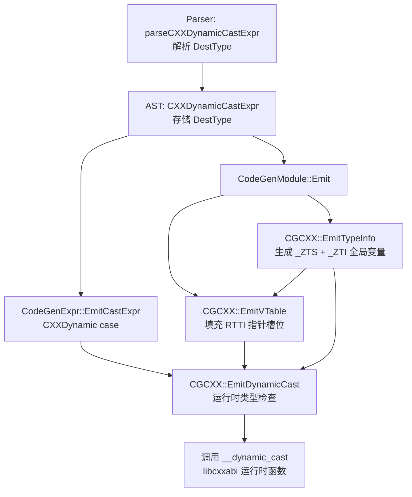

## 产品概述

实现完整的 RTTI（运行时类型信息）基础设施，使 `dynamic_cast` 具备真正的运行时类型检查能力，而非当前的简单 bitcast 降级。

## 核心特性

1. AST 层存储 dynamic_cast 目标类型信息
2. 生成 Itanium ABI 标准 RTTI 全局变量（typeinfo name、typeinfo 对象）
3. VTable 中填充 RTTI 指针槽位
4. CodeGen 生成运行时类型检查代码（调用 `__dynamic_cast`）
5. 支持 null check、downcast、cross-cast
6. 支持 `dynamic_cast<T&>` 引用类型（失败抛 bad_cast）
7. 配套测试用例覆盖各种场景

## 技术栈

- 编译器项目，C++ 实现，使用 LLVM IR 生成
- 遵循 Itanium C++ ABI 标准（RTTI/typeinfo/dynamic_cast 规范）

## 实现方案

### 总体策略

分 6 步渐进构建：AST 扩展 → RTTI 生成 → VTable 填充 → dynamic_cast CodeGen → 引用类型支持 → 测试。每步可独立编译验证。

### Itanium ABI RTTI 结构

```
__class_type_info       — 无基类的简单多态类
__si_class_type_info    — 单继承（含 base typeinfo 指针）
__vmi_class_type_info   — 多重/虚继承（含 base count + flags + offsets）

VTable 布局: [offset-to-top(0)][RTTI ptr → _ZTIClass][vfn0][vfn1]...
typeinfo name: _ZTS<ClassN> → const char[] (空终止字符串)
typeinfo 对象: _ZTI<ClassN> → { vptr, __name } [+ base info]
__dynamic_cast(src_ptr, src_typeinfo, dst_typeinfo, src2dst_offset) → void*
```

### 步骤1: AST 扩展 — CXXDynamicCastExpr 存储目标类型

**文件**: `include/blocktype/AST/Expr.h`、`src/AST/Expr.cpp`、`src/Parse/ParseExprCXX.cpp`

- `CXXDynamicCastExpr` 新增 `QualType DestType` 字段
- 构造函数增加 `QualType DestType` 参数
- 新增 `QualType getDestType() const` 访问器
- Parser 中 `parseCXXDynamicCastExpr()` 将已解析的 `CastType` 传入构造函数
- dump 方法输出 DestType 信息

### 步骤2: RTTI 全局变量生成

**文件**: `include/blocktype/CodeGen/CGCXX.h`、`src/CodeGen/CGCXX.cpp`

新增 `EmitTypeInfo(CXXRecordDecl *RD)` 方法，生成三类 RTTI：

1. **typeinfo name** (`_ZTS<ClassN>`)：`i8[]` 全局常量，内容为类名空终止字符串
2. **typeinfo 对象** (`_ZTI<ClassN>`)：根据继承层次选择：

- 无基类：生成 `__class_type_info` 子对象（仅 vptr + name 指针）
- 单继承：生成 `__si_class_type_info` 子对象（vptr + name + base typeinfo 指针）
- 多重/虚继承：生成 `__vmi_class_type_info` 子对象（vptr + name + flags + base_count + {flags, offset}[]）

3. 需声明外部全局变量：`_ZTVN10__cxxabiv117__class_type_infoE` 等 RTTI 类的 vtable

新增缓存：`llvm::DenseMap<const CXXRecordDecl *, llvm::GlobalVariable *> TypeInfos`

### 步骤3: VTable RTTI 槽位填充

**文件**: `src/CodeGen/CGCXX.cpp`

修改 `EmitVTable()` 中 RTTI 指针槽位（当前为 null）：

- 调用 `EmitTypeInfo(RD)` 获取 typeinfo 全局变量
- 将 slot[1]（RTTI pointer）从 `ConstantPointerNull` 替换为 typeinfo 变量的地址

### 步骤4: dynamic_cast CodeGen 运行时检查

**文件**: `include/blocktype/CodeGen/CGCXX.h`、`src/CodeGen/CGCXX.cpp`、`src/CodeGen/CodeGenExpr.cpp`

新增 `EmitDynamicCast(CodeGenFunction &CGF, CXXDynamicCastExpr *CastExpr)` 方法：

```
生成的 LLVM IR 逻辑：
1. if (SrcPtr == null) goto NullReturn
2. 从对象加载 vptr → vtable
3. vtable[slot 1] → src_typeinfo 指针
4. dst_typeinfo = EmitTypeInfo(DestRecordDecl)
5. src2dst = GetBaseOffset(SrcRecord, DestRecord)  // 编译时可知则传入，否则传 -1
6. result = call @__dynamic_cast(src_ptr, src_typeinfo, dst_typeinfo, src2dst)
7. bitcast result 到目标指针类型
8. NullReturn: return null
```

修改 `CodeGenExpr.cpp` 的 `CXXDynamic` case：从 bitcast 改为调用 `CGCXX::EmitDynamicCast()`。

### 步骤5: 引用类型 dynamic_cast&lt;T&&gt; 支持

**文件**: `src/CodeGen/CGCXX.cpp`

- 检测 DestType 是否为引用类型
- 指针类型：失败返回 null
- 引用类型：失败调用 `__cxa_bad_cast()`（声明外部函数 `_ZTVN10__cxxabiv120__bad_cast_typeinfoE`）
- 通过 if-then 分支实现：result == null → 调用 `__cxa_bad_cast()`

### 步骤6: 测试

**文件**: `tests/lit/CodeGen/dynamic-cast.test`、`tests/unit/CodeGen/`

覆盖场景：

- 简单 downcast（Base *→ Derived*，对象实际为 Derived）
- null 输入（dynamic_cast<T*>(nullptr) 返回 nullptr）
- 失败 downcast（Base *→ Derived*，对象实际为 Base，返回 nullptr）
- 多重继承 downcast（指针偏移调整）
- 引用类型（dynamic_cast<T&>，失败时调用 bad_cast）

## 架构设计



## 目录结构

```
project-root/
├── include/blocktype/AST/Expr.h              # [MODIFY] CXXDynamicCastExpr 新增 DestType 字段、构造函数参数、getDestType() 方法
├── include/blocktype/CodeGen/CGCXX.h         # [MODIFY] 新增 EmitTypeInfo()、EmitDynamicCast() 方法声明；新增 TypeInfos 缓存成员
├── src/AST/Expr.cpp                          # [MODIFY] CXXDynamicCastExpr::dump() 输出 DestType
├── src/Parse/ParseExprCXX.cpp                # [MODIFY] parseCXXDynamicCastExpr() 将 CastType 传入构造函数
├── src/CodeGen/CGCXX.cpp                     # [MODIFY] 实现 EmitTypeInfo()（三类 RTTI 生成）、修改 EmitVTable() 填充 RTTI 槽位、实现 EmitDynamicCast()
├── src/CodeGen/CodeGenExpr.cpp               # [MODIFY] CXXDynamic case 从 bitcast 改为调用 CGCXX::EmitDynamicCast()
├── tests/lit/CodeGen/dynamic-cast.test       # [NEW] dynamic_cast IR 生成测试（downcast/null/cross-cast/ref）
└── docs/dev status/PHASE6-6.2-AUDIT.md       # [MODIFY] 更新条目 8 状态为已修复
```

## 关键接口定义

```cpp
// CGCXX.h — 新增方法
class CGCXX {
  /// RTTI 缓存：CXXRecordDecl → typeinfo 全局变量
  llvm::DenseMap<const CXXRecordDecl *, llvm::GlobalVariable *> TypeInfos;

public:
  /// 生成 RTTI 全局变量（typeinfo name + typeinfo 对象）
  /// 返回 typeinfo 对象的 llvm::GlobalVariable*
  llvm::GlobalVariable *EmitTypeInfo(CXXRecordDecl *RD);

  /// 生成 dynamic_cast 运行时检查代码
  /// 处理 null check → 加载 vtable RTTI → 调用 __dynamic_cast
  llvm::Value *EmitDynamicCast(CodeGenFunction &CGF,
                                CXXDynamicCastExpr *CastExpr);
};

// Expr.h — CXXDynamicCastExpr 扩展
class CXXDynamicCastExpr : public CastExpr {
  QualType DestType;
public:
  CXXDynamicCastExpr(SourceLocation Loc, Expr *SubExpr, QualType DestType);
  QualType getDestType() const { return DestType; }
};
```

## 实现注意事项

- **RTTI 初始化顺序**：`EmitTypeInfo` 必须在 `EmitVTable` 之前或期间调用，因为 VTable slot[1] 需要 typeinfo 地址。使用缓存避免重复生成。
- **外部符号声明**：`__class_type_info` 等是 libcxxabi 中的类，需要声明其 vtable 为外部全局变量（`ExternalLinkage` 声明），不要定义。
- **src2dst 优化**：如果编译时能确定 Src→Dst 的偏移量（如单继承 downcast），传给 `__dynamic_cast` 的第4个参数可以用该偏移量加速；不确定时传 -1（全路径搜索）。
- **非多态类降级**：如果 dynamic_cast 的源类型不是多态类（无虚函数），按 C++ 标准应编译报错，但当前编译器缺少完整 Sema 检查，CodeGen 中可 fallback 为 static_cast + bitcast。
- **回归控制**：每次修改后编译 + 全量测试（662 个），确保不破坏现有功能。RTTI 生成只在 `hasVirtualFunctionsInHierarchy` 为 true 时触发。�。