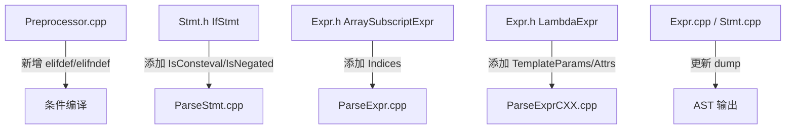

## 产品概述

为 BlockType 编译器解析器实现 5 项 C++23 P0 级特性，提升语言标准合规性。

## 核心功能

1. **`#elifdef` / `#elifndef` 预处理指令** (P2334R1) — 支持新的条件编译指令及其中文映射
2. **`if consteval` / `if !consteval`** (P1938R3) — 编译期常量求值上下文检测，无需条件表达式
3. **多维 `operator[]`** (P2128R6) — 数组下标运算符支持逗号分隔的多参数 `arr[i, j, k]`
4. **Lambda 模板参数** (P1102R2) — Lambda 表达式支持 `[]<typename T>()` 语法
5. **Lambda 属性** (P2173R1) — Lambda 表达式支持 `[[nodiscard]]` 等属性标注

## 技术栈

- 语言: C++17/20 (LLVM 编码风格)
- 构建: CMake + Ninja
- 依赖: LLVM/ADT (SmallVector, ArrayRef, StringRef)
- 测试: Google Test (单元测试) + Lit (集成测试)

## 实现方案

### 1. `#elifdef` / `#elifndef`

在 `Preprocessor.cpp` 的指令分发中添加 `elifdef`/`elifndef` 分支，新增两个方法：`handleElifdefDirective()` 和 `handleElifndefDirective()`。语义等价于 `#elif` + `#ifdef`/`#ifndef` 的组合 — 检查宏是否定义，然后更新 ConditionalStack。中文映射添加 `否则如果定义` → `elifdef`、`否则如果未定义` → `elifndef`。

### 2. `if consteval`

IfStmt 添加 `IsConsteval` 和 `IsNegated` 位域标志。`parseIfStatement()` 在消费 `if` 后检查 `kw_consteval`（支持 `!` 前缀表示 `if !consteval`），跳过条件表达式解析。`if consteval` 不需要 `(condition)` 括号包裹。

### 3. 多维 `operator[]`

ArraySubscriptExpr 添加 `SmallVector<Expr *, 2> Indices` 字段，保留 `getIndex()` 向后兼容（返回第一个下标）。解析时使用 `parseAssignmentExpression()` 循环解析逗号分隔的下标列表（逗号在此上下文中是分隔符而非运算符）。

### 4. Lambda 模板参数 + Lambda 属性（合并实现）

LambdaExpr 添加 `TemplateParameterList *TemplateParams` 和 `AttributeListDecl *Attrs` 字段。`parseLambdaExpression()` 在消费 `[captures]` 后检查 `template <...>` 解析模板参数，在 `[captures]` 前和 `(params)` 后调用 `parseAttributeSpecifier()` 解析属性。

### 性能考虑

- ArraySubscriptExpr 的 SmallVector 初始容量为 2（大多数情况单参数，无堆分配）
- `isDeclarationStart()` 中使用 switch 而非 if-else 链
- Lambda 的模板参数和属性使用指针（非侵入式，不增加常用路径内存）

## 架构设计

## 目录结构

### [MODIFY] `src/Lex/Preprocessor.cpp`

- 指令分发（第 366-367 行）：添加 `elifdef`/`elifndef` 分支
- 中文指令分发（第 425 行）：添加对应分支
- 中文映射（第 75 行）：添加 `否则如果定义`/`否则如果未定义`
- 新增 `handleElifdefDirective()` 方法：检查宏定义 + 更新 ConditionalStack
- 新增 `handleElifndefDirective()` 方法：检查宏未定义 + 更新 ConditionalStack

### [MODIFY] `include/blocktype/Lex/Preprocessor.h`

- 声明 `handleElifdefDirective()` 和 `handleElifndefDirective()`

### [MODIFY] `include/blocktype/AST/Stmt.h`

- IfStmt（第 148 行）：添加 `bool IsConsteval : 1 = false`、`bool IsNegated : 1 = false`、`SourceLocation ConstevalLoc`
- IfStmt 构造函数：添加新参数
- IfStmt 添加 `isConsteval()` / `isNegated()` 访问器

### [MODIFY] `src/AST/Stmt.cpp`

- IfStmt::dump()：输出 consteval/negated 信息

### [MODIFY] `src/Parse/ParseStmt.cpp`

- parseIfStatement()（第 402 行）：在消费 `if` 后检查 `kw_consteval`，支持 `!` 前缀，跳过条件表达式和括号

### [MODIFY] `include/blocktype/AST/Expr.h`

- ArraySubscriptExpr（第 354 行）：添加 `SmallVector<Expr *, 2> Indices` 字段，保留 `getIndex()` 向后兼容，添加 `getIndices()`、`getNumIndices()` 访问器
- LambdaExpr（第 916 行）：添加 `TemplateParameterList *TemplateParams` 和 `AttributeListDecl *Attrs` 字段，构造函数扩展，访问器方法

### [MODIFY] `src/AST/Expr.cpp`

- ArraySubscriptExpr::dump()：输出多个下标
- LambdaExpr::dump()：输出模板参数和属性

### [MODIFY] `src/Parse/ParseExpr.cpp`

- 数组下标解析（第 366-387 行）：循环解析逗号分隔的 `parseAssignmentExpression()` 列表

### [MODIFY] `src/Parse/ParseExprCXX.cpp`

- parseLambdaExpression()（第 136 行）：在 `[captures]` 前解析属性；在 `]` 后解析 `template <...>`；在 `(params)` 后解析属性
- 需要 include `blocktype/AST/TemplateParameterList.h` 和 `blocktype/AST/Decl.h`（AttributeListDecl）

## 实现注意事项

- `parseTemplateParameters()` 已存在于 ParseTemplate.cpp，期望 `<` 已被消费，在 `>` 处停止，返回参数 vector。Lambda 模板参数需要手动消费 `template` 和 `<`，然后调用此方法
- `TemplateParameterList` 类在 `AST/TemplateParameterList.h` 中定义，构造需 TemplateLoc、LAngleLoc、RAngleLoc、Params
- `parseAttributeSpecifier()` 在 ParseDecl.cpp 中实现，需要先检查 `[[`（`l_square` 后跟 `l_square`）再调用
- ArraySubscriptExpr 的 `Index` 字段改为 `Indices` 后，需确保所有使用 `getIndex()` 的代码仍能编译（向后兼容 getter 返回 Indices[0]）
- `Context.create<TemplateParameterList>(...)` 需确认 ASTContext 是否支持；若不支持，使用 `new TemplateParameterList(...)` 或构造后通过 setter 设置

## SubAgent

- **code-explorer**: 用于在实现过程中快速搜索跨文件依赖关系和验证 API 签名