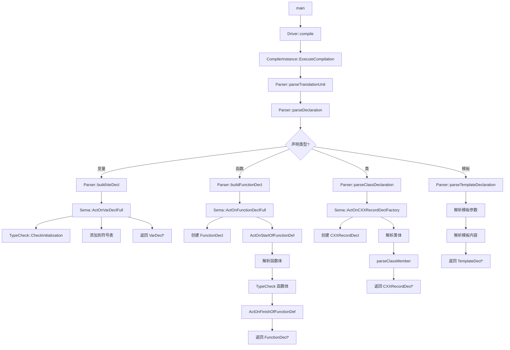
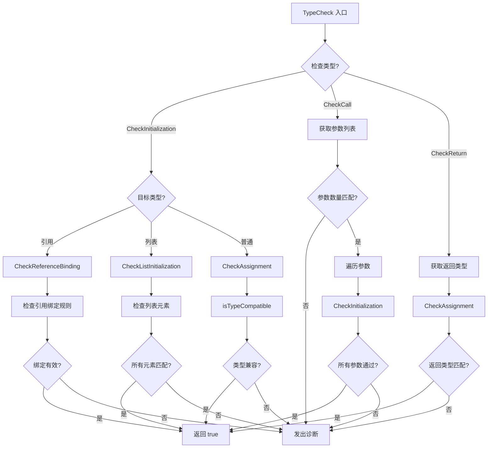
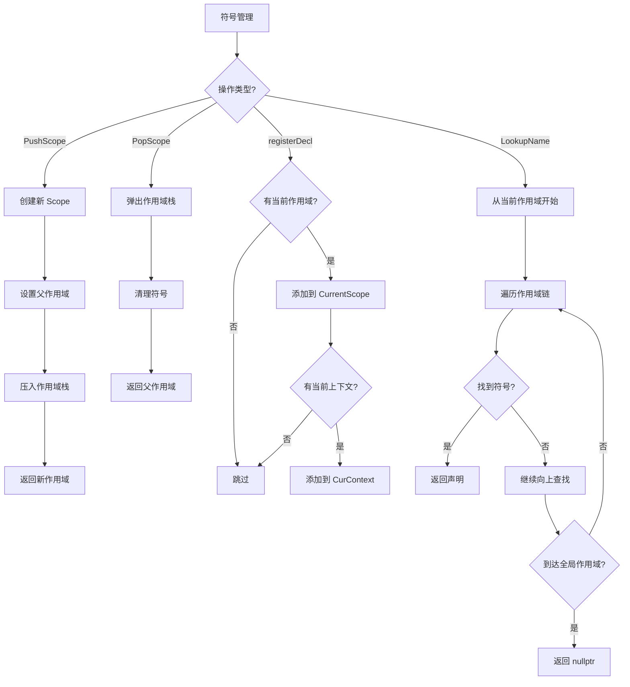
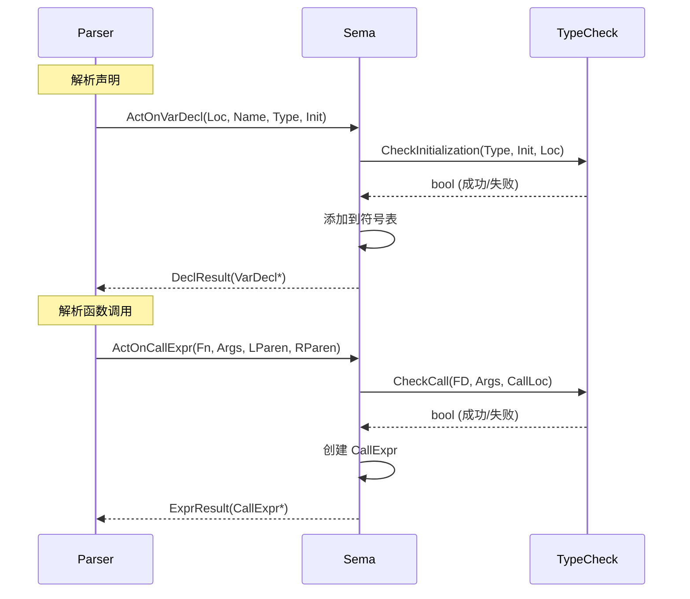
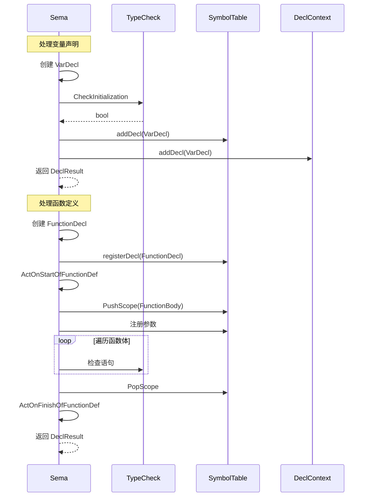

# BlockType 编译器完整流程图

**生成时间**: 2026-04-21 20:48
**基于**: Task 1.1-1.3 分析结果

---

## 📊 完整编译流程



---

## 🔄 表达式处理流程

```mermaid
graph TD
    A[Parser::parseExpression] --> B{表达式类型?}
    
    %% 函数调用
    B -->|函数调用| C[Parser::parseCallExpression]
    C --> D[Sema::ActOnCallExpr]
    D --> E{是 Lambda?}
    E -->|是| F[查找 operator()]
    E -->|否| G[获取 FunctionDecl]
    F --> H[TypeCheck::CheckCall]
    G --> H
    H --> I[创建 CallExpr]
    I --> J[设置返回类型]
    J --> K[返回 CallExpr*]
    
    %% 二元运算
    B -->|二元运算| L[Parser::parseRHS]
    L --> M[Sema::ActOnBinaryOp]
    M --> N[TypeCheck::getCommonType]
    N --> O[创建 BinaryOperator]
    O --> P[设置结果类型]
    P --> Q[返回 BinaryOperator*]
    
    %% 一元运算
    B -->|一元运算| R[Parser::parseUnaryExpression]
    R --> S[Sema::ActOnUnaryOp]
    S --> T[TypeCheck::getUnaryOperatorResultType]
    T --> U[创建 UnaryOperator]
    U --> V[返回 UnaryOperator*]
    
    %% 变量引用
    B -->|标识符| W[Parser::parseIdentifier]
    W --> X[Sema::ActOnIdExpr]
    X --> Y[查找符号]
    Y --> Z[创建 DeclRefExpr]
    Z --> AA[返回 DeclRefExpr*]
    
    %% 字面量
    B -->|字面量| AB[Parser::parseIntegerLiteral等]
    AB --> AC[Sema::ActOnIntegerLiteral等]
    AC --> AD[创建字面量表达式]
    AD --> AE[返回表达式*]
```

---

## 🏗️ Sema 语义分析流程

```mermaid
graph TD
    A[Sema 入口] --> B{ActOn 函数类型?}
    
    %% 声明处理
    B -->|ActOnVarDecl| C[创建 VarDecl]
    C --> D{有初始化?}
    D -->|是| E[CheckInitialization]
    D -->|否| F[跳过检查]
    E --> G{检查通过?}
    G -->|是| H[添加到符号表]
    G -->|否| I[返回 Invalid]
    F --> H
    H --> J[添加到上下文]
    J --> K[返回 DeclResult]
    
    %% 函数处理
    B -->|ActOnFunctionDecl| L[创建 FunctionDecl]
    L --> M[注册到符号表]
    M --> N{有函数体?}
    N -->|是| O[ActOnStartOfFunctionDef]
    O --> P[PushScope]
    P --> Q[注册参数]
    Q --> R[解析函数体]
    R --> S[TypeCheck 语句]
    S --> T[ActOnFinishOfFunctionDef]
    T --> U[PopScope]
    N -->|否| V[跳过函数体处理]
    U --> W[返回 DeclResult]
    V --> W
    
    %% 表达式处理
    B -->|ActOnCallExpr| X[检查调用者]
    X --> Y{调用者类型?}
    Y -->|Lambda| Z[查找 operator()]
    Y -->|函数| AA[获取 FunctionDecl]
    Z --> AB[CheckCall]
    AA --> AB
    AB --> AC{参数匹配?}
    AC -->|是| AD[创建 CallExpr]
    AC -->|否| AE[发出错误]
    AD --> AF[设置返回类型]
    AF --> AG[返回 ExprResult]
```

---

## 🔍 TypeCheck 类型检查流程



---

## 📦 符号管理流程



---

## 🎯 数据流图

### Parser → Sema 数据流



### Sema 内部数据流



---

## 📊 统计数据

### 函数调用统计

| 模块 | 函数类型 | 数量 | 主要功能 |
|------|----------|------|----------|
| Parser | parse* | 50+ | 语法解析 |
| Sema | ActOn* | 50+ | 语义分析 |
| TypeCheck | Check* | 9 | 类型检查 |
| SymbolTable | addDecl/Lookup | 10+ | 符号管理 |

### AST 节点统计

| 类别 | 节点类型 | 数量 |
|------|----------|------|
| 声明 | Decl | 30+ |
| 语句 | Stmt | 15+ |
| 表达式 | Expr | 40+ |
| 类型 | Type | 20+ |

---

## 💡 关键发现

### 1. 清晰的职责分离

- **Parser**: 语法分析，构建 AST 结构
- **Sema**: 语义分析，类型检查，符号管理
- **TypeCheck**: 类型兼容性检查
- **SymbolTable**: 符号存储和查找

### 2. 统一的模式

所有 ActOn 函数遵循相同模式：
1. 创建 AST 节点
2. 类型检查
3. 符号注册
4. 返回结果

### 3. 错误处理机制

使用 Result 对象统一处理错误：
- `DeclResult::getInvalid()`
- `ExprResult::getInvalid()`
- `StmtResult::getInvalid()`

### 4. 作用域管理

使用 RAII 模式管理作用域：
- PushScope/PopScope 配对
- 自动清理符号

---

## 🔗 相关文档

- Task 1.1: Parser 流程梳理
- Task 1.2: Parser 问题诊断
- Task 1.3: Sema 流程细化（本文档）

---

**报告生成时间**: 2026-04-21 20:48
**文件位置**: `docs/review_flowchart.md`
