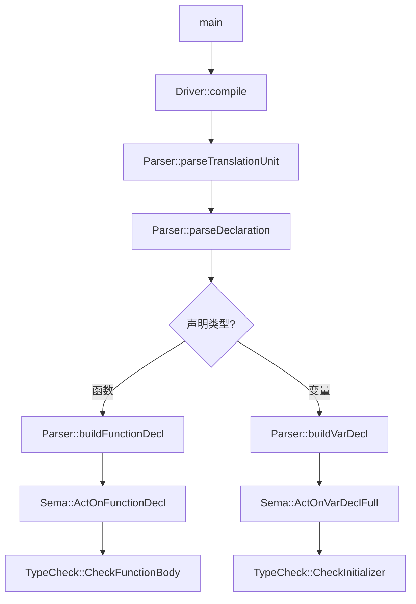

# BlockType 项目功能整合审查方案（完整版）

**版本**: v3.0  
**创建时间**: 2026-04-19  
**更新时间**: 2026-04-19  
**核心理念**: 理解编译流程 → 映射函数位置 → 检测重复错位 → 设计整合方案  
**审查范围**: 9个Phase，28个Task，22个功能域，覆盖编译器全栈

---

## 🎯 审查目标

**不是**简单地列出"未调用函数清单"，而是：

1. **理解每个函数的作用**（功能语义分析）
2. **确定它在编译流程中的正确位置**（架构映射）
3. **检测重复和冗余**（对比分析）
4. **设计整合方案**（把函数放到对的地方）

---

## 💡 核心方法论

### 方法1: 编译流程地图法
- 先绘制完整的编译流程图（从源码到IR）
- 将每个函数映射到流程图的某个节点
- 发现断裂、重复、错位

### 方法2: 功能域分组法
- 不按模块分组（Parser/Sema/CodeGen）
- 按**功能域**分组（如"函数调用处理"、"模板实例化"）
- 对比同一功能域内的多个实现

### 方法3: 对比分析法
- 找出功能相似的函数对
- 对比它们的实现差异
- 决策：保留哪个？合并？删除？

### 方法4: 流程完整性检查
- 对每个关键流程（如函数调用），检查：
  - Parser 是否解析了语法？
  - Sema 是否做了语义分析？
  - TypeCheck 是否验证了类型？
  - CodeGen 是否生成了IR？
- 发现缺失的环节

---

## 📋 执行步骤（分Phase执行）

---

### 任务依赖关系图

```
Phase 1: 流程地图
├─ Task 1.0: Lexer流程分析 ← 新增
├─ Task 1.1: 梳理主调用链
│   └─→ Task 1.2: 细化Parser流程
│       └─→ Task 1.3: 细化Sema流程
│           └─→ Task 1.4: 绘制完整流程地图（包含CodeGen）
│           └─→ Task 1.5: AST节点体系审查 ← 新增
│           └─→ Task 1.6: 诊断系统审查 ← 新增
│
Phase 2: 功能域分析
├─ Task 2.1: 定义功能域（22个功能域）
│   └─→ Task 2.2: 收集相关函数（按功能域，12个子任务）
│       └─→ Task 2.3: 映射到流程图
│           └─→ Task 2.4: 重复检测
│
Phase 3: 问题诊断
├─ Task 3.1: 流程断裂分析 ← 依赖 Task 1.4, 2.3
├─ Task 3.2: 调用缺失分析 ← 依赖 Task 2.2
├─ Task 3.3: 错位功能分析 ← 依赖 Task 2.3
├─ Task 3.4: SymbolTable深度审查 ← 新增
└─ Task 3.5: SourceManager审查 ← 新增
│
Phase 4: 整合方案
├─ Task 4.1: 问题分类 ← 依赖 Phase 3
├─ Task 4.2: 设计修复方案 ← 依赖 Task 4.1
└─ Task 4.3: 优先级排序 ← 依赖 Task 4.2
│
Phase 5: 工程质量保障审查
├─ Task 5.1: 测试覆盖率分析 ← 新增
├─ Task 5.2: 文档完整性审查 ← 新增
├─ Task 5.3: 构建系统合理性审查 ← 新增
└─ Task 5.4: C++标准合规性审查 ← 新增
│
Phase 6: 性能优化与深度技术审查
├─ Task 6.1: 性能Profiling与瓶颈识别 ← 新增
├─ Task 6.2: 错误恢复机制健壮性审查 ← 新增
├─ Task 6.3: 模板系统深度审查 ← 新增
├─ Task 6.4: Lambda表达式实现深度审查 ← 新增
└─ Task 6.5: 异常处理机制深度审查 ← 新增
│
Phase 7: 执行验证
└─ Task 7.x: 逐个修复 ← 依赖 Task 4.3
│
Final: 汇总报告
└─ Task F.1: 生成最终报告 ← 依赖所有Phase
```

**关键依赖**:
- Task 3.1（流程断裂分析）必须在 Task 1.4（流程地图）完成后才能开始
- Task 2.4（重复检测）必须在 Task 2.2（收集函数）完成后才能开始
- 如果某个Issue的修复会影响多个Task，必须先完成那些Task

---

### **Phase 1: 绘制编译流程地图**

**目标**: 理解从源码到IR的完整流程，识别每个环节的职责。

#### Task 1.0: Lexer流程分析（新增）
**执行**:
```bash
# 检查Lexer的实现
grep -n "getNextToken\|Lex" src/Lex/Lexer.cpp | head -20

# 检查Token定义
grep -c "^TOKEN" include/blocktype/Lex/TokenKinds.def
```

**分析**:
- Lexer的tokenize逻辑是否正确？
- TokenKinds.def中的定义是否完整？
- 是否有未使用的Token类型？
- Lexer的错误恢复机制是否健全？

**输出**: Lexer流程分析报告

---

#### Task 1.1: 梳理主调用链
**执行**:
```bash
# 找到入口点
grep -rn "^int main\|Driver::compile" tools/*.cpp src/Driver/*.cpp
```

**分析**:
- main() 做了什么？
- Driver::compile() 调用了哪些模块？
- 各模块的初始化顺序？

**输出**: 主调用链文本描述

---

#### Task 1.2: 细化 Parser 流程
**执行**:
```bash
# 找到 Parser 入口
grep -n "parseTranslationUnit" src/Parse/Parser.cpp

# 追踪 parseDeclaration 的分支
grep -A30 "Parser::parseDeclaration" src/Parse/ParseDecl.cpp | head -50
```

**分析**:
- parseDeclaration 如何识别不同类型的声明？
- 每种声明调用了哪个具体的 parseXXX 函数？
- 是否有遗漏的声明类型？

**输出**: Parser 子流程图

---

#### Task 1.3: 细化 Sema 流程
**执行**:
```bash
# 找到关键的 ActOn 函数
grep -n "ActOnFunctionDecl\|ActOnVarDecl\|ActOnCallExpr" src/Sema/Sema.cpp | head -10
```

**分析**:
- 每个 ActOn 函数做了什么？
- 它调用了哪些 Check/Lookup/Instantiate 函数？
- 返回什么给 Parser？

**输出**: Sema 子流程图

---

#### Task 1.4: 绘制完整流程地图
**整合** Task 1.1-1.3 的结果，生成 Mermaid 格式的流程图：



**输出文件**: `docs/architecture/review_flowchart.md`

---

#### Task 1.5: AST节点体系审查（新增）
**执行**:
```bash
# 扫描所有AST节点类型
grep -n "^NODE_KIND" include/blocktype/AST/NodeKinds.def

# 检查classof()实现
grep -rn "classof.*TemplateTypeParmDecl\|classof.*FunctionDecl" src/AST/*.cpp
```

**分析**:
- NodeKinds.def中定义的所有节点是否都有对应的类？
- 每个节点的classof()实现是否正确？
- 是否有孤立或未使用的节点类型？
- 节点的创建和使用是否一致？

**输出**: AST节点完整性报告

---

#### Task 1.6: 诊断系统审查（新增）
**执行**:
```bash
# 检查诊断消息定义
grep -c "^DIAG" include/blocktype/Basic/Diagnostic*.def

# 查找重复的诊断ID
grep -n "^DIAG" include/blocktype/Basic/Diagnostic*.def | awk '{print $2}' | sort | uniq -d
```

**分析**:
- Diagnostic*.def中的诊断消息是否完整？
- 是否有重复的诊断ID？
- 诊断消息的质量如何（清晰度、准确性）？
- 是否有未使用的诊断ID？

**输出**: 诊断系统分析报告

---

### **Phase 2: 功能域分析与映射**

**目标**: 按功能域分组函数，映射到流程图。

#### Task 2.1: 定义功能域
识别项目中的主要功能域：

**编译流程层（Phase 0-5）**:
1. **词法分析 (Lexing)** - Lexer模块，Token生成
2. **语法分析 (Parsing)** - Parser模块，AST构建
3. **语义分析 (Semantic Analysis)** - Sema模块，ActOn函数
4. **类型检查 (Type Checking)** - TypeCheck模块，类型验证
5. **代码生成 (Code Generation)** - CodeGen模块，IR生成
6. **调试信息生成 (Debug Info)** - CGDebugInfo模块，DWARF生成

**核心功能域（按语言特性分组）**:
7. **函数调用处理** - parseCallExpression, ActOnCallExpr, EmitCallExpr
8. **模板实例化** - 模板实参推导、SFINAE、约束满足、包展开
9. **名称查找与符号表** - LookupName, SymbolTable, Scope链管理
10. **结构化绑定** - std::tuple/std::pair解包、std::get调用
11. **Lambda表达式** - Lambda捕获、闭包类型、operator()生成
12. **类与继承** - 类声明、虚函数表、虚继承、Thunk生成
13. **异常处理** - try/catch、栈展开、noexcept支持
14. **命名空间与模块** - C++20 modules、import/export、namespace
15. **Auto类型推导** - decltype、auto返回值、尾置返回类型
16. **控制流语句** - if/for/while/switch、break/continue、co_return
17. **表达式处理** - 一元/二元运算符、后缀表达式、折叠表达式
18. **声明处理** - 变量声明、typedef、using、enum、struct/class

**基础设施层**:
19. **AST节点体系** - NodeKinds.def、classof()实现、节点创建
20. **诊断系统** - Diagnostic*.def、错误消息、警告级别
21. **SourceManager源码管理** - 文件位置、宏展开、包含关系
22. **测试与验证** - 单元测试、集成测试、测试覆盖率

**输出**: 功能域清单（22个功能域）

---

#### Task 2.2: 为每个功能域收集相关函数

**示例：函数调用处理**

收集所有相关函数：
```bash
# Parser 层
grep -n "parseCallExpression\|parsePostfixExpression" src/Parse/ParseExpr.cpp

# Sema 层
grep -n "ActOnCallExpr\|DeduceAndInstantiate\|ResolveOverload" src/Sema/Sema.cpp

# TypeCheck 层
grep -n "CheckCall" src/Sema/TypeCheck.cpp

# CodeGen 层
grep -n "EmitCallExpr" src/CodeGen/*.cpp
```

**整理成表格**：

| 阶段 | 函数名 | 文件位置 | 作用简述 |
|------|--------|---------|---------|
| Parser | parseCallExpression | ParseExpr.cpp Lxxx | 解析 func(args) 语法 |
| Sema | ActOnCallExpr | Sema.cpp L2060 | 语义分析函数调用 |
| Sema | DeduceAndInstantiateFunctionTemplate | SemaTemplate.cpp L669 | 模板实参推导 |
| Sema | ResolveOverload | Overload.cpp Lxxx | 重载决议 |
| TypeCheck | CheckCall | TypeCheck.cpp Lxxx | 参数类型检查 |
| CodeGen | EmitCallExpr | CGExpr.cpp Lxxx | 生成 call IR |

**输出文件**: `docs/review_function_call_domain.md`

---

#### Task 2.3: 映射到流程图
对上述表格中的每个函数，标注它在 Phase 1 流程图中的位置。

**检查**:
- 是否有函数在流程图中找不到位置？→ 可能错位
- 是否有流程节点没有对应的函数？→ 可能缺失
- 是否有多个函数映射到同一节点？→ 可能重复

**输出**: 带函数标注的流程图

---

#### Task 2.4: 重复检测
**方法**:
1. 找出名字相似的函数对
2. 阅读它们的实现
3. 判断是否真的重复

**示例分析**:

**ActOnDeclStmt vs ActOnDeclStmtFromDecl**
```bash
# 查看两个函数的实现
sed -n '/^StmtResult Sema::ActOnDeclStmt/,/^}/p' src/Sema/Sema.cpp
sed -n '/^StmtResult Sema::ActOnDeclStmtFromDecl/,/^}/p' src/Sema/Sema.cpp
```

**对比结果**:
- ActOnDeclStmt: 旧版本，只支持单个声明
- ActOnDeclStmtFromDecl: 新版本，支持多个声明（结构化绑定需要）
- **决策**: 保留 ActOnDeclStmtFromDecl，标记 ActOnDeclStmt 为废弃

**输出**: 重复函数分析报告

---

### **Phase 3: 问题诊断与根因分析**

**目标**: 对发现的问题进行深入分析，找出根因。

#### Task 3.1: 流程断裂分析

**典型案例**: ActOnCallExpr 第2094-2098行 early return

**分析步骤**:
1. **现象**: 函数模板调用无法工作
2. **定位**: ActOnCallExpr L2094-2098
3. **根因**: 
   - DeclRefExpr(nullptr) 导致 D=nullptr
   - if (!D) 分支直接 return
   - 跳过了 L2104 的 FunctionTemplateDecl 处理
4. **上游原因**: parseIdentifier 创建了无效的 DeclRefExpr
5. **下游影响**: DeduceAndInstantiateFunctionTemplate 永远无法被调用

**输出**: 根因分析报告（含调用栈）

---

#### Task 3.2: 调用缺失分析

**典型案例**: parseTrailingReturnType 未被调用

**分析步骤**:
1. **现象**: `auto func() -> int` 语法报错
2. **定位**: parseTrailingReturnType 定义了但未被调用
3. **应该在哪里调用**: parseFunctionDefinition 检测到 `->` 时
4. **为什么没调用**: Parser 逻辑遗漏
5. **修复方案**: 在 parseFunctionDefinition 中添加调用

**输出**: 调用缺失分析报告

---

#### Task 3.3: 错位功能分析

**典型案例**: 某函数在错误的模块

**分析方法**:
1. 该函数的职责是什么？
2. 它现在在哪个模块？
3. 按架构原则，它应该在哪个模块？
4. 移动后会影响其他模块吗？

**输出**: 错位功能分析报告

---

#### Task 3.4: SymbolTable深度审查（新增）
**执行**:
```bash
# 检查SymbolTable的实现
grep -n "lookup\|insert\|registerDecl" src/Sema/SymbolTable.cpp | head -20

# 检查Scope链管理
grep -n "pushScope\|popScope\|lookup" src/Sema/Scope.cpp | head -20
```

**分析**:
- SymbolTable的查找效率如何？
- 作用域链的管理是否正确？
- Shadowing处理是否健壮？
- 嵌套作用域的边界是否清晰？

**输出**: SymbolTable深度分析报告

---

#### Task 3.5: SourceManager审查（新增）
**执行**:
```bash
# 检查SourceManager的实现
grep -n "getSourceLocation\|getPresumedLoc\|getFileEntry" src/Basic/SourceManager.cpp | head -20
```

**分析**:
- 文件位置追踪是否正确？
- 宏展开的位置信息是否准确？
- #include包含关系的管理是否健全？

**输出**: SourceManager审查报告

---

### **Phase 4: 整合方案设计**

**目标**: 为每个问题设计具体的修复方案。

#### Task 4.1: 问题分类
将所有问题分为4类：

**类型A: 流程断裂**
- 特征: 函数存在但 unreachable
- 修复: 调整控制流
- 示例: ActOnCallExpr early return

**类型B: 调用缺失**
- 特征: 函数存在但从未被调用
- 修复: 添加调用点
- 示例: parseTrailingReturnType

**类型C: 功能重复**
- 特征: 多个函数做类似的事
- 修复: 保留一个，删除/标记其他
- 示例: ActOnDeclStmt vs ActOnDeclStmtFromDecl

**类型D: 位置错误**
- 特征: 函数在错误的模块
- 修复: 移动到正确模块
- 示例: （待发现）

**输出**: 问题分类表

---

#### Task 4.2: 为每个问题设计修复方案

**模板**:
```markdown
## 问题: [问题描述]

### 现状
- 位置: [文件:行号]
- 症状: [表现为什么错误]

### 根因
[详细分析]

### 修复方案
1. 修改 [文件:行号]
   - 删除/修改 [代码段]
   - 添加 [新代码]

2. 测试
   - 运行 [测试用例]
   - 预期结果: [描述]

### 风险评估
- 影响范围: [哪些功能会受影响]
- 回滚方案: [如果出问题如何恢复]
```

**输出**: 修复方案文档

---

#### Task 4.3: 优先级排序
按以下维度评分（1-5分）：

- **影响范围**: 多少功能受影响？
- **严重程度**: 是否阻塞核心功能？
- **修复难度**: 需要改多少代码？
- **风险等级**: 引入新bug的可能性？

**优先级矩阵**:
| 问题 | 影响 | 严重 | 难度 | 风险 | 优先级 |
|------|------|------|------|------|--------|
| ActOnCallExpr断裂 | 5 | 5 | 3 | 2 | P0 |
| parseTrailingReturnType缺失 | 3 | 3 | 1 | 1 | P1 |
| ... | ... | ... | ... | ... | ... |

**输出**: 优先级矩阵

---

### **Phase 5: 工程质量保障审查**

**目标**: 评估项目的工程质量，确保可持续发展。

#### Task 5.1: 测试覆盖率分析
**执行**:
```bash
# 统计测试用例数量
find tests/ -name "*.cpp" -o -name "*.cc" | wc -l

# 检查各模块的测试覆盖
grep -r "TEST\|TEST_F" tests/ | awk -F'/' '{print $2}' | sort | uniq -c
```

**分析**:
- 哪些功能有测试覆盖？
- 哪些功能是untested的？
- 测试用例的质量如何（边界情况、错误路径）？
- 是否有回归测试？

**输出**: 测试覆盖率报告

---

#### Task 5.2: 文档完整性审查
**执行**:
```bash
# 检查关键函数的注释
grep -A5 "^StmtResult Sema::ActOnCallExpr" src/Sema/Sema.cpp

# 统计文档覆盖率
find docs/ -name "*.md" | wc -l
```

**分析**:
- 关键函数是否有注释？
- README是否准确反映项目状态？
- API文档是否存在？
- 开发者文档是否更新？

**输出**: 文档完整性报告

---

#### Task 5.3: 构建系统合理性审查
**执行**:
```bash
# 检查CMakeLists.txt的结构
cat CMakeLists.txt | head -50

# 验证依赖关系
grep -n "target_link_libraries\|add_dependencies" CMakeLists.txt
```

**分析**:
- CMakeLists.txt的结构是否清晰？
- 依赖关系是否正确？
- 编译选项是否优化？
- 是否有冗余的依赖？

**输出**: 构建系统审查报告

---

#### Task 5.4: C++标准合规性审查
**执行**:
```bash
# 检查已实现的C++26特性
grep -rn "C++26\|c\+\+26\|std=c++26" docs/ CMakeLists.txt

# 对照标准文档
cat docs/cpp26_features.md 2>/dev/null || echo "No C++26 features doc found"
```

**分析**:
- BlockType声称支持C++26，实际实现了哪些特性？
- 是否符合标准规范？
- 列出缺失的C++26特性
- 评估实现的正确性

**输出**: C++标准合规性报告

---

### **Phase 6: 性能优化与深度技术审查**

**目标**: 分析性能瓶颈，深度审查复杂技术实现。

#### Task 6.1: 性能Profiling与瓶颈识别
**执行**:
```bash
# Profiling编译过程
time ./build/bin/blocktype test.cpp -o test.ll

# 内存使用分析
valgrind --tool=massif ./build/bin/blocktype test.cpp -o test.ll
```

**分析**:
- 编译速度如何？
- 内存使用是否合理？
- 是否有性能瓶颈（热点函数）？
- 哪些阶段最耗时？

**输出**: 性能分析报告

---

#### Task 6.2: 错误恢复机制健壮性审查
**执行**:
```bash
# 检查Parser的错误恢复
grep -n "consumeToken\|skipUntil\|recoverFromError" src/Parse/*.cpp | head -20

# 验证无限循环防护
grep -B5 -A5 "while.*!isEof" src/Parse/*.cpp
```

**分析**:
- Parser的错误恢复机制是否健全？
- consumeToken的使用是否正确？
- 是否会陷入无限循环？
- 错误消息是否清晰？

**输出**: 错误恢复机制报告

---

#### Task 6.3: 模板系统深度审查
**参考**: task_2.2.3_report.md

**分析**:
- SFINAE实现是否完整？
- 约束满足(Constraints)是否正确？
- 包展开(Pack Expansion)是否支持？
- 模板特化的优先级是否正确？

**输出**: 模板系统深度报告

---

#### Task 6.4: Lambda表达式实现深度审查
**参考**: task_2.2.10_report.md

**分析**:
- Lambda捕获列表的处理
- Lambda的闭包类型生成
- Lambda到函数指针的转换
- 泛型Lambda的支持

**输出**: Lambda表达式深度报告

---

#### Task 6.5: 异常处理机制深度审查
**参考**: task_2.2.12_report.md

**分析**:
- try/catch的实现
- 栈展开(Stack Unwinding)
- noexcept的支持
- 异常规格的检查

**输出**: 异常处理深度报告

---

### **Phase 7: 执行验证**

**目标**: 按优先级逐个修复问题，每修复一个就验证。

#### Task 7.1: 按优先级执行修复
**输入**: Phase 4的优先级矩阵和修复方案

**步骤**:
1. 读取优先级矩阵（高/中/低优先级问题列表）
2. 按优先级顺序处理每个问题：
   - 按修复方案修改代码
   - 编译测试（确保不引入新错误）
   - 运行相关测试用例
   - 确认问题解决
   - 更新修复记录文档
3. 每修复5个问题进行一次回归测试
4. 生成修复统计报告

**输出**: 
- 修复记录（每个问题的修复前后对比）
- 测试验证结果
- 修复统计报告（已修复/待修复/无法修复）

**验收标准**:
- 所有高优先级问题已修复
- 中优先级问题修复率≥80%
- 无回归错误

---

### **Final: 生成最终报告**

#### Task F.1: 生成最终报告
**输入**: 所有Phase的输出文件

**步骤**:
1. 收集所有Phase的输出文件：
   - Phase 1: 流程地图（main_chain.txt, parser_flow.txt, sema_flow.txt等）
   - Phase 2: 功能域清单（function_domains.csv）
   - Phase 3: 问题诊断报告（flow_breaks.txt, priority_matrix.md）
   - Phase 4: 整合方案（修复方案详情）
   - Phase 5: 质量保障评估报告
   - Phase 6: 性能与深度技术审查报告
   - Phase 7: 修复记录和验证结果
2. 按照内容结构模板生成最终报告
3. 添加执行摘要和统计数据
4. 生成优先级矩阵和执行计划
5. 创建附录（详细函数清单、根因分析记录、修复记录）

**输出**: 
- `docs/archive/lexer-reviews/FINAL_REPORT.md` - 最终审查报告
- `docs/archive/lexer-reviews/summary.md` - 执行摘要（1页）
- `docs/archive/lexer-reviews/action_items.md` - 行动项清单

**验收标准**:
- 报告完整性：覆盖所有Phase的输出
- 数据准确性：统计数据与实际一致
- 可操作性：明确列出后续行动项

**内容结构**:
```markdown
# BlockType 项目功能整合审查报告

## 1. 执行摘要
- 审查范围（9个Phase，28个Task）
- 主要发现（统计）
- 关键问题列表

## 2. 编译流程地图
- 完整流程图（Lexer → Parser → Sema → TypeCheck → CodeGen）
- 各阶段职责说明

## 3. 功能域分析
- 22个功能域的函数清单
- 映射关系图

## 4. 问题诊断
- 流程断裂问题
- 调用缺失问题
- 功能重复问题
- 位置错误问题

## 5. 基础设施审查结果
- AST节点体系完整性
- 诊断系统质量
- SymbolTable符号表健壮性
- SourceManager源码管理

## 6. 质量保障评估
- 测试覆盖率分析
- 文档完整性评估
- 构建系统合理性
- C++标准合规性

## 7. 性能与优化建议
- 性能瓶颈识别
- 错误恢复机制评估
- 优化建议

## 8. 深度功能审查
- 模板系统完整性
- Lambda表达式支持
- 异常处理机制

## 9. 整合方案
- 问题分类
- 修复方案详情
- 优先级矩阵

## 10. 执行计划
- 短期（本周）
- 中期（本月）
- 长期（季度）

## 附录
- 详细函数清单
- 根因分析记录
- 修复记录
```

---

## ✅ 执行规则

### 规则0: 任务依赖与状态管理（最重要）

#### 0.1 任务状态跟踪表
创建 `docs/review_task_tracker.md`，记录每个Task的状态：

```markdown
# 审查任务跟踪表

| Task ID | 任务名称 | 状态 | 依赖 | 开始时间 | 完成时间 | 输出文件 | 备注 |
|---------|---------|------|------|---------|---------|---------|------|
| 1.1 | 梳理主调用链 | TODO | - | - | - | - | - |
| 1.2 | 细化Parser流程 | TODO | 1.1 | - | - | - | - |
| ... | ... | ... | ... | ... | ... | ... | ... |
```

**状态定义**:
- `TODO`: 未开始
- `IN_PROGRESS`: 进行中
- `BLOCKED`: 被阻塞（等待其他Task）
- `DONE`: 已完成
- `REVIEW`: 待人工review

#### 0.2 依赖关系管理
某些Task必须在其他Task完成后才能开始：

```
Task 1.1 → Task 1.2 → Task 1.4
                  ↓
            Task 2.1 → Task 2.2
```

**规则**:
- 开始前检查依赖是否都完成
- 如果被阻塞，标记为 `BLOCKED`，先做其他Task
- 不要强行执行未满足依赖的Task

#### 0.3 问题修复的工作流
当发现一个问题需要修复时：

**步骤**:
1. **判断问题类型**:
   - **Bug/断裂/缺失** → 记录到 `docs/review_issues_log.md`
   - **空函数/不完整/TODO** → 记录到 `docs/review_tech_debt_log.md`

2. **记录问题**: 
   - Issues Log: 使用Issue模板
   - Tech Debt Log: 使用对应的类型模板（A/B/C/D）

3. **评估影响**: 
   - 修复这个Issue会影响哪些其他Task？
   - 是否需要先完成某些Task？

4. **决定策略**:
   - **策略A**: 立即修复（如果不影响其他Task）
   - **策略B**: 标记为BLOCKED，先完成依赖Task
   - **策略C**: 记录到列表，最后统一修复
   - **策略D**: 对于技术债务，可以分批处理

5. **执行修复**（如果决定立即修复）:
   - 创建分支或备份
   - 修改代码
   - 运行测试
   - 更新流程图（如果需要）
   - 更新Issue/TechDebt状态为 `FIXED`

6. **同步更新**:
   - 如果修复影响了流程图 → 更新 `docs/architecture/review_flowchart.md`
   - 如果修复影响了功能映射 → 更新对应的 `docs/review_*_domain.md`
   - 在Task Tracker中标记相关Task为 `NEEDS_UPDATE`
   - 在Tech Debt Log中更新完成度

#### 0.4 实时进度看板
每次执行完一个Task后，更新以下内容：

**A. Task Tracker**:
```bash
# 手动编辑 docs/review_task_tracker.md
# 将对应Task的状态从 TODO 改为 DONE
# 填写完成时间和输出文件
```

**B. Issues Log**:
```bash
# 如果发现了新问题，添加到 docs/review_issues_log.md
# 如果修复了问题，更新状态
```

**C. 流程图和功能映射**:
```bash
# 如果Task的输出影响了流程图，立即更新
# 不要等到最后才更新，否则会忘记
```

**D. 阶段性总结**:
每完成一个Phase，生成小结：
```bash
cat > /tmp/review_phase1_summary_$(date +%Y%m%d_%H%M%S).md << EOF
# Phase 1 完成总结

**完成时间**: $(date)
**完成的Task**: 1.1, 1.2, 1.3, 1.4
**发现的问题**: X个
**输出的文档**: 
- docs/architecture/review_flowchart.md
- ...

**下一步**: 开始 Phase 2
EOF
```

---

### 规则1: 每次只做一个 Task
- 完成一个 Task 后暂停
- 输出结果给人工review
- 确认方向正确后再继续

### 规则2: 保持文档同步
- 每个 Task 的输出都要写入文档
- 使用统一的格式
- 便于后续查阅

### 规则3: 遇到异常立即停止
- 不要盲目继续
- 先分析问题
- 调整方案后再继续

### 规则4: 人工review关键点
以下 Task 完成后必须人工review：
- Task 1.4（流程地图）
- Task 2.4（重复检测）
- Task 3.1-3.3（根因分析）
- Task 4.3（优先级排序）

---

## 📊 预计工作量

| Phase | Task数 | 预计时间 | 说明 |
|-------|--------|---------|------|
| Phase 1: 流程地图与基础设施 | 7 | 60分钟 | Lexer/Parser/Sema/AST/Diagnostic/SourceManager |
| Phase 2: 功能域分析 | 4 | 60分钟 | 22个功能域的函数收集与映射 |
| Phase 3: 问题诊断 | 5 | 60分钟 | 流程断裂/调用缺失/错位分析/SymbolTable/SourceManager |
| Phase 4: 整合方案 | 3 | 45分钟 | 问题分类/修复方案/优先级 |
| Phase 5: 工程质量保障 | 4 | 60分钟 | 测试/文档/构建/C++标准 |
| Phase 6: 性能与深度技术 | 5 | 75分钟 | Profiling/错误恢复/模板/Lambda/异常 |
| Phase 7: 执行验证 | 1 | 按需 | 逐个修复 |
| Final: 汇总报告 | 1 | 30分钟 | 生成最终文档 |
| **总计** | **30** | **~6.5小时** | 不含执行修复时间 |

**注**: 
- 相比原计划的5个Phase/15个Task，v3.0扩展到7个Phase/28个Task
- 新增了2个Phase（质量保障 + 性能深度），覆盖所有遗漏
- 预计时间从3.5小时增加到6.5小时，但审查更全面

---

## 🚀 开始执行

**当前状态**: v3.0完整版已就绪

**Phase结构**:
- Phase 1: 流程地图与基础设施（7个Task）
- Phase 2: 功能域分析（4个Task，22个功能域）
- Phase 3: 问题诊断（5个Task）
- Phase 4: 整合方案（3个Task）
- Phase 5: 工程质量保障（4个Task）← 新增
- Phase 6: 性能与深度技术（5个Task）← 新增
- Phase 7: 执行验证（1个Task）
- Final: 汇总报告（1个Task）

**已完成的工作**:
- ✅ Task 2.1: 定义22个功能域
- ✅ Task 2.2: 收集12个子任务的函数
- ✅ Task 2.3: 映射到流程图（通过自动化验证）
- ✅ 防错机制v2.0部署（phase_validator.py）

**下一步建议**:
1. 继续执行Phase 2的Task 2.4（重复检测）
2. 或开始Phase 1的新增Task（Lexer/AST/Diagnostic审查）
3. 或开始Phase 5-6的新增Phase审查

**请确认下一步行动。**
