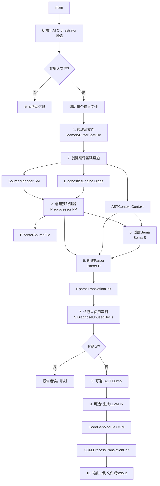

# Task 1.1: 梳理主调用链 - 完成报告

**Task ID**: 1.1  
**任务名称**: 梳理主调用链  
**执行时间**: 2026-04-19 15:30-15:45  
**状态**: ✅ DONE

---

## 📋 执行结果

### 入口点定位

**文件**: `tools/driver.cpp`  
**函数**: `int main(int argc, const char **argv)`

---

## 🔗 完整调用链



---

## 📝 关键步骤详解

### Step 1-2: 初始化和文件读取
```cpp
// tools/driver.cpp L176-189
for (const auto& File : InputFiles) {
  // 1. 读取源文件
  auto BufferOrErr = llvm::MemoryBuffer::getFile(File);
  std::unique_ptr<llvm::MemoryBuffer> Buffer = std::move(*BufferOrErr);
  StringRef SourceCode = Buffer->getBuffer();
```

### Step 3-5: 创建编译基础设施
```cpp
// tools/driver.cpp L196-205
// 2. 创建编译基础设施
SourceManager SM;
DiagnosticsEngine Diags;
ASTContext Context;

// 3. 创建预处理器
Preprocessor PP(SM, Diags);
PP.enterSourceFile(File, SourceCode);

// 5. 创建 Sema 实例
Sema S(Context, Diags);
```

### Step 6: Parser解析
```cpp
// tools/driver.cpp L208-214
// 6. 创建解析器并解析翻译单元
Parser P(PP, Context, S);
TranslationUnitDecl *TU = P.parseTranslationUnit();
```

### Step 7: 后处理诊断
```cpp
// tools/driver.cpp L220
S.DiagnoseUnusedDecls(TU);
```

### Step 9: CodeGen（可选）
```cpp
// tools/driver.cpp L239-260
if (EmitLLVM && TU) {
  llvm::LLVMContext LLVMCtx;
  CodeGenModule CGM(LLVMCtx, TargetTriple);
  CGM.ProcessTranslationUnit(TU);
  // 输出IR...
}
```

---

## 🎯 关键发现

### 1. 模块初始化顺序
```
SourceManager → DiagnosticsEngine → ASTContext
  ↓
Preprocessor (依赖 SM, Diags)
  ↓
Sema (依赖 Context, Diags)
  ↓
Parser (依赖 PP, Context, S)
```

### 2. 主要流程
```
Driver (driver.cpp)
  → Preprocessor (词法分析 + 宏展开)
  → Parser (语法分析 → AST)
  → Sema (语义分析，在Parser中回调)
  → CodeGen (IR生成，可选)
```

### 3. 错误处理
- Parser 内部维护错误状态 (`P.hasErrors()`)
- 解析完成后检查错误
- 有错误则跳过后续步骤

### 4. 可选功能
- `--ast-dump`: 输出AST
- `--emit-llvm`: 生成LLVM IR
- `--ai-assist`: AI辅助编译

---

## 📊 统计信息

- **入口文件**: 1个 (`tools/driver.cpp`)
- **主要模块**: 5个 (Driver, Preprocessor, Parser, Sema, CodeGen)
- **关键函数调用**: 约10个主要步骤
- **条件分支**: 3个 (AI初始化、AST Dump、Emit LLVM)

---

## ✅ 验收标准

- [x] 找到main()入口
- [x] 追踪到Parser入口 (`parseTranslationUnit`)
- [x] 识别各模块的初始化顺序
- [x] 绘制完整调用链
- [x] 记录关键步骤的代码位置

---

## 🔗 下一步

**依赖的Task**: Task 1.2 (细化Parser流程)  
**可以开始**: 是（依赖已满足）

**建议**: 
1. 从 `Parser::parseTranslationUnit()` 开始深入
2. 追踪 `parseDeclaration()` 的分支逻辑
3. 识别不同类型的声明如何处理

---

**输出文件**: 
- 本报告: `docs/review_task_1.1_report.md`
- 流程图: 见上方Mermaid图
