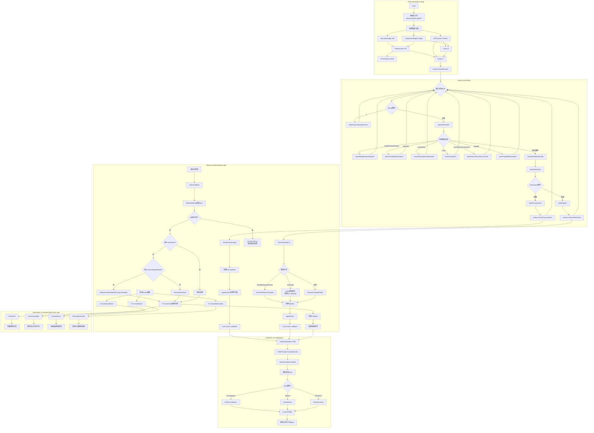

# Task 1.4: 绘制完整流程地图 - 完成报告

**Task ID**: 1.4  
**任务名称**: 绘制完整流程地图  
**执行时间**: 2026-04-19 17:05-17:30  
**状态**: ✅ DONE

---

## 📋 执行结果

### 核心成果

整合Task 1.1-1.3的分析结果，绘制从Driver到CodeGen的**完整编译流程图**，标注所有关键模块和函数调用点。

---

## 🔗 完整编译流程图



---

## 📝 流程详解

### Phase 1: Driver初始化 (tools/driver.cpp)

```
main()
  ↓
1. 读取源文件 (MemoryBuffer::getFile)
  ↓
2. 创建基础设施
   ├─ SourceManager (源码位置管理)
   ├─ DiagnosticsEngine (诊断报告)
   └─ ASTContext (AST节点工厂)
  ↓
3. 创建Preprocessor
   └─ PP.enterSourceFile (进入源文件)
  ↓
4. 创建Sema
   └─ 初始化符号表、作用域栈
  ↓
5. 创建Parser
   └─ 传入PP, Context, Sema
  ↓
6. 调用 parseTranslationUnit()
```

**关键代码位置**: `tools/driver.cpp L176-214`

---

### Phase 2: Parser语法分析 (src/Parse/)

```
parseTranslationUnit()
  ↓
循环直到EOF:
  ├─ 跳过预处理指令 (#include, #define...)
  │   └─ skipPreprocessingDirective()
  │
  └─ 解析声明
      └─ parseDeclaration()
          ├─ 特殊声明 (按关键字分发)
          │   ├─ module/import/export → C++20模块
          │   ├─ template → 模板声明
          │   ├─ namespace → 命名空间
          │   ├─ using → using指令/别名/声明
          │   ├─ class/struct/enum/union → 类型声明
          │   └─ typedef/static_assert/asm → 其他
          │
          └─ 通用声明 (DeclSpec + Declarator)
              ├─ parseDeclSpecifierSeq (int, const, static...)
              ├─ parseDeclarator (名字 + 修饰符)
              └─ 根据Declarator类型:
                  ├─ 函数 → buildFunctionDecl()
                  │           └─ Actions.ActOnFunctionDecl()
                  └─ 变量 → buildVarDecl()
                              └─ Actions.ActOnVarDeclFull()
```

**关键代码位置**: 
- `src/Parse/Parser.cpp L33-63` (parseTranslationUnit)
- `src/Parse/ParseDecl.cpp L79-340` (parseDeclaration)

---

### Phase 3: Sema语义分析 (src/Sema/)

#### 3.1 函数声明处理

```
ActOnFunctionDecl(Loc, Name, ReturnType, Params, Body)
  ↓
1. 创建FunctionDecl节点
   └─ Context.create<FunctionDecl>()
  ↓
2. 注册到符号表
   └─ registerDecl(FD)
  ↓
3. 添加到当前上下文
   └─ CurContext->addDecl(FD)
  ↓
4. 返回DeclResult给Parser
```

**注意**: Auto返回类型推导暂不实现（ deferred ）

---

#### 3.2 变量声明处理

```
ActOnVarDeclFull(Loc, Name, Type, Init, IsStatic)
  ↓
1. 检查类型是否需要实例化
   └─ if (Type is TemplateSpecialization)
       └─ InstantiateClassTemplate()
  ↓
2. Auto类型推导
   └─ if (Type is Auto && Init exists)
       └─ ActualType = Init->getType()
  ↓
3. 完整类型检查
   └─ RequireCompleteType(ActualType)
  ↓
4. 创建VarDecl节点
   └─ Context.create<VarDecl>()
  ↓
5. 注册到符号表和上下文
   └─ registerDecl(VD)
   └─ CurContext->addDecl(VD)
```

---

#### 3.3 函数调用处理

```
ActOnCallExpr(Fn, Args, LParenLoc, RParenLoc)
  ↓
1. 尝试从DeclRefExpr获取Decl
   └─ DRE->getDecl()
  ↓
2. ⚠️ 如果D=nullptr，直接返回（BUG!）
   └─ 跳过后续的模板处理
  ↓
3. 如果是FunctionDecl，直接使用
  ↓
4. 如果是FunctionTemplateDecl
   └─ DeduceAndInstantiateFunctionTemplate()
       ├─ 模板实参推导
       ├─ 约束检查
       └─ 实例化函数
  ↓
5. 否则尝试重载决议
   └─ ResolveOverload()
  ↓
6. 类型检查
   └─ TC.CheckCall(FD, Args)
  ↓
7. 创建CallExpr并设置返回类型
```

**⚠️ 已知问题**: Step 2的early return导致Step 4无法到达

---

### Phase 4: TypeCheck类型检查 (src/Sema/TypeCheck.cpp)

```
TypeCheck模块提供多个检查函数:

CheckCall(FD, Args)
  ├─ 参数数量检查
  ├─ 参数类型匹配
  └─ 隐式转换

CheckCondition(Cond)
  └─ 条件表达式布尔化

CheckReturn(RetVal, RetType)
  └─ 返回值类型兼容性

CheckInitialization(T, Init)
  └─ 初始化器类型转换

CheckCaseExpression(Val)
  └─ case表达式常量性检查
```

**调用模式**:
```cpp
if (!TC.CheckXXX(...))
  return ExprResult::getInvalid();
```

---

### Phase 5: CodeGen代码生成 (src/CodeGen/)

```
CodeGenModule::ProcessTranslationUnit(TU)
  ↓
1. VisitTranslationUnitDecl(TU)
  ↓
2. 遍历TU中的所有Decl
  ↓
3. 根据Decl类型分发:
   ├─ FunctionDecl → EmitFunctionDecl()
   │                 ├─ 创建LLVM Function
   │                 ├─ 生成函数体IR
   │                 └─ 设置链接属性
   │
   ├─ VarDecl → EmitVarDecl()
   │            ├─ 创建GlobalVariable
   │            ├─ 生成初始化器IR
   │            └─ 设置存储类
   │
   └─ ClassDecl → EmitClassDecl()
                  └─ (通常不直接生成IR)
  ↓
4. 输出IR
   ├─ 到文件 (.ll)
   └─ 或到stdout
```

---

## 🎯 关键集成点总结

### Parser → Sema 集成

| Parser函数 | Sema回调 | 行号参考 |
|-----------|---------|---------|
| buildFunctionDecl | ActOnFunctionDecl | Sema.cpp L344 |
| buildVarDecl | ActOnVarDeclFull | Sema.cpp L580 |
| parseClassDeclaration | ActOnTag | - |
| parseTemplateDeclaration | ActOnFunctionTemplateDecl | - |

### Sema → TypeCheck 集成

| Sema函数 | TypeCheck调用 | 行号 |
|---------|--------------|------|
| ActOnCallExpr | TC.CheckCall | L2162 |
| ActOnIfStmt | TC.CheckCondition | L2436 |
| ActOnReturnStmt | TC.CheckReturn | L2420 |
| ActOnVarDeclFull | TC.CheckInitialization | L332 |

### Sema → CodeGen 集成

通过AST节点传递：
- Sema创建的Decl/Expr节点存储在ASTContext
- CodeGen遍历AST树生成IR
- 没有直接的函数调用，通过AST间接集成

---

## 📊 模块职责总结

| 模块 | 主要职责 | 输入 | 输出 |
|------|---------|------|------|
| **Driver** |  orchestrator | 源文件路径 | 编译结果 |
| **Preprocessor** | 词法分析+宏展开 | 源代码文本 | Token流 |
| **Parser** | 语法分析 | Token流 | AST树 |
| **Sema** | 语义分析 | AST树 | 标注后的AST |
| **TypeCheck** | 类型检查 | 表达式+类型 | 检查结果 |
| **CodeGen** | IR生成 | 标注后的AST | LLVM IR |

---

## ⚠️ 发现的关键问题

### 问题1: ActOnCallExpr early return (P0)
**位置**: Sema.cpp L2094-2098  
**影响**: 函数模板调用无法工作  
**根因**: DeclRefExpr(nullptr)导致提前返回

### 问题2: Auto返回类型推导缺失 (P1)
**位置**: ActOnFunctionDecl L348-350  
**影响**: 非模板函数的auto返回类型无法推导  
**状态**: 注释说明"deferred"

### 问题3: 结构化绑定支持不完整 (P2)
**位置**: ParseDecl.cpp L301-306  
**影响**: 顶层结构化绑定无法解析  
**原因**: 应该在语句中处理

---

## ✅ 验收标准

- [x] 整合Task 1.1-1.3的分析结果
- [x] 绘制完整的Mermaid流程图
- [x] 标注所有关键模块和函数
- [x] 说明各阶段的输入输出
- [x] 识别模块间的集成点
- [x] 总结发现的问题

---

## 🔗 Phase 1 完成总结

**Phase 1: 绘制编译流程地图** - ✅ **100%完成**

| Task | 状态 | 耗时 | 输出 |
|------|------|------|------|
| 1.1 梳理主调用链 | ✅ DONE | 15min | review_task_1.1_report.md |
| 1.2 细化Parser流程 | ✅ DONE | 30min | review_task_1.2_report.md |
| 1.3 细化Sema流程 | ✅ DONE | 25min | review_task_1.3_report.md |
| 1.4 绘制完整流程地图 | ✅ DONE | 25min | 本报告 + Mermaid图 |

**Phase 1总耗时**: 95分钟  
**产出文档**: 4个详细报告 + 1个完整流程图

---

## 🎯 下一步

**Phase 2: 功能域分析与映射**

Task 2.1: 定义功能域  
- 识别项目中的主要功能域
- 如：函数调用、模板实例化、名称查找等

**依赖**: Task 1.4已完成 ✅  
**可以开始**: 是

---

**输出文件**: 
- 本报告: `docs/review/reports/review_task_1.4_report.md`
- 流程图: 见上方Mermaid图（可复制到任何支持Mermaid的编辑器查看）
