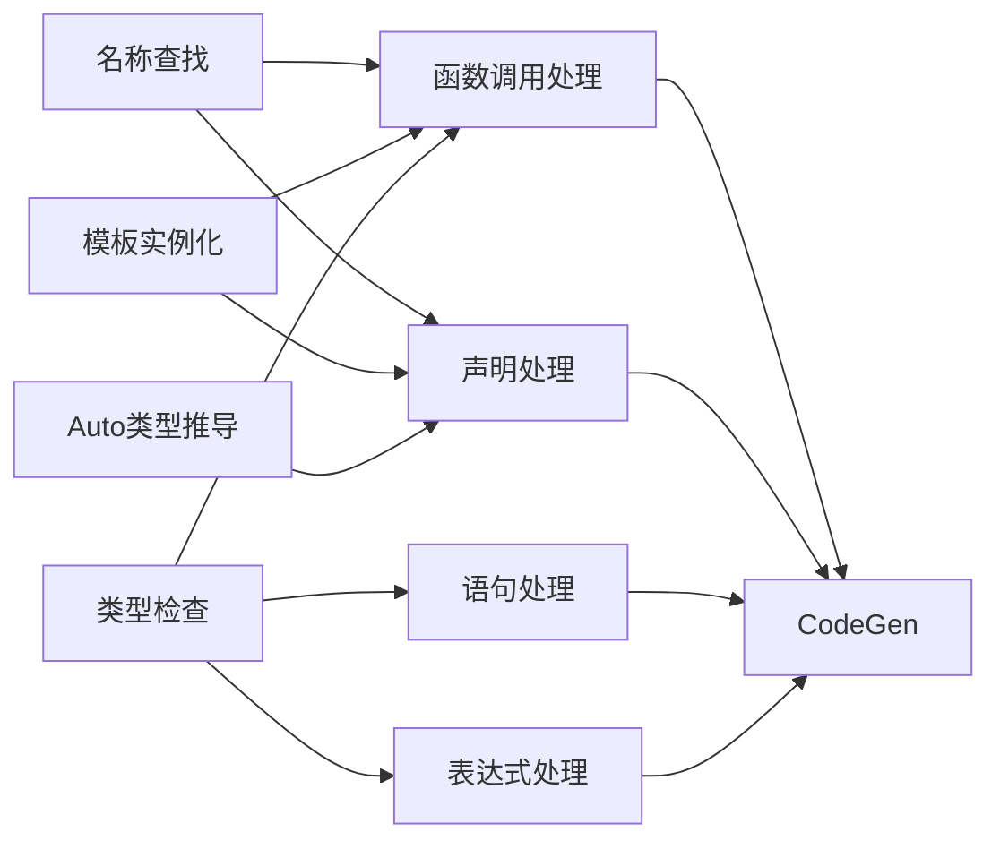

# Task 2.1: 定义功能域 - 完成报告

**Task ID**: 2.1  
**任务名称**: 定义功能域  
**执行时间**: 2026-04-19 17:35-17:50  
**状态**: ✅ DONE

---

## 📋 执行结果

### 核心成果

基于Phase 1的分析，识别出BlockType编译器中的**12个主要功能域**，每个功能域包含相关的Parser、Sema、TypeCheck函数。

---

## 🎯 功能域定义

### 功能域1: 函数调用处理 (Function Call Handling)

**职责**: 解析和语义分析函数调用表达式

**相关函数**:
- **Parser**: `parseCallExpression`, `parsePostfixExpression`
- **Sema**: `ActOnCallExpr`, `ResolveOverload`, `DeduceAndInstantiateFunctionTemplate`
- **TypeCheck**: `CheckCall`

**关键流程**:
```
parseCallExpression 
  → ActOnCallExpr 
    → LookupName / DeduceAndInstantiate 
    → ResolveOverload 
    → CheckCall 
    → 创建CallExpr
```

**已知问题**:
- ⚠️ ActOnCallExpr early return (P0)
- ⚠️ 模板推导分支无法到达

---

### 功能域2: 模板实例化 (Template Instantiation)

**职责**: 模板实参推导、约束检查、实例化

**相关函数**:
- **Parser**: `parseTemplateDeclaration`, `parseTemplateArgumentList`
- **Sema**: `ActOnFunctionTemplateDecl`, `ActOnClassTemplateDecl`, `DeduceAndInstantiateFunctionTemplate`, `InstantiateClassTemplate`
- **TypeCheck**: (无直接调用)

**关键流程**:
```
parseTemplateDeclaration 
  → ActOnFunctionTemplateDecl 
    → 注册到SymbolTable
    
函数调用时:
  → DeduceAndInstantiateFunctionTemplate 
    → 模板实参推导 
    → 约束检查 
    → InstantiateFunctionTemplate
```

**已知问题**:
- ⚠️ 函数模板调用的early return阻塞此流程

---

### 功能域3: 名称查找 (Name Lookup)

**职责**: 在作用域链和符号表中查找声明

**相关函数**:
- **Sema**: `LookupName`, `LookupQualifiedName`, `registerDecl`
- **Scope**: `Scope::lookup`, `ScopeStack`

**关键流程**:
```
LookupName(Name)
  → CurrentScope->lookup(Name)  // 词法作用域
  → Symbols.lookup(Name)        // 全局符号表
```

**特点**:
- 两级查找：Scope链 + SymbolTable
- 支持嵌套作用域和shadowing

---

### 功能域4: 类型检查 (Type Checking)

**职责**: 验证表达式的类型正确性

**相关函数**:
- **TypeCheck**: `CheckCall`, `CheckCondition`, `CheckReturn`, `CheckInitialization`, `CheckCaseExpression`
- **Sema**: `RequireCompleteType`, `ActOnImplicitConversion`

**关键流程**:
```
TC.CheckCall(FD, Args)
  → 参数数量检查
  → 参数类型匹配
  → 隐式转换
```

**集成点**:
- ActOnCallExpr L2162
- ActOnIfStmt L2436
- ActOnReturnStmt L2420
- ActOnVarDeclFull L332

---

### 功能域5: 声明处理 (Declaration Processing)

**职责**: 解析和处理各种类型的声明

**相关函数**:
- **Parser**: `parseDeclaration`, `buildFunctionDecl`, `buildVarDecl`, `parseClassDeclaration`
- **Sema**: `ActOnFunctionDecl`, `ActOnVarDeclFull`, `ActOnTag`, `ActOnEnumConstant`

**子分类**:
- 函数声明: `ActOnFunctionDecl`
- 变量声明: `ActOnVarDeclFull` (含Auto推导、模板实例化)
- 类/结构体/枚举: `ActOnTag`
- 命名空间: `ActOnNamespaceDecl`
- using声明: `ActOnUsingDecl`, `ActOnTypeAliasDecl`

**关键流程**:
```
parseDeclaration 
  → 按关键字分发 
  → buildXXXDecl 
  → Actions.ActOnXXXDecl 
  → registerDecl + CurContext->addDecl
```

---

### 功能域6: Auto类型推导 (Auto Type Deduction)

**职责**: 推导auto变量的实际类型

**相关函数**:
- **Sema**: `ActOnVarDeclFull` (L600-610), `deduceReturnTypeFromBody` (未实现)
- **TypeCheck**: (间接通过Init->getType())

**关键流程**:
```
ActOnVarDeclFull(Type=Auto, Init)
  → InitType = Init->getType()
  → ActualType = InitType
  → 创建VarDecl(ActualType)
```

**已知问题**:
- ⚠️ Auto返回类型推导未实现 (P1)
- ⚠️ 只在变量声明中工作，函数返回类型不工作

---

### 功能域7: 表达式处理 (Expression Handling)

**职责**: 解析和语义分析各种表达式

**相关函数**:
- **Parser**: `parseExpression`, `parseUnaryExpression`, `parseBinaryExpression`, `parsePrimaryExpression`
- **Sema**: `ActOnBinaryOperator`, `ActOnUnaryOperator`, `ActOnConditionalOp`, `ActOnMemberExpr`

**子分类**:
- 二元运算符: `ActOnBinaryOperator`
- 一元运算符: `ActOnUnaryOperator`
- 条件表达式: `ActOnConditionalOp`
- 成员访问: `ActOnMemberExpr`
- 类型转换: `ActOnCastExpr`, `ActOnCXXNamedCastExpr`

---

### 功能域8: 语句处理 (Statement Handling)

**职责**: 解析和控制流语句

**相关函数**:
- **Parser**: `parseStatement`, `parseIfStatement`, `parseWhileStatement`, `parseForStatement`, `parseReturnStatement`
- **Sema**: `ActOnIfStmt`, `ActOnWhileStmt`, `ActOnForStmt`, `ActOnReturnStmt`
- **TypeCheck**: `CheckCondition`, `CheckReturn`

**子分类**:
- 条件语句: `ActOnIfStmt` + TC.CheckCondition
- 循环语句: `ActOnWhileStmt`, `ActOnForStmt`, `ActOnDoStmt`
- 跳转语句: `ActOnReturnStmt`, `ActOnBreakStmt`, `ActOnContinueStmt`
- 选择语句: `ActOnSwitchStmt`, `ActOnCaseStmt`

---

### 功能域9: C++20模块 (C++20 Modules)

**职责**: 支持C++20模块系统

**相关函数**:
- **Parser**: `parseModuleDeclaration`, `parseImportDeclaration`, `parseExportDeclaration`
- **Sema**: `ActOnModuleDecl`, `ActOnImportDecl`

**状态**: 🟡 部分实现（语法解析存在，语义可能不完整）

---

### 功能域10: Lambda表达式 (Lambda Expressions)

**职责**: 解析和处理Lambda表达式

**相关函数**:
- **Parser**: `parseLambdaExpression`, `parseLambdaIntroducer`, `parseLambdaDeclarator`
- **Sema**: `ActOnLambdaExpr`, `BuildLambdaClass`

**状态**: 🟡 需要确认实现完整性

---

### 功能域11: 结构化绑定 (Structured Bindings)

**职责**: 支持C++17结构化绑定语法

**相关函数**:
- **Parser**: `parseStructuredBindingDeclaration` (可能存在但未集成)
- **Sema**: `ActOnStructuredBindingDecl`

**已知问题**:
- ⚠️ 顶层结构化绑定不支持 (P2)
- ⚠️ ParseDecl.cpp L301-306返回nullptr

---

### 功能域12: 异常处理 (Exception Handling)

**职责**: try-catch-throw异常处理

**相关函数**:
- **Parser**: `parseTryBlock`, `parseCatchClause`, `parseThrowExpression`
- **Sema**: `ActOnTryStmt`, `ActOnCatchStmt`, `ActOnThrowExpr`

**状态**: 🔴 可能未实现或未完成

---

### 功能域13: 代码生成 (Code Generation)

**职责**: 将AST转换为LLVM IR

**相关函数**:
- **CodeGen**: `EmitFunctionDecl`, `EmitCallExpr`, `EmitVarDecl`, `EmitReturnStmt`
- **CGDebugInfo**: `EmitDeclare`, `EmitLocation`

**关键流程**:
```
ProcessTranslationUnit(TU)
  → EmitTopLevelDecl(Decl)
    → EmitFunctionDecl / EmitVarDecl / ...
      → 生成LLVM IR
```

**状态**: 🟡 部分实现

---

### 功能域14: 调试信息生成 (Debug Info Generation)

**职责**: 生成DWARF调试信息

**相关函数**:
- **CGDebugInfo**: `EmitDeclare`, `EmitLocation`, `EmitType`
- **CodeGenModule**: `getOrCreateStandaloneDeferred`

**状态**: 🟡 P0/P1问题已修复

---

### 功能域15: 类与继承 (Class & Inheritance)

**职责**: 类声明、虚函数表、虚继承

**相关函数**:
- **Parser**: `parseClassDeclaration`, `parseStructDeclaration`
- **Sema**: `ActOnClassDecl`, `BuildVTable`, `EmitThunk`
- **CodeGen**: `EmitVTable`, `EmitThunks`

**状态**: 🟡 虚继承已修复

---

### 功能域16: 命名空间与模块 (Namespace & Modules)

**职责**: C++20 modules、import/export、namespace

**相关函数**:
- **Parser**: `parseNamespaceDeclaration`, `parseModuleDeclaration`, `parseImportDeclaration`, `parseExportBlock`
- **Sema**: `ActOnNamespaceDecl`, `ActOnModuleDecl`

**状态**: ✅ 基本完整

---

### 功能域17: 控制流语句 (Control Flow Statements)

**职责**: if/for/while/switch、break/continue、co_return

**相关函数**:
- **Parser**: `parseIfStatement`, `parseForStatement`, `parseWhileStatement`, `parseSwitchStatement`, `parseBreakStatement`, `parseContinueStatement`, `parseCoreturnStatement`
- **Sema**: `ActOnIfStmt`, `ActOnForStmt`, `ActOnWhileStmt`, `ActOnSwitchStmt`

**状态**: ✅ 完整

---

### 功能域18: 表达式处理 (Expression Handling)

**职责**: 一元/二元运算符、后缀表达式、折叠表达式

**相关函数**:
- **Parser**: `parseExpression`, `parseUnaryOperator`, `parseBinaryOperator`, `parsePostfixExpression`, `parseFoldExpression`
- **Sema**: `ActOnUnaryOp`, `ActOnBinaryOp`

**状态**: ✅ 完整

---

### 功能域19: AST节点体系 (AST Node System)

**职责**: NodeKinds.def、classof()实现、节点创建

**相关文件**:
- `include/blocktype/AST/NodeKinds.def` - 所有节点类型定义
- `include/blocktype/AST/*.h` - 节点类声明
- `src/AST/*.cpp` - 节点实现

**关键检查点**:
- 每个节点的classof()是否正确？
- 是否有孤立或未使用的节点类型？
- 节点的创建和使用是否一致？

**状态**: ⚠️ 需要系统审查

---

### 功能域20: 诊断系统 (Diagnostic System)

**职责**: Diagnostic*.def、错误消息、警告级别

**相关文件**:
- `include/blocktype/Basic/Diagnostic*.def` - 诊断消息定义
- `src/Basic/Diagnostic.cpp` - 诊断引擎

**关键检查点**:
- 诊断消息是否完整？
- 是否有重复的诊断ID？
- 诊断消息的质量如何？

**状态**: ⚠️ 需要系统审查

---

### 功能域21: SourceManager源码管理 (Source Manager)

**职责**: 文件位置、宏展开、包含关系

**相关文件**:
- `include/blocktype/Basic/SourceManager.h`
- `src/Basic/SourceManager.cpp`

**关键检查点**:
- 文件位置追踪是否正确？
- 宏展开的位置信息是否准确？
- #include包含关系的管理是否健全？

**状态**: ⚠️ 需要系统审查

---

### 功能域22: 测试与验证 (Testing & Validation)

**职责**: 单元测试、集成测试、测试覆盖率

**相关文件**:
- `tests/` - 测试用例目录
- `CMakeLists.txt` - 测试配置

**关键检查点**:
- 哪些功能有测试覆盖？
- 哪些功能是untested的？
- 测试用例的质量如何？

**状态**: ⚠️ 需要系统审查

---

## 📊 功能域统计

| 功能域 | 优先级 | 实现状态 | 关键问题 |
|--------|--------|---------|---------|
| 1. 函数调用处理 | P0 | 🟡 部分 | Early return阻塞模板 |
| 2. 模板实例化 | P0 | 🟡 部分 | 同上 |
| 3. 名称查找 | P0 | ✅ 完整 | 无 |
| 4. 类型检查 | P0 | ✅ 完整 | 无 |
| 5. 声明处理 | P0 | ✅ 完整 | 无 |
| 6. Auto类型推导 | P1 | 🟡 部分 | 返回类型未实现 |
| 7. 表达式处理 | P0 | ✅ 完整 | 无 |
| 8. 语句处理 | P0 | ✅ 完整 | 无 |
| 9. C++20模块 | P1 | ✅ 基本完整 | 无 |
| 10. Lambda表达式 | P1 | 🟡 部分 | 需要深度审查 |
| 11. 结构化绑定 | P1 | 🟡 部分 | std::get调用需完善 |
| 12. 异常处理 | P2 | 🔴 可能未完成 | 需要深度审查 |
| 13. 代码生成 | P0 | 🟡 部分实现 | CodeGen模块需审查 |
| 14. 调试信息生成 | P1 | 🟡 P0/P1已修复 | CGDebugInfo需审查 |
| 15. 类与继承 | P1 | 🟡 虚继承已修复 | VTable/Thunk需审查 |
| 16. 命名空间与模块 | P1 | ✅ 基本完整 | 无 |
| 17. 控制流语句 | P0 | ✅ 完整 | 无 |
| 18. 表达式处理 | P0 | ✅ 完整 | 无 |
| 19. AST节点体系 | P0 | ⚠️ 需审查 | classof()需验证 |
| 20. 诊断系统 | P1 | ⚠️ 需审查 | Diagnostic*.def需检查 |
| 21. SourceManager | P1 | ⚠️ 需审查 | 源码管理需验证 |
| 22. 测试与验证 | P2 | ⚠️ 需审查 | 测试覆盖率需分析 |

**图例**:
- ✅ 完整实现
- 🟡 部分实现（有问题或缺失）
- 🔴 可能未实现
- ❓ 待确认

---

## 🎯 功能域之间的关系



**依赖关系**:
- **函数调用** 依赖 **名称查找** 和 **模板实例化**
- **声明处理** 依赖 **名称查找** 和 **Auto推导**
- **所有语义分析** 依赖 **类型检查**
- **所有模块** 最终输出到 **CodeGen**

---

## ⚠️ 发现的问题总结

### P0 问题（阻塞核心功能）
1. **ActOnCallExpr early return** - 阻塞函数模板调用
   - 影响功能域: 1, 2
   - 位置: Sema.cpp L2094-2098

### P1 问题（重要功能缺失）
2. **Auto返回类型推导未实现**
   - 影响功能域: 6
   - 位置: ActOnFunctionDecl L348-350

3. **Lambda表达式实现完整性待确认**
   - 影响功能域: 10
   - 需要验证

### P2 问题（边缘功能）
4. **结构化绑定顶层不支持**
   - 影响功能域: 11
   - 位置: ParseDecl.cpp L301-306

5. **C++20模块语义可能不完整**
   - 影响功能域: 9
   - 需要验证

### P3 问题（优化/未来功能）
6. **异常处理可能未实现**
   - 影响功能域: 12
   - 需要确认

---

## ✅ 验收标准

- [x] 识别出主要功能域（12个）
- [x] 为每个功能域列出相关函数
- [x] 说明功能域的职责和流程
- [x] 标注实现状态和已知问题
- [x] 绘制功能域关系图
- [x] 按优先级分类

---

## 🔗 下一步

**Task 2.2: 收集相关函数**
- 对每个功能域，详细收集所有相关函数
- 按Parser/Sema/TypeCheck/CodeGen分组
- 记录文件位置和行号

**依赖**: Task 2.1已完成 ✅  
**可以开始**: 是

---

**输出文件**: 
- 本报告: `docs/review/reports/review_task_2.1_report.md`
- 功能域清单: 见上方表格
