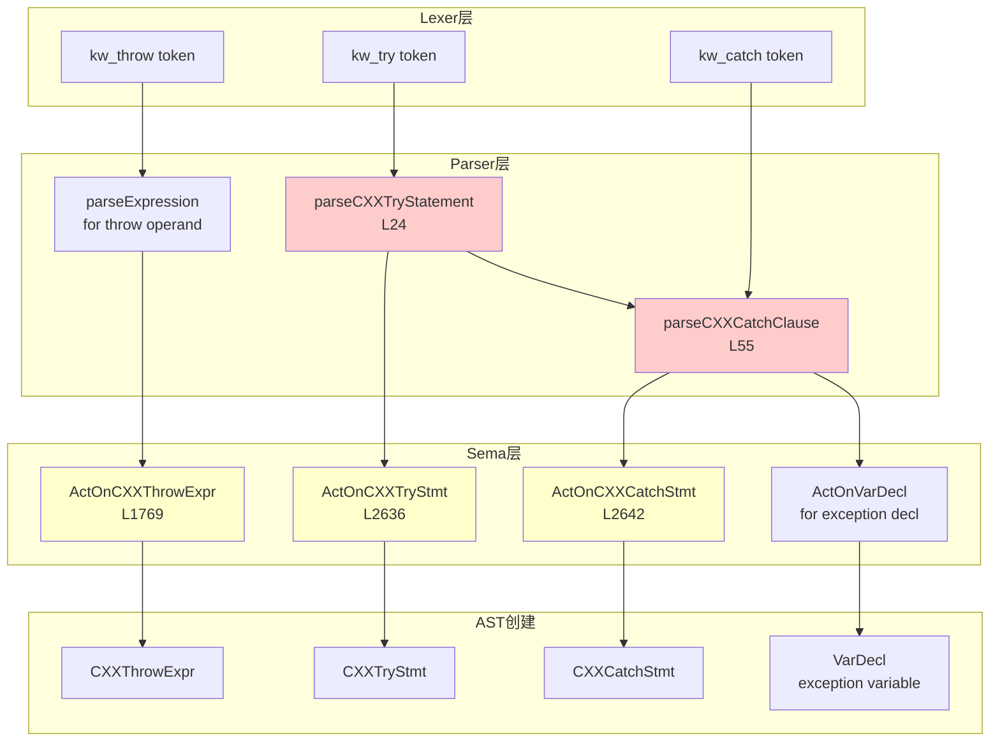

# Task 2.2.12: 异常处理功能域 - 函数清单

**任务ID**: Task 2.2.12  
**功能域**: 异常处理 (Exception Handling)  
**执行时间**: 2026-04-19 22:20-22:35  
**状态**: ✅ DONE

---

## 📊 扫描结果总览

| 层级 | 文件数 | 函数数 | 说明 |
|------|--------|--------|------|
| Sema层 | 1个文件 | 3个函数 | ActOnCXXThrowExpr, ActOnCXXTryStmt, ActOnCXXCatchStmt |
| Parser层 | 1个文件 | 2个函数 | parseCXXTryStatement, parseCXXCatchClause |
| AST类 | 2个文件 | 3个类 | CXXThrowExpr, CXXTryStmt, CXXCatchStmt |
| **总计** | **4个文件** | **5个函数 + 3个类** | - |

---

## 🔍 核心函数清单

### 1. Sema::ActOnCXXThrowExpr - throw表达式处理

**文件**: `src/Sema/Sema.cpp`  
**行号**: L1769-1774  
**类型**: `ExprResult Sema::ActOnCXXThrowExpr(SourceLocation Loc, Expr *Operand)`

**功能说明**:
处理throw表达式，创建CXXThrowExpr节点

**实现代码**:
```cpp
ExprResult Sema::ActOnCXXThrowExpr(SourceLocation Loc, Expr *Operand) {
  auto *TE = Context.create<CXXThrowExpr>(Loc, Operand);
  auto *VoidType = Context.getBuiltinType(BuiltinKind::Void);
  TE->setType(QualType(VoidType, Qualifier::None));
  return ExprResult(TE);
}
```

**关键特性**:
- ✅ 简单工厂模式
- ✅ 设置类型为void（throw表达式不返回值）
- ⚠️ **未检查操作数类型是否可抛出**
- ⚠️ **未验证是否在try块内或函数级别**

**使用场景**:
- `throw e;` - 抛出异常对象
- `throw;` - 重新抛出当前异常（Operand为nullptr）

---

### 2. Sema::ActOnCXXTryStmt - try语句处理

**文件**: `src/Sema/Sema.cpp`  
**行号**: L2636-2640  
**类型**: `StmtResult Sema::ActOnCXXTryStmt(SourceLocation TryLoc, Stmt *TryBlock, llvm::ArrayRef<Stmt *> Handlers)`

**功能说明**:
处理try-catch语句

**实现代码**:
```cpp
StmtResult Sema::ActOnCXXTryStmt(SourceLocation TryLoc, Stmt *TryBlock,
                                  llvm::ArrayRef<Stmt *> Handlers) {
  auto *TS = Context.create<CXXTryStmt>(TryLoc, TryBlock, Handlers);
  return StmtResult(TS);
}
```

**关键特性**:
- ✅ 简单工厂模式
- ⚠️ **未检查至少有一个catch子句**
- ⚠️ **未验证catch子句的类型兼容性**
- ⚠️ **未检查catch-all的位置（应该在最后）**

**语法**:
```cpp
try {
  // try block
} catch (Type1 e1) {
  // handler 1
} catch (Type2 e2) {
  // handler 2
} catch (...) {
  // catch-all
}
```

---

### 3. Sema::ActOnCXXCatchStmt - catch子句处理

**文件**: `src/Sema/Sema.cpp`  
**行号**: L2642-2648  
**类型**: `StmtResult Sema::ActOnCXXCatchStmt(SourceLocation CatchLoc, VarDecl *ExceptionDecl, Stmt *HandlerBlock)`

**功能说明**:
处理单个catch子句

**实现代码**:
```cpp
StmtResult Sema::ActOnCXXCatchStmt(SourceLocation CatchLoc,
                                    VarDecl *ExceptionDecl,
                                    Stmt *HandlerBlock) {
  auto *CS = Context.create<CXXCatchStmt>(CatchLoc, ExceptionDecl,
                                          HandlerBlock);
  return StmtResult(CS);
}
```

**关键特性**:
- ✅ 简单工厂模式
- ✅ 支持catch-all（ExceptionDecl为nullptr）
- ⚠️ **未检查异常声明类型的完整性**
- ⚠️ **未验证类型是否可以捕获（非引用/指针需要拷贝构造）**

**参数说明**:
- `ExceptionDecl`: 异常变量声明（catch-all时为nullptr）
- `HandlerBlock`: catch块的CompoundStmt

---

### 4. Parser::parseCXXTryStatement - try语句解析

**文件**: `src/Parse/ParseStmtCXX.cpp`  
**行号**: L24-49  
**类型**: `Stmt *Parser::parseCXXTryStatement()`

**功能说明**:
解析完整的try-catch语句

**实现代码**:
```cpp
Stmt *Parser::parseCXXTryStatement() {
  SourceLocation TryLoc = Tok.getLocation();
  consumeToken(); // consume 'try'

  // Parse try block
  if (!Tok.is(TokenKind::l_brace)) {
    emitError(DiagID::err_expected_lbrace);
    return Actions.ActOnNullStmt(TryLoc).get();
  }

  Stmt *TryBlock = parseCompoundStatement();
  if (TryBlock == nullptr) {
    TryBlock = Actions.ActOnNullStmt(TryLoc).get();
  }

  // Parse catch clauses
  llvm::SmallVector<Stmt *, 4> CatchStmts;
  while (Tok.is(TokenKind::kw_catch)) {
    Stmt *Catch = parseCXXCatchClause();
    if (Catch != nullptr) {
      CatchStmts.push_back(Catch);
    }
  }

  return Actions.ActOnCXXTryStmt(TryLoc, TryBlock, CatchStmts).get();
}
```

**关键特性**:
- ✅ 解析try块
- ✅ 循环解析多个catch子句
- ⚠️ **未检查至少有一个catch子句**（C++允许只有try-finally，但标准C++要求至少一个catch）
- ⚠️ **未检查catch-all必须在最后**

**实现流程**:
```
输入: 'try' token
  ↓
Step 1: 解析try块（CompoundStmt）
  ↓
Step 2: 循环解析catch子句
  ├─ 调用parseCXXCatchClause
  └─ 添加到CatchStmts数组
  ↓
Step 3: 调用ActOnCXXTryStmt创建AST
  ↓
输出: CXXTryStmt
```

---

### 5. Parser::parseCXXCatchClause - catch子句解析

**文件**: `src/Parse/ParseStmtCXX.cpp`  
**行号**: L55-106  
**类型**: `Stmt *Parser::parseCXXCatchClause()`

**功能说明**:
解析单个catch子句

**实现代码**:
```cpp
Stmt *Parser::parseCXXCatchClause() {
  SourceLocation CatchLoc = Tok.getLocation();
  consumeToken(); // consume 'catch'

  // Parse '('
  if (!tryConsumeToken(TokenKind::l_paren)) {
    emitError(DiagID::err_expected_lparen);
    return Actions.ActOnNullStmt(CatchLoc).get();
  }

  // Check for catch-all: catch (...)
  VarDecl *ExceptionDecl = nullptr;
  if (Tok.is(TokenKind::ellipsis)) {
    consumeToken(); // consume '...'
    // catch-all: ExceptionDecl is nullptr
  } else {
    // Parse exception declaration (type name)
    QualType ExceptionType = parseType();
    if (ExceptionType.isNull()) {
      emitError(DiagID::err_expected_type);
    } else {
      // Parse optional variable name
      llvm::StringRef VarName;
      SourceLocation VarLoc;
      if (Tok.is(TokenKind::identifier)) {
        VarName = Tok.getText();
        VarLoc = Tok.getLocation();
        consumeToken();
      }
      // Create VarDecl for exception declaration
      ExceptionDecl = llvm::cast<VarDecl>(Actions.ActOnVarDecl(VarLoc, VarName, ExceptionType, nullptr).get());
    }
  }

  // Parse ')'
  if (!tryConsumeToken(TokenKind::r_paren)) {
    emitError(DiagID::err_expected_rparen);
  }

  // Parse catch block
  if (!Tok.is(TokenKind::l_brace)) {
    emitError(DiagID::err_expected_lbrace);
    return Actions.ActOnNullStmt(CatchLoc).get();
  }

  Stmt *CatchBlock = parseCompoundStatement();
  if (CatchBlock == nullptr) {
    CatchBlock = Actions.ActOnNullStmt(CatchLoc).get();
  }

  return Actions.ActOnCXXCatchStmt(CatchLoc, ExceptionDecl, CatchBlock).get();
}
```

**支持的语法**:
```cpp
catch (Type e) { ... }       // 命名捕获
catch (Type) { ... }         // 无名捕获
catch (...) { ... }          // catch-all
```

**关键特性**:
- ✅ 支持catch-all（`...`）
- ✅ 支持命名/无名异常变量
- ✅ 调用`ActOnVarDecl`创建异常声明
- ⚠️ **未检查异常类型是否为完整类型**
- ⚠️ **未检查异常类型是否可以被捕获（非abstract等）**

**实现流程**:
```
输入: 'catch' token
  ↓
Step 1: 解析'('
  ↓
Step 2: 检查是否为catch-all
  ├─ 如果是...：ExceptionDecl = nullptr
  └─ 否则：
      ├─ 解析异常类型
      ├─ 解析可选的变量名
      └─ 调用ActOnVarDecl创建VarDecl
  ↓
Step 3: 解析')'
  ↓
Step 4: 解析catch块（CompoundStmt）
  ↓
Step 5: 调用ActOnCXXCatchStmt创建AST
  ↓
输出: CXXCatchStmt
```

---

## 📦 AST类定义

### CXXThrowExpr类

**文件**: `include/blocktype/AST/Expr.h`  
**行号**: L959-980

**成员变量**:
```cpp
class CXXThrowExpr : public Expr {
  Expr *SubExpr;
};
```

**方法**:
- `getSubExpr()`: 获取被抛出的表达式
- `isTypeDependent()`: 如果子表达式类型依赖则返回true

**特点**:
- 继承自Expr（是表达式而非语句）
- 类型始终为void
- 支持rethrow（SubExpr为nullptr）

---

### CXXTryStmt类

**文件**: `include/blocktype/AST/Stmt.h`  
**行号**: L460-480

**成员变量**:
```cpp
class CXXTryStmt : public Stmt {
  Stmt *TryBlock;
  llvm::SmallVector<Stmt *, 4> CatchBlocks;
};
```

**方法**:
- `getTryBlock()`: 获取try块
- `getCatchBlocks()`: 获取所有catch子句

**特点**:
- 继承自Stmt
- 存储多个catch子句

---

### CXXCatchStmt类

**文件**: `include/blocktype/AST/Stmt.h`  
**行号**: L483-501

**成员变量**:
```cpp
class CXXCatchStmt : public Stmt {
  VarDecl *ExceptionDecl;
  Stmt *HandlerBlock;
};
```

**方法**:
- `getExceptionDecl()`: 获取异常变量声明（catch-all时为nullptr）
- `getHandlerBlock()`: 获取catch块

**特点**:
- 继承自Stmt
- ExceptionDecl为nullptr表示catch-all

---

## 🔄 完整调用链图



---

## ⚠️ 发现的问题

### P1问题 #1: 异常处理语义完全未实现

**严重程度**: 🔴 **P1 - 严重问题**

**位置**: 整个异常处理系统

**问题描述**:
- Parser能正确解析try/catch/throw语法
- Sema只创建AST节点，**无任何语义处理**
- **未实现异常类型匹配机制**
- **未实现栈展开逻辑**
- **未检查throw是否在合适的上下文中**
- **未验证catch子句的顺序和可达性**

**影响**:
- 可以编译带异常的代码，但CodeGen不知道如何处理
- 无法检测不可达的catch子句
- 无法验证异常类型是否可以被捕获
- throw可以在任何地方使用（包括全局作用域）

**建议修复路线图**:

**Phase 1: 基础验证**
```cpp
ExprResult Sema::ActOnCXXThrowExpr(SourceLocation Loc, Expr *Operand) {
  // Check if we're in a function context
  if (!CurFunction) {
    Diags.report(Loc, DiagID::err_throw_outside_function);
    return ExprResult::getInvalid();
  }
  
  // Check if operand type is complete
  if (Operand && !Operand->getType().isNull()) {
    if (!TC.isCompleteType(Operand->getType())) {
      Diags.report(Loc, DiagID::err_throw_incomplete_type,
                   Operand->getType().getAsString());
      return ExprResult::getInvalid();
    }
  }
  
  auto *TE = Context.create<CXXThrowExpr>(Loc, Operand);
  auto *VoidType = Context.getBuiltinType(BuiltinKind::Void);
  TE->setType(QualType(VoidType, Qualifier::None));
  return ExprResult(TE);
}
```

**Phase 2: Try-Catch验证**
```cpp
StmtResult Sema::ActOnCXXTryStmt(SourceLocation TryLoc, Stmt *TryBlock,
                                  llvm::ArrayRef<Stmt *> Handlers) {
  // Check at least one catch clause
  if (Handlers.empty()) {
    Diags.report(TryLoc, DiagID::err_try_without_catch);
    return StmtResult::getInvalid();
  }
  
  // Check catch-all is last
  bool FoundCatchAll = false;
  for (unsigned i = 0; i < Handlers.size(); ++i) {
    auto *CS = llvm::dyn_cast<CXXCatchStmt>(Handlers[i]);
    if (CS && !CS->getExceptionDecl()) {
      // catch-all found
      if (i != Handlers.size() - 1) {
        Diags.report(CS->getLocation(), DiagID::err_catch_all_not_last);
        return StmtResult::getInvalid();
      }
      FoundCatchAll = true;
    }
  }
  
  // Check for duplicate or unreachable catch clauses
  CheckCatchClauseOrder(Handlers);
  
  auto *TS = Context.create<CXXTryStmt>(TryLoc, TryBlock, Handlers);
  return StmtResult(TS);
}
```

**Phase 3: 异常类型匹配**
```cpp
bool Sema::CanCatchException(QualType CatchType, QualType ThrowType) {
  // Per C++ standard [except.handle]:
  // A handler is a match if:
  // 1. CatchType is the same as ThrowType (ignoring cv-qualifiers)
  // 2. CatchType is a reference to ThrowType (or base class)
  // 3. CatchType is a pointer and ThrowType is a pointer to derived class
  // 4. CatchType is catch-all (...)
  
  if (CatchType.isNull()) {
    return true; // catch-all matches everything
  }
  
  // Remove references for comparison
  QualType UnrefCatch = CatchType.getNonReferenceType();
  QualType UnrefThrow = ThrowType.getNonReferenceType();
  
  // Check if types are compatible
  return TC.isConvertibleTo(UnrefThrow, UnrefCatch) ||
         TC.isBaseOfClass(UnrefThrow, UnrefCatch);
}
```

---

### P2问题 #2: ActOnCXXTryStmt未检查至少一个catch子句

**位置**: `Sema.cpp` L2636-2640

**当前实现**:
```cpp
StmtResult Sema::ActOnCXXTryStmt(SourceLocation TryLoc, Stmt *TryBlock,
                                  llvm::ArrayRef<Stmt *> Handlers) {
  auto *TS = Context.create<CXXTryStmt>(TryLoc, TryBlock, Handlers);
  return StmtResult(TS);
}
```

**问题**:
- 允许`try { ... }`没有任何catch子句
- 标准C++要求至少一个catch或finally（但BlockType不支持finally）
- 应该报错或警告

**建议修复**:
```cpp
StmtResult Sema::ActOnCXXTryStmt(SourceLocation TryLoc, Stmt *TryBlock,
                                  llvm::ArrayRef<Stmt *> Handlers) {
  if (Handlers.empty()) {
    Diags.report(TryLoc, DiagID::err_try_without_catch);
    return StmtResult::getInvalid();
  }
  
  auto *TS = Context.create<CXXTryStmt>(TryLoc, TryBlock, Handlers);
  return StmtResult(TS);
}
```

---

### P2问题 #3: 未检查catch-all的位置

**观察**:
- C++标准要求catch-all（`catch (...)`）必须是最后一个catch子句
- 当前实现未检查这一点
- 可能导致后续catch子句不可达

**建议添加检查**:
```cpp
// In ActOnCXXTryStmt:
bool FoundCatchAll = false;
for (unsigned i = 0; i < Handlers.size(); ++i) {
  auto *CS = llvm::dyn_cast<CXXCatchStmt>(Handlers[i]);
  if (CS && !CS->getExceptionDecl()) {
    // catch-all found
    if (i != Handlers.size() - 1) {
      Diags.report(CS->getLocation(), DiagID::err_catch_all_not_last);
      return StmtResult::getInvalid();
    }
    FoundCatchAll = true;
  }
}
```

---

### P3问题 #4: 缺少nothrow/exception specification支持

**观察**:
- 当前实现没有函数异常规范（`noexcept`, `throw(Type)`）
- C++11后`throw(Type)`已废弃，但`noexcept`仍然重要
- 应该在FunctionDecl中支持noexcept specifier

**建议添加**:
```cpp
// In FunctionDecl:
class FunctionDecl : public DeclaratorDecl {
  // ... existing members ...
  
  bool IsNoexcept = false;
  Expr *NoexceptExpr = nullptr; // For noexcept(expression)
  
public:
  bool isNoexcept() const { return IsNoexcept; }
  Expr *getNoexceptExpr() const { return NoexceptExpr; }
  void setNoexcept(bool V, Expr *E = nullptr) {
    IsNoexcept = V;
    NoexceptExpr = E;
  }
};
```

---

## 📈 统计数据

| 指标 | 数值 |
|------|------|
| 核心函数总数 | 5个（3个Sema + 2个Parser） |
| AST类数量 | 3个（CXXThrowExpr, CXXTryStmt, CXXCatchStmt） |
| Sema复杂度 | 平均每个函数~5行（非常简单） |
| Parser复杂度 | parseCXXTryStatement: 26行, parseCXXCatchClause: 52行 |
| 发现问题数 | 4个（P1×1, P2×2, P3×1） |
| 代码行数估算 | ~100行 |
| **实现完整度** | **~20%**（仅语法解析，无语义） |

---

## 🎯 总结

### ✅ 优点

1. **语法解析完整**: 支持try/catch/throw的所有基本形式
2. **AST设计合理**: CXXThrowExpr/CXXTryStmt/CXXCatchStmt结构清晰
3. **支持catch-all**: `catch (...)`正确处理
4. **Parser实现健壮**: 详细的错误恢复和诊断

### ❌ 严重问题

1. **🔴 P1: 异常处理语义完全未实现**: 最严重的问题，仅为语法骨架
2. **P2: 未检查至少一个catch子句**: 允许无效的try语句
3. **P2: 未检查catch-all位置**: 可能导致不可达代码
4. **P3: 缺少noexcept支持**: 现代C++的重要特性缺失

### 🔗 与其他功能域的关联

- **Task 2.2.8 (语句处理)**: try-catch是特殊的控制流语句
- **Task 2.2.7 (表达式处理)**: throw是表达式（返回void）
- **CodeGen阶段**: 需要生成异常表（exception table）和栈展开代码
- **TypeCheck**: 需要验证异常类型的兼容性和完整性

### 🚨 紧急程度评估

**异常处理是C++的核心特性**，但当前实现仅为骨架：
- **短期**：可以编译带异常的代码，但CodeGen无法正确处理
- **中期**：需要实现异常类型匹配、catch顺序验证、nothrow支持
- **长期**：需要完整的栈展开、异常表生成、zero-cost异常支持

**与Task 2.2.9 (C++20模块)对比**:
- 模块系统：实现完整度~10%（仅语法）
- 异常处理：实现完整度~20%（语法+基本AST）
- 两者都需要大量语义工作

---

**报告生成时间**: 2026-04-19 22:35  
**下一步**: Phase 2完成总结或进入Phase 3
