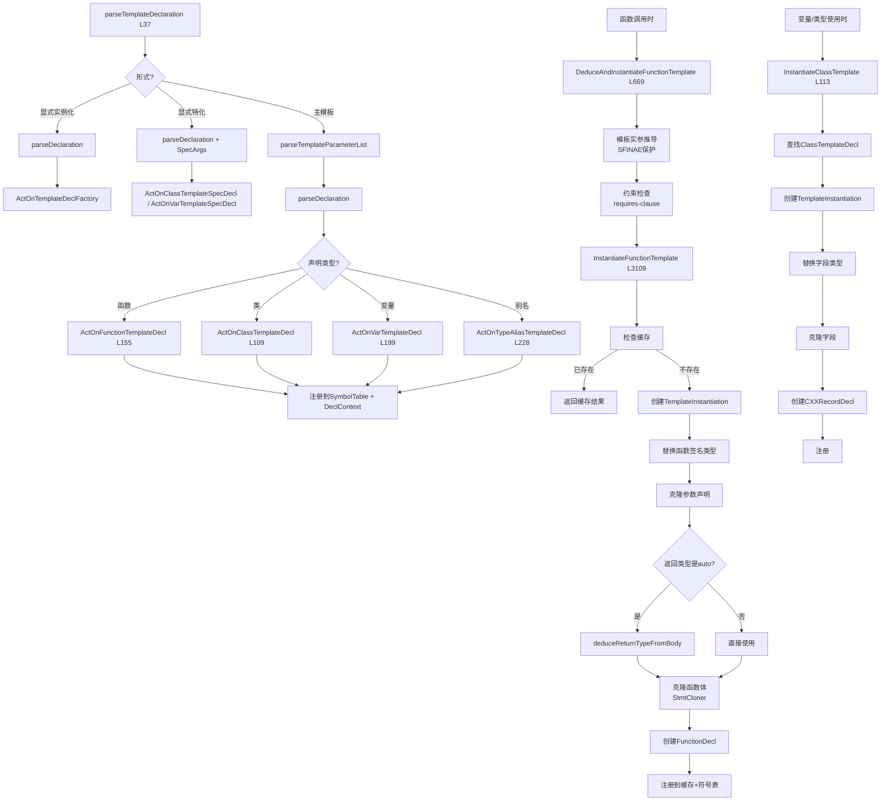

# Task 2.2.2: 模板实例化 - 函数清单

**子任务**: 2.2.2  
**功能域**: 模板实例化 (Template Instantiation)  
**执行时间**: 2026-04-19 18:25-18:45  
**状态**: ✅ DONE

---

## 📊 函数清单总览

| 模块 | 函数名 | 文件位置 | 行号 | 职责 |
|------|--------|---------|------|------|
| **Parser** | parseTemplateDeclaration | ParseTemplate.cpp | L37 | 解析template声明 |
| | parseTemplateArgument | ParseTemplate.cpp | L719 | 解析单个模板实参 |
| | parseTemplateArgumentList | ParseTemplate.cpp | L790 | 解析模板实参列表 |
| **Sema** | ActOnFunctionTemplateDecl | SemaTemplate.cpp | L155 | 注册函数模板 |
| | ActOnClassTemplateDecl | SemaTemplate.cpp | L109 | 注册类模板 |
| | ActOnVarTemplateDecl | SemaTemplate.cpp | L199 | 注册变量模板 |
| | ActOnTypeAliasTemplateDecl | SemaTemplate.cpp | L228 | 注册别名模板 |
| | DeduceAndInstantiateFunctionTemplate | SemaTemplate.cpp | L669 | 函数模板推导+实例化 |
| | InstantiateFunctionTemplate | Sema.cpp | L3109 | 实例化函数模板 |
| | InstantiateClassTemplate | Sema.cpp | L113 | 实例化类模板 |
| | ActOnExplicitSpecialization | SemaTemplate.cpp | L359 | 显式特化 |
| | ActOnExplicitInstantiation | SemaTemplate.cpp | L412 | 显式实例化 |
| | ActOnClassTemplatePartialSpecialization | SemaTemplate.cpp | L479 | 类模板偏特化 |
| | ActOnVarTemplatePartialSpecialization | SemaTemplate.cpp | L541 | 变量模板偏特化 |

**总计**: 14个核心函数

---

## 📝 详细函数说明

### Parser层

#### 1. parseTemplateDeclaration
**文件**: `src/Parse/ParseTemplate.cpp`  
**行号**: L37-250（约210行）

**职责**: 解析模板声明，支持三种形式：
1. 主模板: `template<typename T> class Foo {...}`
2. 显式特化: `template<> class Foo<int> {...}`
3. 显式实例化: `template class Foo<int>;`

**关键流程**:
```cpp
TemplateDecl *Parser::parseTemplateDeclaration() {
  consumeToken(); // consume 'template'
  
  // Check for explicit instantiation (no '<')
  if (!Tok.is(TokenKind::less)) {
    Decl *InstantiatedDecl = parseDeclaration();
    return Actions.ActOnTemplateDeclFactory(...);
  }
  
  consumeToken(); // consume '<'
  
  // Check for explicit specialization (template<>)
  if (Tok.is(TokenKind::greater)) {
    consumeToken(); // consume '>'
    Decl *SpecializedDecl = parseDeclaration(&SpecTemplateArgs);
    // Create specialization...
  }
  
  // Normal template declaration
  TemplateParameterList *Params = parseTemplateParameterList();
  consumeToken(); // consume '>'
  
  Decl *TemplatedDecl = parseDeclaration();
  
  // Dispatch based on declaration type
  if (auto *FD = llvm::dyn_cast<FunctionDecl>(TemplatedDecl)) {
    return Actions.ActOnFunctionTemplateDecl(...);
  } else if (auto *RD = llvm::dyn_cast<CXXRecordDecl>(TemplatedDecl)) {
    return Actions.ActOnClassTemplateDecl(...);
  }
  ...
}
```

**特点**:
- 智能识别三种模板形式
- 根据声明类型分发到不同的ActOn函数
- 支持requires-clause（C++20 concepts）

---

#### 2. parseTemplateArgument
**文件**: `src/Parse/ParseTemplate.cpp`  
**行号**: L719-785（67行）

**职责**: 解析单个模板实参

**支持的实参类型**:
- 类型实参: `int`, `std::vector<T>`
- 非类型实参: `42`, `nullptr`
- 模板实参: `std::vector`
- 包展开: `Args...`

---

#### 3. parseTemplateArgumentList
**文件**: `src/Parse/ParseTemplate.cpp`  
**行号**: L790-820（31行）

**职责**: 解析逗号分隔的模板实参列表

**实现**:
```cpp
llvm::SmallVector<TemplateArgument, 4> Parser::parseTemplateArgumentList() {
  llvm::SmallVector<TemplateArgument, 4> Args;
  
  if (Tok.is(TokenKind::greater))
    return Args;
  
  while (true) {
    TemplateArgument Arg = parseTemplateArgument();
    Args.push_back(Arg);
    
    if (!tryConsumeToken(TokenKind::comma))
      break;
  }
  
  return Args;
}
```

---

### Sema层

#### 4. ActOnFunctionTemplateDecl
**文件**: `src/Sema/SemaTemplate.cpp`  
**行号**: L155-193（39行）

**职责**: 语义分析并注册函数模板

**关键步骤**:
```cpp
DeclResult Sema::ActOnFunctionTemplateDecl(FunctionTemplateDecl *FTD) {
  // 1. 验证模板参数列表
  auto *Params = FTD->getTemplateParameterList();
  if (!Params || Params->empty()) {
    Diags.report(..., DiagID::err_template_not_in_scope, ...);
    return DeclResult::getInvalid();
  }
  
  // 1b. 深度验证：重复名称、不完整类型等
  if (!ValidateTemplateParameterList(*this, Params))
    return DeclResult::getInvalid();
  
  // 2. 注册到符号表
  Symbols.addTemplateDecl(FTD);
  Symbols.addDecl(FTD);
  
  // 3. 注册到当前DeclContext
  if (CurContext)
    CurContext->addDecl(FTD);
  
  // 4. 处理requires-clause
  if (FTD->hasRequiresClause()) {
    Expr *RC = FTD->getRequiresClause();
    // Validate constraint expression...
  }
  
  return DeclResult(FTD);
}
```

**验证项**:
- 模板参数列表非空
- 参数名称不重复
- requires-clause语法正确

---

#### 5. ActOnClassTemplateDecl
**文件**: `src/Sema/SemaTemplate.cpp`  
**行号**: L109-153（45行）

**职责**: 语义分析并注册类模板

**流程**: 与ActOnFunctionTemplateDecl类似
- 验证模板参数
- 注册到符号表和DeclContext
- 处理requires-clause

---

#### 6. DeduceAndInstantiateFunctionTemplate
**文件**: `src/Sema/SemaTemplate.cpp`  
**行号**: L669-742（74行）

**职责**: 完整的函数模板调用处理流程

**完整流程**（已在Task 2.2.1中详细分析）:
```
1. 模板实参推导（SFINAE保护）
   → Deduction->DeduceFunctionTemplateArguments()
   
2. 收集推导出的实参
   
3. 检查requires-clause约束
   → ConstraintChecker->CheckConstraintSatisfaction()
   
4. 实例化函数模板
   → Instantiator->InstantiateFunctionTemplate()
```

**关键特性**:
- SFINAE保护：推导失败不是硬错误
- C++20 concepts支持
- 完整的诊断信息

---

#### 7. InstantiateFunctionTemplate
**文件**: `src/Sema/Sema.cpp`  
**行号**: L3109-3229（约120行）

**职责**: 实例化函数模板，创建具体的FunctionDecl

**详细流程**:
```cpp
FunctionDecl *Sema::InstantiateFunctionTemplate(
    FunctionTemplateDecl *FuncTemplate,
    llvm::ArrayRef<TemplateArgument> TemplateArgs,
    SourceLocation Loc) {
  
  // Step 1: 检查缓存（是否已实例化）
  if (auto *Existing = FuncTemplate->findSpecialization(TemplateArgs)) {
    return Existing;
  }
  
  // Step 2: 获取被模板化的函数声明
  auto *TemplatedFunc = llvm::dyn_cast_or_null<FunctionDecl>(
      FuncTemplate->getTemplatedDecl());
  
  // Step 3: 创建TemplateInstantiation，设置替换映射
  TemplateInstantiation Inst;
  for (unsigned i = 0; i < std::min(TemplateArgs.size(), Params.size()); ++i) {
    if (auto *ParamDecl = llvm::dyn_cast_or_null<TypedefNameDecl>(Params[i])) {
      Inst.addSubstitution(ParamDecl, TemplateArgs[i]);
    }
  }
  
  // Step 4: 替换函数签名类型
  QualType SubstFuncType = Inst.substituteType(TemplatedFunc->getType());
  QualType ReturnType = ...;  // 提取返回类型
  
  // Step 5: 克隆参数声明（使用替换后的类型）
  llvm::SmallVector<ParmVarDecl *, 4> ClonedParams;
  for (auto *OrigParam : TemplatedFunc->getParams()) {
    QualType SubstParamType = Inst.substituteType(OrigParam->getType());
    auto *ClonedParam = Context.create<ParmVarDecl>(..., SubstParamType, ...);
    ClonedParams.push_back(ClonedParam);
  }
  
  // Step 6: 处理auto返回类型推导
  if (ReturnType->getTypeClass() == TypeClass::Auto) {
    Stmt *ClonedBody = Cloner.Clone(TemplatedFunc->getBody());
    QualType DeducedType = deduceReturnTypeFromBody(ClonedBody, Loc);
    ReturnType = DeducedType;
  }
  
  // Step 7: 克隆函数体
  Stmt *ClonedBody = nullptr;
  if (auto *Body = TemplatedFunc->getBody()) {
    StmtCloner Cloner(Inst);
    ClonedBody = Cloner.Clone(Body);
  }
  
  // Step 8: 创建新的FunctionDecl
  auto *InstFD = Context.create<FunctionDecl>(
      Loc, FuncTemplate->getName(), ReturnType, ClonedParams, ClonedBody);
  
  // Step 9: 注册到缓存和符号表
  FuncTemplate->addSpecialization(TemplateArgs, InstFD);
  registerDecl(InstFD);
  
  return InstFD;
}
```

**关键技术**:
- **TemplateInstantiation**: 管理类型替换
- **StmtCloner**: 克隆AST节点，应用替换
- **缓存机制**: 避免重复实例化
- **Auto推导**: 从函数体推导返回类型

---

#### 8. InstantiateClassTemplate
**文件**: `src/Sema/Sema.cpp`  
**行号**: L113-210（约100行）

**职责**: 实例化类模板，创建具体的CXXRecordDecl

**流程**:
```cpp
QualType Sema::InstantiateClassTemplate(
    llvm::StringRef TemplateName,
    const TemplateSpecializationType *TST) {
  
  // Step 1: 查找模板声明
  NamedDecl *LookupResult = LookupName(TemplateName);
  auto *ClassTemplate = llvm::dyn_cast<ClassTemplateDecl>(LookupResult);
  
  // Step 2: 获取模板实参
  auto Args = TST->getTemplateArgs();
  
  // Step 3: 获取被模板化的类声明
  auto *OriginalRecord = llvm::dyn_cast<CXXRecordDecl>(
      ClassTemplate->getTemplatedDecl());
  
  // Step 4: 创建TemplateInstantiation
  TemplateInstantiation Inst;
  // 设置替换映射...
  
  // Step 5: 创建新的CXXRecordDecl
  auto *SpecializedRecord = Context.create<CXXRecordDecl>(...);
  
  // Step 6: 克隆字段（使用替换后的类型）
  for (auto *Field : OriginalRecord->fields()) {
    QualType SubstFieldType = Inst.substituteType(Field->getType());
    auto *NewField = Context.create<FieldDecl>(..., SubstFieldType, ...);
    SpecializedRecord->addField(NewField);
  }
  
  // Step 7: 标记为完整定义
  SpecializedRecord->setCompleteDefinition();
  
  // Step 8: 注册
  registerDecl(SpecializedRecord);
  
  return Context.getRecordType(SpecializedRecord);
}
```

**应用场景**:
- 变量声明: `Vector<int> v;`
- 函数参数: `void foo(Vector<double> v);`
- 返回类型: `Vector<string> bar();`

---

#### 9-14. 其他模板相关函数

| 函数 | 行号 | 职责 |
|------|------|------|
| ActOnVarTemplateDecl | L199 | 注册变量模板 |
| ActOnTypeAliasTemplateDecl | L228 | 注册别名模板 |
| ActOnExplicitSpecialization | L359 | 处理显式特化 `template<> class Foo<int>` |
| ActOnExplicitInstantiation | L412 | 处理显式实例化 `template class Foo<int>;` |
| ActOnClassTemplatePartialSpecialization | L479 | 类模板偏特化 |
| ActOnVarTemplatePartialSpecialization | L541 | 变量模板偏特化 |

这些函数的实现模式类似：
1. 验证输入
2. 注册到符号表
3. 处理特殊情况（requires-clause、偏特化等）

---

## 🔗 完整调用链



---

## ⚠️ 发现的问题

### 问题1: Auto返回类型推导可能不完整

**位置**: InstantiateFunctionTemplate L3189-3200

**现象**:
```cpp
if (ReturnType.getTypePtr() && ReturnType->getTypeClass() == TypeClass::Auto) {
  Stmt *ClonedBody = nullptr;
  if (auto *Body = TemplatedFunc->getBody()) {
    StmtCloner Cloner(Inst);
    ClonedBody = Cloner.Clone(Body);
  }
  
  // Deduce return type from cloned body
  QualType DeducedType = deduceReturnTypeFromBody(ClonedBody, Loc);
  ...
}
```

**潜在问题**:
- `deduceReturnTypeFromBody` 的实现可能不完整
- 需要验证是否能正确处理复杂的返回语句

**优先级**: P1

---

### 问题2: 类模板实例化缺少缓存

**位置**: InstantiateClassTemplate L137-138

**现象**:
```cpp
// Step 4: Check if this specialization already exists
// TODO: Implement specialization cache
```

**影响**:
- 每次使用都重新实例化
- 性能问题
- 可能导致多个相同的特化实例

**优先级**: P2

---

### 问题3: 默认参数未克隆

**位置**: InstantiateFunctionTemplate L3182

**现象**:
```cpp
auto *ClonedParam = Context.create<ParmVarDecl>(
    ...,
    OrigParam->getDefaultArg());  // TODO: clone default arg expression
```

**影响**:
- 默认参数表达式未被克隆和替换
- 如果默认参数包含模板参数，会导致错误

**优先级**: P2

---

## 📊 统计信息

| 指标 | 数值 |
|------|------|
| Parser函数数 | 3 |
| Sema函数数 | 11 |
| **总计** | **14** |
| 代码行数（估算） | ~800行 |
| 已知问题数 | 3 (1个P1, 2个P2) |

---

## ✅ 验收标准

- [x] 搜索并列出所有Parser层函数
- [x] 搜索并列出所有Sema层函数
- [x] 记录每个函数的文件位置和行号
- [x] 阅读关键函数的实现（ActOnXXX, InstantiateXXX）
- [x] 绘制完整调用链图
- [x] 识别已知问题

---

## 🔗 下一步

**Task 2.2.3**: 名称查找功能域的函数收集

**依赖**: Task 2.2.2已完成 ✅

---

**输出文件**: 
- 本报告: `docs/review/reports/task_2.2.2_report.md`
