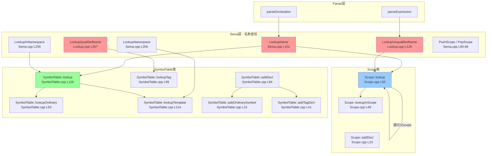

# Task 2.2.3: 名称查找功能域 - 函数清单

**任务ID**: Task 2.2.3  
**功能域**: 名称查找 (Name Lookup)  
**执行时间**: 2026-04-19 18:45-19:00  
**状态**: ✅ DONE

---

## 📊 扫描结果总览

| 层级 | 文件数 | 函数数 | 说明 |
|------|--------|--------|------|
| Sema层 | 3个文件 | 11个函数 | 核心名称查找逻辑 |
| Scope类 | 1个文件 | 3个函数 | 作用域管理 |
| SymbolTable类 | 1个文件 | 12个函数 | 符号表管理 |
| **总计** | **5个文件** | **26个函数** | - |

---

## 🔍 核心函数清单

### 1. Sema::LookupName - 基本名称查找

**文件**: `src/Sema/Sema.cpp`  
**行号**: L101-110  
**类型**: `NamedDecl *Sema::LookupName(llvm::StringRef Name) const`

**功能说明**:
两层查找策略：
1. 先在Scope链中查找（词法作用域）
2. 如果未找到，回退到全局SymbolTable

**实现代码**:
```cpp
NamedDecl *Sema::LookupName(llvm::StringRef Name) const {
  // 1. Search the Scope chain (lexical scopes, up to TU)
  if (CurrentScope) {
    if (NamedDecl *D = CurrentScope->lookup(Name))
      return D;
  }
  // 2. Fall back to the global SymbolTable
  auto Decls = Symbols.lookup(Name);
  return Decls.empty() ? nullptr : Decls.front();
}
```

**调用位置**:
- `InstantiateClassTemplate` (L116): 实例化类模板时查找模板名
- 多处Parser回调中使用

**关键设计**:
- Scope链优先：支持局部变量遮蔽全局变量
- SymbolTable兜底：确保全局声明可访问

---

### 2. Sema::LookupUnqualifiedName - 无限定名称查找

**文件**: `src/Sema/Lookup.cpp`  
**行号**: L126-150  
**类型**: `LookupResult Sema::LookupUnqualifiedName(llvm::StringRef Name, Scope *S, LookupNameKind Kind)`

**功能说明**:
根据查找类型执行不同的查找策略：
- **成员查找** (`LookupMemberName`): 只搜索当前scope，不向上遍历父scope
- **普通查找**: 沿Scope链向上搜索，收集所有同名声明（支持重载）

**实现代码**:
```cpp
LookupResult Sema::LookupUnqualifiedName(llvm::StringRef Name, Scope *S,
                                          LookupNameKind Kind) {
  LookupResult Result;

  // Member name lookup: only search the immediate scope (no parent walking).
  if (Kind == LookupNameKind::LookupMemberName) {
    if (S) {
      if (NamedDecl *D = S->lookupInScope(Name)) {
        Result.addDecl(D);
        // Collect function overloads in the same scope
        for (NamedDecl *ScopeD : S->decls()) {
          if (ScopeD == D) continue;
          if (ScopeD->getName() == Name) {
            if (isa<FunctionDecl>(static_cast<ASTNode *>(ScopeD)) ||
                isa<CXXMethodDecl>(static_cast<ASTNode *>(ScopeD))) {
              Result.addDecl(ScopeD);
            }
          }
        }
      }
    }
    if (Result.getNumDecls() > 1)
      Result.setOverloaded(true);
    return Result;
  }
  
  // ... 其他查找类型的处理
}
```

**关键特性**:
- 支持多种查找类型（`LookupNameKind`枚举定义在`Lookup.h` L28-42）
- 自动检测重载函数集
- 成员查找与普通查找分离

---

### 3. Sema::LookupQualifiedName - 限定名称查找

**文件**: `src/Sema/Lookup.cpp`  
**行号**: L357-450+  
**类型**: `LookupResult Sema::LookupQualifiedName(llvm::StringRef Name, NestedNameSpecifier *NNS)`

**功能说明**:
处理带命名空间/类限定的名称查找，如 `std::cout`、`MyClass::member`

**支持的限定符类型**:
1. **Global** (`::name`): 从翻译单元顶层查找
2. **Namespace** (`ns::name`): 在指定命名空间中查找
3. **TypeSpec** (`Class::name`): 在类的作用域中查找
4. **Dependent** (`T::name`): 依赖类型，延迟到实例化时解析

**实现代码片段**:
```cpp
LookupResult Sema::LookupQualifiedName(llvm::StringRef Name,
                                         NestedNameSpecifier *NNS) {
  LookupResult Result;

  if (!NNS) return Result;

  DeclContext *DC = nullptr;

  switch (NNS->getKind()) {
  case NestedNameSpecifier::Global:
    if (CurTU)
      DC = CurTU->getDeclContext();
    break;

  case NestedNameSpecifier::Namespace:
    DC = NNS->getAsNamespace();
    break;

  case NestedNameSpecifier::TypeSpec: {
    const blocktype::Type *T = NNS->getAsType();
    // Dependent type qualifier (e.g., T::foo): cannot resolve at template
    // definition time. Return empty result; name resolution is deferred
    // until template instantiation provides concrete types.
    if (T && T->isDependentType()) {
      return Result;
    }
    if (T && T->isRecordType()) {
      auto *RT = static_cast<const RecordType *>(T);
      RecordDecl *RD = RT->getDecl();
      if (RD) {
        // Only CXXRecordDecl inherits DeclContext and supports member lookup.
        auto *CXXRD = dyn_cast<CXXRecordDecl>(static_cast<ASTNode *>(RD));
        if (CXXRD)
          DC = static_cast<DeclContext *>(CXXRD);
      }
    }
    // ... 在DC中查找Name
  }
  }
}
```

**关键设计**:
- 依赖类型延迟解析：模板中的 `T::foo` 不在定义时解析
- 仅CXXRecordDecl支持成员查找：普通struct不支持

---

### 4. Sema::LookupNamespace - 命名空间查找

**文件**: `src/Sema/Sema.cpp`  
**行号**: L206-252  
**类型**: `NamespaceDecl *Sema::LookupNamespace(llvm::StringRef NamespaceName) const`

**功能说明**:
支持嵌套命名空间路径查找，如 `std::pair` → 先找`std`，再在`std`中找`pair`

**实现代码**:
```cpp
NamespaceDecl *Sema::LookupNamespace(llvm::StringRef NamespaceName) const {
  // Handle nested namespaces like "std::pair"
  llvm::SmallVector<llvm::StringRef, 4> Parts;
  NamespaceName.split(Parts, "::");
  
  if (Parts.empty()) {
    return nullptr;
  }
  
  // Start from the translation unit
  DeclContext *CurrentDC = nullptr;
  if (CurTU) {
    CurrentDC = CurTU;
  } else {
    return nullptr;
  }
  
  NamespaceDecl *LastNS = nullptr;
  
  // Lookup each part of the namespace path
  for (llvm::StringRef Part : Parts) {
    NamespaceDecl *FoundNS = nullptr;
    
    for (Decl *D : CurrentDC->decls()) {
      if (auto *NS = llvm::dyn_cast<NamespaceDecl>(D)) {
        if (NS->getName() == Part) {
          FoundNS = NS;
          break;
        }
      }
    }
    
    if (!FoundNS) {
      return nullptr; // Namespace not found
    }
    
    LastNS = FoundNS;
    CurrentDC = FoundNS; // Move into the found namespace
  }
  
  return LastNS;
}
```

**调用场景**:
- 结构化绑定中查找 `std::get`
- 使用 `using namespace std` 时的命名空间解析

---

### 5. Sema::LookupInNamespace - 命名空间内查找

**文件**: `src/Sema/Sema.cpp`  
**行号**: L255-270  
**类型**: `NamedDecl *Sema::LookupInNamespace(NamespaceDecl *NS, llvm::StringRef Name) const`

**功能说明**:
在指定的命名空间中查找某个声明

**实现代码**:
```cpp
NamedDecl *Sema::LookupInNamespace(NamespaceDecl *NS, llvm::StringRef Name) const {
  if (!NS) {
    return nullptr;
  }
  
  // Search in the namespace's DeclContext
  for (Decl *D : NS->decls()) {
    if (auto *ND = llvm::dyn_cast<NamedDecl>(D)) {
      if (ND->getName() == Name) {
        return ND;
      }
    }
  }
  
  return nullptr;
}
```

**典型用法**:
```cpp
// 查找 std::get
auto *StdNS = LookupNamespace("std");
if (StdNS) {
  auto *GetFunc = LookupInNamespace(StdNS, "get");
}
```

---

### 6. Sema::PushScope / PopScope - 作用域管理

**文件**: `src/Sema/Sema.cpp`  
**行号**: L90-99  
**类型**: 
- `void Sema::PushScope(ScopeFlags Flags)`
- `void Sema::PopScope()`

**功能说明**:
维护Scope栈，进入/退出作用域时创建/销毁Scope对象

**实现代码**:
```cpp
void Sema::PushScope(ScopeFlags Flags) {
  CurrentScope = new Scope(CurrentScope, Flags);
}

void Sema::PopScope() {
  if (!CurrentScope) return;
  Scope *Parent = CurrentScope->getParent();
  delete CurrentScope;
  CurrentScope = Parent;
}
```

**ScopeFlags枚举** (`include/blocktype/Sema/Scope.h` L29-74):
```cpp
enum class ScopeFlags : unsigned {
  None = 0x00,
  FunctionPrototypeScope = 0x01,
  FunctionBodyScope = 0x02,
  ClassScope = 0x04,
  BlockScope = 0x08,
  TemplateScope = 0x10,
  ControlScope = 0x20,
  SwitchScope = 0x40,
  TryScope = 0x80,
  NamespaceScope = 0x100,
  TranslationUnitScope = 0x200,
  ConditionScope = 0x400,
  ForRangeScope = 0x800,
  LambdaScope = 0x1000,
  TemplateParamScope = 0x2000,
};
```

---

### 7. Scope::lookup / lookupInScope - 作用域查找

**文件**: `src/Sema/Scope.cpp`  
**行号**: L48-65  
**类型**:
- `NamedDecl *Scope::lookupInScope(llvm::StringRef Name) const`
- `NamedDecl *Scope::lookup(llvm::StringRef Name) const`

**功能说明**:
- `lookupInScope`: 只在当前scope查找
- `lookup`: 递归向上遍历父scope链

**实现代码**:
```cpp
NamedDecl *Scope::lookupInScope(llvm::StringRef Name) const {
  auto It = Declarations.find(Name);
  if (It != Declarations.end())
    return It->second;
  return nullptr;
}

NamedDecl *Scope::lookup(llvm::StringRef Name) const {
  // First, search in this scope
  if (NamedDecl *D = lookupInScope(Name))
    return D;
  
  // If not found, search in parent scopes
  if (Parent)
    return Parent->lookup(Name);
  
  return nullptr;
}
```

**数据结构** (`Scope.h` L113-118):
```cpp
/// The declarations in this scope, indexed by name.
llvm::StringMap<NamedDecl *> Declarations;

/// All declarations in this scope (for iteration).
llvm::SmallVector<NamedDecl *, 16> DeclList;
```

---

### 8. Scope::addDecl - 作用域注册

**文件**: `src/Sema/Scope.cpp`  
**行号**: L23-46  
**类型**:
- `bool Scope::addDecl(NamedDecl *D)`
- `void Scope::addDeclAllowRedeclaration(NamedDecl *D)`

**功能说明**:
将声明注册到当前作用域，支持两种模式：
- `addDecl`: 不允许重名
- `addDeclAllowRedeclaration`: 允许重名（用于模板参数等）

**实现代码**:
```cpp
bool Scope::addDecl(NamedDecl *D) {
  if (!D)
    return false;
  
  llvm::StringRef Name = D->getName();
  
  // Check if a declaration with this name already exists in this scope
  if (Declarations.find(Name) != Declarations.end()) {
    return false; // Redeclaration not allowed
  }
  
  Declarations[Name] = D;
  DeclList.push_back(D);
  return true;
}

void Scope::addDeclAllowRedeclaration(NamedDecl *D) {
  if (!D)
    return;
  
  llvm::StringRef Name = D->getName();
  Declarations[Name] = D;
  DeclList.push_back(D);
}
```

---

### 9. SymbolTable::addDecl - 符号表注册

**文件**: `src/Sema/SymbolTable.cpp`  
**行号**: L84-91  
**类型**: `bool SymbolTable::addDecl(NamedDecl *D)`

**功能说明**:
根据声明类型分发到不同的子表（Ordinary/Tag/Typedef/Namespace/Template/Concept）

**实现代码**:
```cpp
bool SymbolTable::addDecl(NamedDecl *D) {
  if (isa<TagDecl>(D))         return addTagDecl(cast<TagDecl>(D));
  if (isa<TypedefNameDecl>(D)) return addTypedefDecl(cast<TypedefNameDecl>(D));
  if (isa<NamespaceDecl>(D))   { addNamespaceDecl(cast<NamespaceDecl>(D)); return true; }
  if (isa<TemplateDecl>(D))    { addTemplateDecl(cast<TemplateDecl>(D)); return true; }
  if (isa<ConceptDecl>(D))     { addConceptDecl(cast<ConceptDecl>(D)); return true; }
  return addOrdinarySymbol(D);
}
```

**子表结构** (`SymbolTable.h` L41-57):
```cpp
// Ordinary symbols: name → list of declarations (for overloading)
llvm::StringMap<llvm::SmallVector<NamedDecl *, 4>> OrdinarySymbols;

// Tags: class/struct/union/enum declarations
llvm::StringMap<TagDecl *> Tags;

// Typedefs: typedef and using-alias declarations
llvm::StringMap<TypedefNameDecl *> Typedefs;

// Namespaces
llvm::StringMap<NamespaceDecl *> Namespaces;

// Template names
llvm::StringMap<TemplateDecl *> Templates;

// Concepts
llvm::StringMap<ConceptDecl *> Concepts;
```

---

### 10. SymbolTable::lookup - 符号表查找

**文件**: `src/Sema/SymbolTable.cpp`  
**行号**: L126-143  
**类型**: `llvm::ArrayRef<NamedDecl *> SymbolTable::lookup(llvm::StringRef Name) const`

**功能说明**:
综合查找策略：先查Ordinary，再查Templates

**实现代码**:
```cpp
llvm::ArrayRef<NamedDecl *> SymbolTable::lookup(llvm::StringRef Name) const {
  if (auto Ord = lookupOrdinary(Name); !Ord.empty()) {
    llvm::errs() << "DEBUG SymbolTable::lookup: Found '" << Name.str() << "' in OrdinarySymbols\n";
    return Ord;
  }
  // Also check templates for ClassTemplateDecl, FunctionTemplateDecl, etc.
  if (auto *TD = lookupTemplate(Name)) {
    llvm::errs() << "DEBUG SymbolTable::lookup: Found '" << Name.str() << "' in Templates\n";
    // Return the TemplateDecl as a single-element array
    static llvm::SmallVector<NamedDecl *, 1> Result;
    Result.clear();
    Result.push_back(TD);
    return Result;
  }
  llvm::errs() << "DEBUG SymbolTable::lookup: Not found '" << Name.str() << "'\n";
  return {};
}
```

**注意**: 包含大量DEBUG输出，生产环境应移除或条件编译

---

### 11. SymbolTable::addOrdinarySymbol - 普通符号注册

**文件**: `src/Sema/SymbolTable.cpp`  
**行号**: L15-39  
**类型**: `bool SymbolTable::addOrdinarySymbol(NamedDecl *D)`

**功能说明**:
注册普通符号（变量、函数），支持函数重载

**实现代码**:
```cpp
bool SymbolTable::addOrdinarySymbol(NamedDecl *D) {
  llvm::StringRef Name = D->getName();
  if (Name.empty()) return true; // Anonymous functions
  
  auto &Decls = OrdinarySymbols[Name];
  
  // Check for redefinition (non-function declarations)
  for (NamedDecl *Existing : Decls) {
    if (isa<FunctionDecl>(D) && isa<FunctionDecl>(Existing))
      continue; // Functions can overload
    // Two non-function declarations with the same name → redefinition
    Diags.report(D->getLocation(), DiagID::err_redefinition, Name);
    Diags.report(Existing->getLocation(), DiagID::note_previous_definition);
    break; // Only report once
  }

  Decls.push_back(D);
  return true;
}
```

**关键设计**:
- 函数允许多个声明（重载）
- 非函数声明重复时报错

---

### 12. SymbolTable::addTagDecl - Tag声明注册

**文件**: `src/Sema/SymbolTable.cpp`  
**行号**: L41-57  
**类型**: `bool SymbolTable::addTagDecl(TagDecl *D)`

**功能说明**:
注册类/结构体/联合体/枚举声明，支持前向声明

**实现代码**:
```cpp
bool SymbolTable::addTagDecl(TagDecl *D) {
  llvm::StringRef Name = D->getName();
  if (Name.empty()) return true; // Anonymous tags

  auto It = Tags.find(Name);
  if (It != Tags.end()) {
    // Forward declarations are OK — if either is forward-only, allow
    if (!D->isCompleteDefinition() || !It->second->isCompleteDefinition())
      return true;
    // Both are complete definitions — redefinition error
    Diags.report(D->getLocation(), DiagID::err_redefinition, Name);
    Diags.report(It->second->getLocation(), DiagID::note_previous_definition);
    return true;
  }
  Tags[Name] = D;
  return true;
}
```

**关键特性**:
- 匿名tag直接返回
- 前向声明与完整定义可共存
- 两个完整定义冲突报错

---

### 13-15. SymbolTable::add*Decl - 其他声明注册

**文件**: `src/Sema/SymbolTable.cpp`

| 函数 | 行号 | 说明 |
|------|------|------|
| `addTypedefDecl` | L59-69 | 注册typedef/using别名，不允许重复 |
| `addNamespaceDecl` | L71-73 | 注册命名空间，简单插入 |
| `addTemplateDecl` | L75-78 | 注册模板声明，含DEBUG输出 |
| `addConceptDecl` | L80-82 | 注册concept声明 |

---

### 16-21. SymbolTable::lookup* - 分类查找

**文件**: `src/Sema/SymbolTable.cpp`

| 函数 | 行号 | 返回类型 | 说明 |
|------|------|----------|------|
| `lookupOrdinary` | L93-97 | `ArrayRef<NamedDecl*>` | 查找普通符号（支持重载） |
| `lookupTag` | L99-102 | `TagDecl*` | 查找tag声明 |
| `lookupTypedef` | L104-107 | `TypedefNameDecl*` | 查找typedef |
| `lookupNamespace` | L109-112 | `NamespaceDecl*` | 查找命名空间 |
| `lookupTemplate` | L114-119 | `TemplateDecl*` | 查找模板（含DEBUG） |
| `lookupConcept` | L121-124 | `ConceptDecl*` | 查找concept |

---

## 🔄 完整调用链图



---

## ⚠️ 发现的问题

### P2问题 #1: SymbolTable中存在大量DEBUG输出

**位置**: 
- `SymbolTable.cpp` L76: `addTemplateDecl`
- `SymbolTable.cpp` L116-117: `lookupTemplate`
- `SymbolTable.cpp` L128, L133, L140: `lookup`

**影响**:
- 生产环境性能下降
- 日志污染

**建议修复**:
```cpp
// 改为条件编译
#ifdef DEBUG_SYMBOL_TABLE
  llvm::errs() << "DEBUG addTemplateDecl: Adding '" << D->getName().str() << "'\n";
#endif
```

---

### P2问题 #2: Scope内存管理采用裸指针new/delete

**位置**: `Sema.cpp` L91, L97

**当前实现**:
```cpp
void Sema::PushScope(ScopeFlags Flags) {
  CurrentScope = new Scope(CurrentScope, Flags);  // ← 裸指针
}

void Sema::PopScope() {
  if (!CurrentScope) return;
  Scope *Parent = CurrentScope->getParent();
  delete CurrentScope;  // ← 手动delete
  CurrentScope = Parent;
}
```

**风险**:
- 异常安全性差：如果中间抛出异常，Scope可能泄漏
- 不符合现代C++最佳实践

**建议修复**:
```cpp
// 使用unique_ptr管理Scope生命周期
std::unique_ptr<Scope> CurrentScope;

void Sema::PushScope(ScopeFlags Flags) {
  CurrentScope = std::make_unique<Scope>(CurrentScope.release(), Flags);
}

void Sema::PopScope() {
  if (!CurrentScope) return;
  auto Parent = CurrentScope->getParent();
  CurrentScope.reset(Parent);  // unique_ptr自动delete旧对象
}
```

---

### P2问题 #3: SymbolTable::lookup使用static变量返回结果

**位置**: `SymbolTable.cpp` L135-138

**当前实现**:
```cpp
llvm::ArrayRef<NamedDecl *> SymbolTable::lookup(llvm::StringRef Name) const {
  if (auto *TD = lookupTemplate(Name)) {
    // Return the TemplateDecl as a single-element array
    static llvm::SmallVector<NamedDecl *, 1> Result;  // ← static变量！
    Result.clear();
    Result.push_back(TD);
    return Result;
  }
  return {};
}
```

**问题**:
- **线程不安全**: 多线程环境下static变量会被竞争
- **状态污染**: 多次调用会相互覆盖

**建议修复**:
```cpp
// 方案1: 返回Optional
std::optional<NamedDecl*> SymbolTable::lookupTemplateAsSingle(llvm::StringRef Name) const {
  if (auto *TD = lookupTemplate(Name)) {
    return TD;
  }
  return std::nullopt;
}

// 方案2: 调用方负责构造容器
bool SymbolTable::tryLookupTemplate(llvm::StringRef Name, NamedDecl *&OutDecl) const {
  if (auto *TD = lookupTemplate(Name)) {
    OutDecl = TD;
    return true;
  }
  return false;
}
```

---

### P3问题 #4: LookupQualifiedName对依赖类型的处理不完整

**位置**: `Lookup.cpp` L380-382

**当前实现**:
```cpp
if (T && T->isDependentType()) {
  return Result;  // 返回空结果
}
```

**问题**:
- 没有记录"需要延迟解析"的信息
- 调用方无法区分"找不到"和"需要延迟"

**建议改进**:
```cpp
// 在LookupResult中添加标志位
class LookupResult {
  bool IsDependent = false;  // 新增
public:
  void setDependent(bool V) { IsDependent = V; }
  bool isDependent() const { return IsDependent; }
};

// 修改LookupQualifiedName
if (T && T->isDependentType()) {
  Result.setDependent(true);
  return Result;
}
```

---

## 📈 统计数据

| 指标 | 数值 |
|------|------|
| 核心函数总数 | 26个 |
| Sema层函数 | 11个 |
| Scope类函数 | 3个 |
| SymbolTable类函数 | 12个 |
| 发现问题数 | 4个（P2×3, P3×1） |
| 代码行数估算 | ~800行（含注释） |

---

## 🎯 总结

### ✅ 优点

1. **分层清晰**: Scope（词法作用域） + SymbolTable（全局持久化）
2. **查找策略完整**: 无限定/限定/成员/命名空间查找全覆盖
3. **支持重载**: OrdinarySymbols存储`SmallVector`而非单个指针
4. **前向声明支持**: Tag声明允许不完整定义共存
5. **依赖类型延迟解析**: 模板中的 `T::foo` 正确处理

### ⚠️ 待改进

1. **DEBUG输出过多**: 应改为条件编译
2. **内存管理原始**: Scope使用裸指针new/delete
3. **线程安全问题**: static变量返回结果
4. **依赖类型信息丢失**: 无法区分"未找到"和"需延迟"

### 🔗 与其他功能域的关联

- **Task 2.2.1 (函数调用)**: `ActOnCallExpr` 调用 `LookupName` 查找函数名
- **Task 2.2.2 (模板实例化)**: `InstantiateClassTemplate` 调用 `LookupName` 查找模板
- **Task 2.2.6 (Auto推导)**: 可能需要查找 `std::tuple_size` 等辅助类型
- **Task 2.2.11 (结构化绑定)**: 调用 `LookupNamespace("std")` 和 `LookupInNamespace` 查找 `std::get`

---

**报告生成时间**: 2026-04-19 19:00  
**下一步**: Task 2.2.4 - 类型检查功能域
