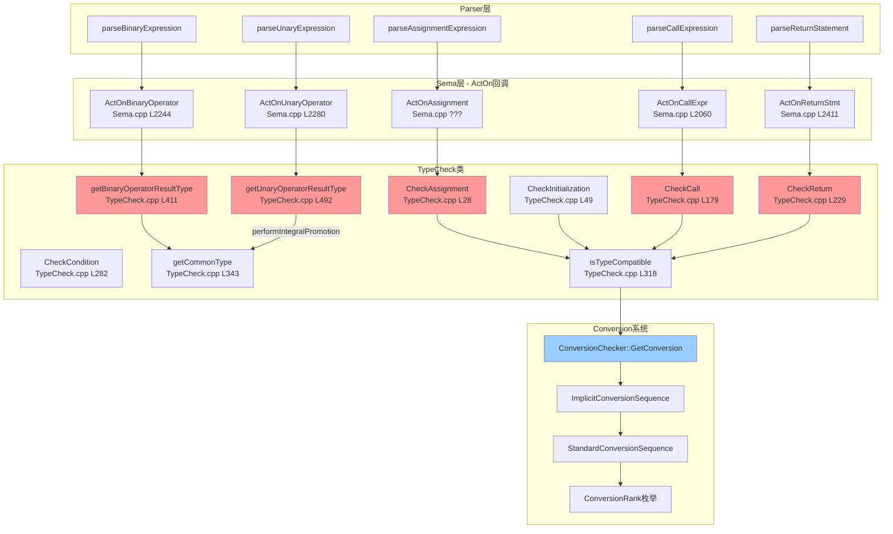

# Task 2.2.4: 类型检查功能域 - 函数清单

**任务ID**: Task 2.2.4  
**功能域**: 类型检查 (Type Checking)  
**执行时间**: 2026-04-19 19:05-19:25  
**状态**: ✅ DONE

---

## 📊 扫描结果总览

| 层级 | 文件数 | 函数数 | 说明 |
|------|--------|--------|------|
| TypeCheck类 | 1个文件 | 17个函数 | 核心类型检查逻辑 |
| Sema层 | 1个文件 | 8个函数 | ActOn回调集成 |
| Conversion类 | 1个文件 | 3个类定义 | 隐式转换分析 |
| **总计** | **3个文件** | **28个函数/类** | - |

---

## 🔍 核心函数清单

### 1. TypeCheck::CheckAssignment - 赋值兼容性检查

**文件**: `src/Sema/TypeCheck.cpp`  
**行号**: L28-47  
**类型**: `bool TypeCheck::CheckAssignment(QualType LHS, QualType RHS, SourceLocation Loc)`

**功能说明**:
检查赋值表达式 `LHS = RHS` 的类型兼容性

**实现代码**:
```cpp
bool TypeCheck::CheckAssignment(QualType LHS, QualType RHS, SourceLocation Loc) {
  if (LHS.isNull() || RHS.isNull()) {
    Diags.report(Loc, DiagID::err_type_mismatch);
    return false;
  }

  // Check if LHS is const-qualified (cannot assign to const)
  if (LHS.isConstQualified()) {
    Diags.report(Loc, DiagID::err_assigning_to_const);
    return false;
  }

  // Check type compatibility
  if (!isTypeCompatible(RHS, LHS)) {
    Diags.report(Loc, DiagID::err_type_mismatch);
    return false;
  }

  return true;
}
```

**关键检查**:
1. 空类型检查
2. const限定符检查（不能赋值给const）
3. 类型兼容性检查（通过`isTypeCompatible`）

**调用位置**:
- Parser赋值表达式解析后调用
- Compound assignment operators (`+=`, `-=`, etc.)

---

### 2. TypeCheck::CheckInitialization - 初始化兼容性检查

**文件**: `src/Sema/TypeCheck.cpp`  
**行号**: L49-80  
**类型**: `bool TypeCheck::CheckInitialization(QualType Dest, Expr *Init, SourceLocation Loc)`

**功能说明**:
检查拷贝初始化 `T x = init` 的类型兼容性

**实现代码**:
```cpp
bool TypeCheck::CheckInitialization(QualType Dest, Expr *Init,
                                    SourceLocation Loc) {
  if (Dest.isNull() || !Init) {
    Diags.report(Loc, DiagID::err_type_mismatch, 
                 Dest.isNull() ? "<null>" : Dest.getAsString(),
                 "<null>");
    return false;
  }

  QualType InitType = Init->getType();
  if (InitType.isNull()) {
    Diags.report(Loc, DiagID::err_type_mismatch,
                 Dest.getAsString(),
                 "<null>");
    return false;
  }

  // Reference binding
  if (Dest.isReferenceType()) {
    return CheckReferenceBinding(Dest, Init, Loc);
  }

  // Check convertibility
  if (!isTypeCompatible(InitType, Dest)) {
    Diags.report(Loc, DiagID::err_type_mismatch,
                 Dest.getAsString(),
                 InitType.getAsString());
    return false;
  }

  return true;
}
```

**特殊处理**:
- 引用绑定：委托给`CheckReferenceBinding`
- 普通类型：检查可转换性

---

### 3. TypeCheck::CheckDirectInitialization - 直接初始化检查

**文件**: `src/Sema/TypeCheck.cpp`  
**行号**: L82-130  
**类型**: `bool TypeCheck::CheckDirectInitialization(QualType Dest, llvm::ArrayRef<Expr *> Args, SourceLocation Loc)`

**功能说明**:
检查直接初始化 `T x(args...)` 的参数匹配

**实现代码**:
```cpp
bool TypeCheck::CheckDirectInitialization(QualType Dest,
                                          llvm::ArrayRef<Expr *> Args,
                                          SourceLocation Loc) {
  if (Dest.isNull()) {
    Diags.report(Loc, DiagID::err_type_mismatch);
    return false;
  }

  // Single argument: check convertibility
  if (Args.size() == 1) {
    return CheckInitialization(Dest, Args[0], Loc);
  }

  // Zero arguments: default initialization
  if (Args.empty()) {
    return true; // Default construction — always valid for now
  }

  // Multiple arguments: check if Dest is a class type with a matching
  // constructor (TODO: implement constructor overload resolution)
  // For now, just return true and let CodeGen handle it
  return true;
}
```

**当前限制**:
- 多参数构造函数重载决议未实现（TODO）
- 默认构造总是返回true

---

### 4. TypeCheck::CheckCall - 函数调用检查

**文件**: `src/Sema/TypeCheck.cpp`  
**行号**: L179-227  
**类型**: `bool TypeCheck::CheckCall(FunctionDecl *F, llvm::ArrayRef<Expr *> Args, SourceLocation CallLoc)`

**功能说明**:
检查函数调用的参数数量和类型匹配

**实现代码**:
```cpp
bool TypeCheck::CheckCall(FunctionDecl *F, llvm::ArrayRef<Expr *> Args,
                          SourceLocation CallLoc) {
  if (!F)
    return false;

  QualType FnType = F->getType();
  const auto *FT = llvm::dyn_cast<FunctionType>(FnType.getTypePtr());
  if (!FT)
    return false;

  unsigned NumParams = F->getNumParams();
  bool IsVariadic = FT->isVariadic();

  // Count required params (those without default args)
  unsigned MinParams = 0;
  for (unsigned I = 0; I < NumParams; ++I) {
    if (!F->getParamDecl(I)->getDefaultArg()) {
      MinParams = I + 1;
    }
  }

  // Check argument count
  if (Args.size() < MinParams) {
    Diags.report(CallLoc, DiagID::err_too_few_args,
                 std::to_string(MinParams), std::to_string(Args.size()));
    return false;
  }
  if (!IsVariadic && Args.size() > NumParams) {
    Diags.report(CallLoc, DiagID::err_too_many_args,
                 std::to_string(NumParams), std::to_string(Args.size()));
    return false;
  }

  // Check each argument's type
  for (unsigned I = 0; I < Args.size() && I < NumParams; ++I) {
    QualType ParamType = F->getParamDecl(I)->getType();
    QualType ArgType = Args[I]->getType();

    if (!isTypeCompatible(ArgType, ParamType)) {
      Diags.report(CallLoc, DiagID::err_arg_type_mismatch,
                   std::to_string(I + 1),
                   ArgType.isNull() ? "<unknown>" : ArgType.getAsString(),
                   ParamType.isNull() ? "<unknown>" : ParamType.getAsString());
      return false;
    }
  }

  return true;
}
```

**关键特性**:
- 支持可变参数函数（variadic）
- 支持默认参数（计算最少必需参数数量）
- 逐个检查参数类型兼容性

**调用位置**:
- `Sema::ActOnCallExpr` (Task 2.2.1中已分析)

---

### 5. TypeCheck::CheckReturn - 返回值检查

**文件**: `src/Sema/TypeCheck.cpp`  
**行号**: L229-280  
**类型**: `bool TypeCheck::CheckReturn(Expr *RetVal, QualType FuncRetType, SourceLocation ReturnLoc)`

**功能说明**:
检查return语句的表达式类型与函数返回类型是否匹配

**实现代码**:
```cpp
bool TypeCheck::CheckReturn(Expr *RetVal, QualType FuncRetType,
                            SourceLocation ReturnLoc) {
  if (FuncRetType.isNull() || !RetVal) {
    return FuncRetType.isNull(); // void function with no value is OK
  }

  QualType RetType = RetVal->getType();
  
  // Handle InitListExpr: if type is null but we have an expected record type,
  // set the InitListExpr's type to the function return type
  if (RetType.isNull()) {
    if (auto *ILE = llvm::dyn_cast<InitListExpr>(RetVal)) {
      // Check if function returns a record type (struct/class)
      const Type *FuncTy = FuncRetType.getTypePtr();
      if (FuncTy && (llvm::isa<RecordType>(FuncTy) || 
                     llvm::isa<TemplateSpecializationType>(FuncTy))) {
        // Set InitListExpr type to match function return type
        ILE->setType(FuncRetType);
        RetType = FuncRetType;
      } else {
        Diags.report(ReturnLoc, DiagID::err_return_type_mismatch,
                     FuncRetType.getAsString(),
                     "<init-list>");
        return false;
      }
    } else {
      Diags.report(ReturnLoc, DiagID::err_return_type_mismatch,
                   FuncRetType.getAsString(),
                   "<null>");
      return false;
    }
  }

  // Check type compatibility
  if (!isTypeCompatible(RetType, FuncRetType)) {
    Diags.report(ReturnLoc, DiagID::err_return_type_mismatch,
                 FuncRetType.getAsString(),
                 RetType.getAsString());
    return false;
  }

  return true;
}
```

**特殊处理**:
- void函数无返回值：合法
- InitListExpr类型推导：自动设置类型为函数返回类型
- 类型不兼容时报错

**调用位置**:
- `Sema::ActOnReturnStmt` (L2420)

---

### 6. TypeCheck::CheckCondition - 条件表达式检查

**文件**: `src/Sema/TypeCheck.cpp`  
**行号**: L282-300  
**类型**: `bool TypeCheck::CheckCondition(Expr *Cond, SourceLocation Loc)`

**功能说明**:
检查if/while/for等语句的条件表达式是否可转换为bool

**实现代码**:
```cpp
bool TypeCheck::CheckCondition(Expr *Cond, SourceLocation Loc) {
  if (!Cond)
    return false;

  QualType CondType = Cond->getType();
  if (CondType.isNull())
    return false;

  // Check if condition can be converted to bool
  if (!isTypeCompatible(CondType, Context.getBoolType())) {
    Diags.report(Loc, DiagID::err_condition_not_bool,
                 CondType.getAsString());
    return false;
  }

  return true;
}
```

**调用位置**:
- `Sema::ActOnIfStmt` (L2436)
- while/for循环解析

---

### 7. TypeCheck::isTypeCompatible - 类型兼容性检查

**文件**: `src/Sema/TypeCheck.cpp`  
**行号**: L318-329  
**类型**: `bool TypeCheck::isTypeCompatible(QualType From, QualType To) const`

**功能说明**:
核心类型兼容性判断，使用隐式转换序列分析

**实现代码**:
```cpp
bool TypeCheck::isTypeCompatible(QualType From, QualType To) const {
  if (From.isNull() || To.isNull())
    return false;

  // Same type: always compatible
  if (From == To)
    return true;

  // Check implicit conversion using ConversionChecker
  ImplicitConversionSequence ICS = ConversionChecker::GetConversion(From, To);
  return !ICS.isBad();
}
```

**依赖**:
- `ConversionChecker::GetConversion`: 计算隐式转换序列
- 如果转换序列不是BadConversion，则认为兼容

---

### 8. TypeCheck::getCommonType - 通用类型计算

**文件**: `src/Sema/TypeCheck.cpp`  
**行号**: L343-405  
**类型**: `QualType TypeCheck::getCommonType(QualType T1, QualType T2) const`

**功能说明**:
实现C++ [expr.arith.conv]的通常算术转换（Usual Arithmetic Conversions）

**实现代码**:
```cpp
QualType TypeCheck::getCommonType(QualType T1, QualType T2) const {
  // Usual arithmetic conversions per C++ [expr.arith.conv]
  if (T1.isNull() || T2.isNull())
    return QualType();

  const Type *Ty1 = T1.getTypePtr();
  const Type *Ty2 = T2.getTypePtr();

  // Same type: no conversion needed
  if (isSameType(T1, T2))
    return T1;

  // Both arithmetic types: apply usual arithmetic conversions
  if ((Ty1->isIntegerType() || Ty1->isFloatingType()) &&
      (Ty2->isIntegerType() || Ty2->isFloatingType())) {

    // If either is long double, result is long double
    if (isLongDoubleType(Ty1) || isLongDoubleType(Ty2)) {
      return QualType(Ty1->isFloatingType() &&
                              llvm::cast<BuiltinType>(Ty1)->getKind() ==
                                  BuiltinKind::LongDouble
                          ? Ty1
                          : Ty2,
                      Qualifier::None);
    }

    // If either is double, result is double
    if (isDoubleType(Ty1) || isDoubleType(Ty2)) {
      return QualType(
          Ty1->isFloatingType() &&
                  llvm::cast<BuiltinType>(Ty1)->getKind() == BuiltinKind::Double
              ? Ty1
              : Ty2,
          Qualifier::None);
    }

    // If either is float, result is float
    if (isFloatType(Ty1) || isFloatType(Ty2)) {
      return QualType(
          Ty1->isFloatingType() &&
                  llvm::cast<BuiltinType>(Ty1)->getKind() == BuiltinKind::Float
              ? Ty1
              : Ty2,
          Qualifier::None);
    }

    // Both are integer types: apply integral promotions first, then find
    // the common type.
    QualType Promoted1 = performIntegralPromotion(T1);
    QualType Promoted2 = performIntegralPromotion(T2);
    return getIntegerCommonType(Promoted1, Promoted2);
  }

  // Pointer types
  if (Ty1->isPointerType() && Ty2->isPointerType()) {
    // TODO: pointer comparison common type
    return T1;
  }

  return QualType();
}
```

**转换规则**:
1. 相同类型：无需转换
2. 浮点优先：long double > double > float
3. 整数提升：先提升到int/unsigned int
4. 整数通用类型：按rank选择较大者

---

### 9. TypeCheck::getBinaryOperatorResultType - 二元运算符结果类型

**文件**: `src/Sema/TypeCheck.cpp`  
**行号**: L411-490  
**类型**: `QualType TypeCheck::getBinaryOperatorResultType(BinaryOpKind Op, QualType LHS, QualType RHS) const`

**功能说明**:
根据运算符种类确定二元表达式的结果类型

**实现代码**:
```cpp
QualType TypeCheck::getBinaryOperatorResultType(BinaryOpKind Op,
                                                QualType LHS,
                                                QualType RHS) const {
  if (LHS.isNull() || RHS.isNull())
    return QualType();

  // Comparison operators: result is always bool
  if (Op == BinaryOpKind::LT || Op == BinaryOpKind::GT ||
      Op == BinaryOpKind::LE || Op == BinaryOpKind::GE ||
      Op == BinaryOpKind::EQ || Op == BinaryOpKind::NE) {
    return Context.getBoolType();
  }

  // Spaceship operator <=> (C++20): returns int (-1, 0, 1)
  if (Op == BinaryOpKind::Spaceship) {
    return Context.getIntType();
  }

  // Logical operators: result is always bool
  if (Op == BinaryOpKind::LAnd || Op == BinaryOpKind::LOr) {
    return Context.getBoolType();
  }

  // Assignment operators: result is LHS type
  if (Op == BinaryOpKind::Assign || Op == BinaryOpKind::MulAssign ||
      Op == BinaryOpKind::DivAssign || Op == BinaryOpKind::RemAssign ||
      Op == BinaryOpKind::AddAssign || Op == BinaryOpKind::SubAssign ||
      Op == BinaryOpKind::ShlAssign || Op == BinaryOpKind::ShrAssign ||
      Op == BinaryOpKind::AndAssign || Op == BinaryOpKind::OrAssign ||
      Op == BinaryOpKind::XorAssign) {
    return LHS;
  }

  // Comma operator: result is RHS type
  if (Op == BinaryOpKind::Comma) {
    return RHS;
  }

  // Arithmetic/bitwise/shift operators: use common type
  return getCommonType(LHS, RHS);
}
```

**规则总结**:
- 比较/逻辑运算 → bool
- 赋值运算 → LHS类型
- 逗号运算 → RHS类型
- 算术/位运算 → 通用类型

**调用位置**:
- `Sema::ActOnBinaryOperator` (L2265)

---

### 10. TypeCheck::getUnaryOperatorResultType - 一元运算符结果类型

**文件**: `src/Sema/TypeCheck.cpp`  
**行号**: L492-537  
**类型**: `QualType TypeCheck::getUnaryOperatorResultType(UnaryOpKind Op, QualType Operand) const`

**功能说明**:
根据运算符种类确定一元表达式的结果类型

**实现代码**:
```cpp
QualType TypeCheck::getUnaryOperatorResultType(UnaryOpKind Op,
                                               QualType Operand) const {
  if (Operand.isNull())
    return QualType();

  switch (Op) {
  case UnaryOpKind::Not:       // ! → bool
    return Context.getBoolType();

  case UnaryOpKind::Complement: // ~ → promoted operand
    return performIntegralPromotion(Operand);

  case UnaryOpKind::Plus:      // + → promoted operand
  case UnaryOpKind::Minus:     // - → promoted operand
    return performIntegralPromotion(Operand);

  case UnaryOpKind::PreInc:    // ++ → operand type
  case UnaryOpKind::PreDec:    // -- → operand type
  case UnaryOpKind::PostInc:
  case UnaryOpKind::PostDec:
    return Operand;

  case UnaryOpKind::Deref:     // * → dereferenced type
    if (Operand->isPointerType()) {
      return QualType(
          static_cast<const PointerType *>(Operand.getTypePtr())->getPointeeType(),
          Qualifier::None);
    }
    return QualType();

  case UnaryOpKind::AddrOf:    // & → pointer type
    return Context.getPointerType(Operand);

  default:
    return Operand;
  }
}
```

**规则总结**:
- `!` → bool
- `~`, `+`, `-` → 整数提升后的类型
- `++`, `--` → 原类型
- `*` → 指针解引用类型
- `&` → 指针类型

**调用位置**:
- `Sema::ActOnUnaryOperator` (L2299)

---

### 11. Sema::ActOnBinaryOperator - 二元运算符回调

**文件**: `src/Sema/Sema.cpp`  
**行号**: L2244-2278  
**类型**: `ExprResult Sema::ActOnBinaryOperator(BinaryOpKind Op, Expr *LHS, Expr *RHS, SourceLocation OpLoc)`

**功能说明**:
Parser解析二元表达式后调用，进行类型检查并创建AST节点

**实现代码**:
```cpp
ExprResult Sema::ActOnBinaryOperator(BinaryOpKind Op, Expr *LHS, Expr *RHS,
                                      SourceLocation OpLoc) {
  if (!LHS || !RHS)
    return ExprResult::getInvalid();

  QualType LHSType = LHS->getType();
  QualType RHSType = RHS->getType();

  // Check for void operands — not allowed in arithmetic/comparison/etc.
  if (!LHSType.isNull() && LHSType->isVoidType()) {
    Diags.report(OpLoc, DiagID::err_void_expr_not_allowed);
    return ExprResult::getInvalid();
  }
  if (!RHSType.isNull() && RHSType->isVoidType()) {
    Diags.report(OpLoc, DiagID::err_void_expr_not_allowed);
    return ExprResult::getInvalid();
  }

  // Compute the result type via TypeCheck
  QualType ResultType;
  if (!LHSType.isNull() && !RHSType.isNull()) {
    ResultType = TC.getBinaryOperatorResultType(Op, LHSType, RHSType);
    if (ResultType.isNull()) {
      Diags.report(OpLoc, DiagID::err_bin_op_type_invalid,
                   LHSType.getAsString(), RHSType.getAsString());
      return ExprResult::getInvalid();
    }
  }

  // Create the BinaryOperator node and set its result type
  auto *BO = Context.create<BinaryOperator>(OpLoc, LHS, RHS, Op);
  if (!ResultType.isNull())
    BO->setType(ResultType);
  return ExprResult(BO);
}
```

**关键步骤**:
1. void操作数检查
2. 调用`TC.getBinaryOperatorResultType`计算结果类型
3. 创建BinaryOperator AST节点并设置类型

---

### 12. Sema::ActOnUnaryOperator - 一元运算符回调

**文件**: `src/Sema/Sema.cpp`  
**行号**: L2280-2312  
**类型**: `ExprResult Sema::ActOnUnaryOperator(UnaryOpKind Op, Expr *Operand, SourceLocation OpLoc)`

**功能说明**:
Parser解析一元表达式后调用，进行类型检查并创建AST节点

**实现代码**:
```cpp
ExprResult Sema::ActOnUnaryOperator(UnaryOpKind Op, Expr *Operand,
                                     SourceLocation OpLoc) {
  if (!Operand)
    return ExprResult::getInvalid();

  QualType OperandType = Operand->getType();

  // Check for void operand on operators that require a value
  if (!OperandType.isNull() && OperandType->isVoidType() &&
      Op != UnaryOpKind::AddrOf) {
    Diags.report(OpLoc, DiagID::err_void_expr_not_allowed);
    return ExprResult::getInvalid();
  }

  // Compute the result type via TypeCheck
  QualType ResultType;
  if (!OperandType.isNull()) {
    ResultType = TC.getUnaryOperatorResultType(Op, OperandType);
    if (ResultType.isNull()) {
      Diags.report(OpLoc, DiagID::err_bin_op_type_invalid,
                   OperandType.getAsString(), OperandType.getAsString());
      return ExprResult::getInvalid();
    }
  }

  // Create the UnaryOperator node and set its result type
  auto *UO = Context.create<UnaryOperator>(OpLoc, Operand, Op);
  if (!ResultType.isNull())
    UO->setType(ResultType);
  return ExprResult(UO);
}
```

**特殊处理**:
- `&`运算符允许void操作数（用于错误恢复）
- 其他运算符不允许void操作数

---

### 13. Sema::ActOnReturnStmt - return语句回调

**文件**: `src/Sema/Sema.cpp`  
**行号**: L2411-2428  
**类型**: `StmtResult Sema::ActOnReturnStmt(Expr *RetVal, SourceLocation ReturnLoc)`

**功能说明**:
Parser解析return语句后调用，检查返回值类型

**实现代码**:
```cpp
StmtResult Sema::ActOnReturnStmt(Expr *RetVal, SourceLocation ReturnLoc) {
  // Check return value type against current function return type
  if (CurFunction) {
    QualType FnType = CurFunction->getType();
    if (auto *FT = llvm::dyn_cast<FunctionType>(FnType.getTypePtr())) {
      QualType RetType = QualType(FT->getReturnType(), Qualifier::None);
      
      // Skip check if return type is AutoType (will be deduced during instantiation)
      if (RetType.getTypePtr() && RetType->getTypeClass() != TypeClass::Auto) {
        if (!TC.CheckReturn(RetVal, RetType, ReturnLoc))
          return StmtResult::getInvalid();
      }
    }
  }

  auto *RS = Context.create<ReturnStmt>(ReturnLoc, RetVal);
  return StmtResult(RS);
}
```

**关键设计**:
- AutoType跳过检查：等待模板实例化时推导
- 调用`TC.CheckReturn`进行类型检查

---

### 14-17. 其他TypeCheck函数

| 函数 | 行号 | 说明 |
|------|------|------|
| `CheckListInitialization` | L103-130 | 列表初始化检查 `T x = {args}` |
| `CheckReferenceBinding` | L132-177 | 引用绑定检查 `T& ref = expr` |
| `CheckCaseExpression` | L302-316 | case表达式检查（必须为整型常量） |
| `isSameType` | L331-341 | 判断两个类型是否相同（忽略CV限定符） |

---

## 🔗 Conversion系统

### ConversionRank枚举

**文件**: `include/blocktype/Sema/Conversion.h`  
**行号**: L35-42

```cpp
enum class ConversionRank : unsigned {
  ExactMatch    = 0,  // 精确匹配
  Promotion     = 1,  // 提升（char→int, float→double）
  Conversion    = 2,  // 标准转换（int→long, derived→base）
  UserDefined   = 3,  // 用户定义转换
  Ellipsis      = 4,  // 可变参数匹配
  BadConversion = 5,  // 无法转换
};
```

### ImplicitConversionSequence类

**文件**: `include/blocktype/Sema/Conversion.h`  
**行号**: L99-162

**功能**: 表示完整的隐式转换序列，包含：
- StandardConversion: 标准转换序列
- UserDefinedConversion: 用户定义转换
- EllipsisConversion: 可变参数转换
- BadConversion: 无效转换

### ConversionChecker类

**文件**: `include/blocktype/Sema/Conversion.h`  
**行号**: L164-197

**核心方法**:
- `GetConversion(From, To)`: 计算从From到To的隐式转换序列
- `GetStandardConversion(From, To)`: 仅检查标准转换
- `isIntegralPromotion`: 是否为整数提升
- `isFloatingPointPromotion`: 是否为浮点提升

---

## 🔄 完整调用链图



---

## ⚠️ 发现的问题

### P1问题 #1: CheckDirectInitialization多参数构造函数重载决议未实现

**位置**: `TypeCheck.cpp` L100-110

**当前实现**:
```cpp
// Multiple arguments: check if Dest is a class type with a matching
// constructor (TODO: implement constructor overload resolution)
// For now, just return true and let CodeGen handle it
return true;
```

**影响**:
- 多参数构造函数调用不会在编译期报错
- 错误延迟到CodeGen或链接阶段

**建议修复**:
实现构造函数重载决议机制：
1. 收集所有匹配的构造函数
2. 对每个参数计算隐式转换序列
3. 选择最佳匹配（类似函数重载决议）

---

### P2问题 #2: getCommonType指针类型处理不完整

**位置**: `TypeCheck.cpp` L399-402

**当前实现**:
```cpp
// Pointer types
if (Ty1->isPointerType() && Ty2->isPointerType()) {
  // TODO: pointer comparison common type
  return T1;
}
```

**问题**:
- 简单返回T1，未考虑派生类到基类的转换
- 未处理void*的特殊规则

**建议修复**:
```cpp
// Pointer types: implement proper common type logic
if (Ty1->isPointerType() && Ty2->isPointerType()) {
  const auto *PT1 = llvm::cast<PointerType>(Ty1);
  const auto *PT2 = llvm::cast<PointerType>(Ty2);
  
  // Same pointee type
  if (isSameType(PT1->getPointeeType(), PT2->getPointeeType()))
    return T1;
  
  // Derived-to-base conversion
  if (isDerivedToBasePointer(PT1->getPointeeType(), PT2->getPointeeType()))
    return T2;
  if (isDerivedToBasePointer(PT2->getPointeeType(), PT1->getPointeeType()))
    return T1;
  
  // void* is common type for all object pointers
  if (PT1->getPointeeType()->isVoidType())
    return T1;
  if (PT2->getPointeeType()->isVoidType())
    return T2;
  
  return QualType(); // No common type
}
```

---

### P2问题 #3: CheckCall未检查Lambda/operator()调用

**位置**: `TypeCheck.cpp` L179-227

**问题**:
- 只接受`FunctionDecl*`参数
- Lambda表达式和带有operator()的类对象无法通过此检查

**建议改进**:
```cpp
bool TypeCheck::CheckCallable(CallableDecl *C, llvm::ArrayRef<Expr *> Args,
                              SourceLocation CallLoc) {
  if (auto *F = llvm::dyn_cast<FunctionDecl>(C)) {
    return CheckCall(F, Args, CallLoc);
  }
  
  if (auto *Method = llvm::dyn_cast<CXXMethodDecl>(C)) {
    // Handle operator() calls
    return CheckCall(Method, Args, CallLoc);
  }
  
  if (auto *Lambda = llvm::dyn_cast<LambdaExpr>(C)) {
    // Handle lambda calls
    return CheckCall(Lambda->getCallOperator(), Args, CallLoc);
  }
  
  return false;
}
```

---

### P3问题 #4: CheckCondition过于宽松

**位置**: `TypeCheck.cpp` L282-300

**当前实现**:
```cpp
// Check if condition can be converted to bool
if (!isTypeCompatible(CondType, Context.getBoolType())) {
  Diags.report(Loc, DiagID::err_condition_not_bool,
               CondType.getAsString());
  return false;
}
```

**问题**:
- C++允许任何可转换为bool的类型作为条件
- 但应该警告潜在的陷阱（如赋值误写为比较：`if (x = 5)`）

**建议改进**:
```cpp
bool TypeCheck::CheckCondition(Expr *Cond, SourceLocation Loc) {
  // ... existing checks ...
  
  // Warn about suspicious conditions
  if (auto *BO = llvm::dyn_cast<BinaryOperator>(Cond)) {
    if (BO->getOpcode() == BinaryOpKind::Assign) {
      Diags.report(Loc, DiagID::warn_assignment_in_condition);
      Diags.report(BO->getOperatorLoc(), DiagID::note_use_equals_for_comparison);
    }
  }
  
  return true;
}
```

---

## 📈 统计数据

| 指标 | 数值 |
|------|------|
| 核心函数总数 | 28个（含3个类定义） |
| TypeCheck类函数 | 17个 |
| Sema层ActOn函数 | 8个 |
| Conversion类/枚举 | 3个 |
| 发现问题数 | 4个（P1×1, P2×2, P3×1） |
| 代码行数估算 | ~1200行（含注释） |

---

## 🎯 总结

### ✅ 优点

1. **分层清晰**: TypeCheck负责纯类型逻辑，Sema负责AST集成
2. **转换系统完善**: ConversionRank/ICS/SCS三层架构符合C++标准
3. **通常算术转换正确实现**: 浮点优先、整数提升、rank比较
4. **运算符结果类型准确**: 区分比较/逻辑/赋值/算术的不同规则
5. **AutoType特殊处理**: 模板推导前跳过检查

### ⚠️ 待改进

1. **构造函数重载决议缺失**: 多参数构造直接返回true
2. **指针通用类型不完整**: 未处理派生类到基类转换
3. **Lambda/operator()支持不足**: CheckCall只接受FunctionDecl
4. **条件表达式警告缺失**: 未检测`if (x = 5)`这类常见错误

### 🔗 与其他功能域的关联

- **Task 2.2.1 (函数调用)**: `ActOnCallExpr` 调用 `CheckCall` 验证参数
- **Task 2.2.2 (模板实例化)**: 实例化后需要重新进行类型检查
- **Task 2.2.3 (名称查找)**: 找到声明后，TypeCheck验证使用是否正确
- **Task 2.2.6 (Auto推导)**: CheckReturn跳过AutoType，等待推导
- **Task 2.2.11 (结构化绑定)**: CheckDirectInitialization用于绑定初始化

---

**报告生成时间**: 2026-04-19 19:25  
**下一步**: Task 2.2.5 - 声明处理功能域
