# Task 2.2.5: 声明处理功能域 - 函数清单

**任务ID**: Task 2.2.5  
**功能域**: 声明处理 (Declaration Handling)  
**执行时间**: 2026-04-19 19:30-19:50  
**状态**: ✅ DONE

---

## 📊 扫描结果总览

| 层级 | 文件数 | 函数数 | 说明 |
|------|--------|--------|------|
| Sema层 | 1个文件 | 35+个函数 | ActOn回调和辅助函数 |
| **总计** | **1个文件** | **35+个函数** | - |

---

## 🔍 核心函数清单

### 1. Sema::registerDecl - 声明注册（内联函数）

**文件**: `include/blocktype/Sema/Sema.h`  
**行号**: L199-207  
**类型**: `void Sema::registerDecl(NamedDecl *ND)` （内联）

**功能说明**:
将声明同时注册到Scope链和SymbolTable，但只在翻译单元级别添加到全局符号表

**实现代码**:
```cpp
void registerDecl(NamedDecl *ND) {
  bool AddedToScope = false;
  if (CurrentScope) AddedToScope = CurrentScope->addDecl(ND);
  // Only add to global SymbolTable for translation-unit level declarations
  // Local variables should only be in Scope, not in SymbolTable
  if (AddedToScope && CurrentScope && CurrentScope->isTranslationUnitScope()) {
    Symbols.addDecl(ND);
  }
}
```

**关键设计**:
- **局部变量**：只添加到当前Scope，不进入全局SymbolTable
- **全局声明**：既添加到Scope也添加到SymbolTable
- 防止局部变量污染全局命名空间

---

### 2. Sema::registerDeclAllowRedecl - 允许重声明的注册

**文件**: `include/blocktype/Sema/Sema.h`  
**行号**: L210-213  
**类型**: `void Sema::registerDeclAllowRedecl(NamedDecl *ND)` （内联）

**功能说明**:
允许在同一作用域中重复声明（用于模板参数等场景）

**实现代码**:
```cpp
void registerDeclAllowRedecl(NamedDecl *ND) {
  if (CurrentScope) CurrentScope->addDeclAllowRedeclaration(ND);
  Symbols.addDecl(ND);
}
```

**使用场景**:
- 模板参数声明
- 需要覆盖前一个声明的特殊情况

---

### 3. Sema::ActOnFinishDecl - 完成声明处理

**文件**: `src/Sema/Sema.cpp`  
**行号**: L320-324  
**类型**: `void Sema::ActOnFinishDecl(Decl *D)`

**功能说明**:
将声明添加到当前的DeclContext中

**实现代码**:
```cpp
void Sema::ActOnFinishDecl(Decl *D) {
  if (CurContext && D) {
    CurContext->addDecl(D);
  }
}
```

**调用时机**:
- 声明解析完成后统一调用
- 确保声明被正确添加到所属的作用域

---

### 4. Sema::ActOnVarDecl - 变量声明处理

**文件**: `src/Sema/Sema.cpp`  
**行号**: L326-342  
**类型**: `DeclResult Sema::ActOnVarDecl(SourceLocation Loc, llvm::StringRef Name, QualType T, Expr *Init)`

**功能说明**:
处理简单变量声明 `T name = init;`

**实现代码**:
```cpp
DeclResult Sema::ActOnVarDecl(SourceLocation Loc, llvm::StringRef Name,
                               QualType T, Expr *Init) {
  auto *VD = Context.create<VarDecl>(Loc, Name, T, Init);

  // Check initializer if present
  if (Init) {
    if (!TC.CheckInitialization(T, Init, Loc))
      return DeclResult::getInvalid();
  }

  if (CurrentScope)
    Symbols.addDecl(VD);
  if (CurContext)
    CurContext->addDecl(VD);

  return DeclResult(VD);
}
```

**关键步骤**:
1. 创建VarDecl节点
2. 检查初始化器类型兼容性（调用`CheckInitialization`）
3. 注册到SymbolTable和CurContext

**注意**: 这里直接调用`Symbols.addDecl`而非`registerDecl`，可能是早期实现遗留

---

### 5. Sema::ActOnVarDeclFull - 完整变量声明处理

**文件**: `src/Sema/Sema.cpp`  
**行号**: L580-621  
**类型**: `DeclResult Sema::ActOnVarDeclFull(SourceLocation Loc, llvm::StringRef Name, QualType T, Expr *Init, bool IsStatic)`

**功能说明**:
处理完整的变量声明，支持模板实例化和auto推导

**实现代码**:
```cpp
DeclResult Sema::ActOnVarDeclFull(SourceLocation Loc, llvm::StringRef Name,
                                  QualType T, Expr *Init, bool IsStatic) {
  llvm::errs() << "DEBUG [Sema L580]: ActOnVarDeclFull for '" << Name.str() 
               << "', T class = " << (T.getTypePtr() ? std::to_string(static_cast<int>(T->getTypeClass())) : "null")
               << ", Init = " << (Init ? std::to_string(static_cast<int>(Init->getKind())) : "null")
               << "\n";
  
  // Check if type needs template instantiation
  QualType ActualType = T;
  if (T.getTypePtr() && T->getTypeClass() == TypeClass::TemplateSpecialization) {
    auto *TST = static_cast<const TemplateSpecializationType *>(T.getTypePtr());
    QualType Instantiated = InstantiateClassTemplate(TST->getTemplateName(), TST);
    if (!Instantiated.isNull()) {
      ActualType = Instantiated;
    } else {
      return DeclResult::getInvalid();
    }
  }
  
  // Auto type deduction: replace AutoType with initializer's type
  if (ActualType.getTypePtr() && ActualType->getTypeClass() == TypeClass::Auto && Init) {
    // Get the initializer's type
    QualType InitType = Init->getType();
    if (!InitType.isNull()) {
      ActualType = InitType;
    } else {
      Diags.report(Loc, DiagID::err_type_mismatch);
      return DeclResult::getInvalid();
    }
  }
  
  // Check for complete type
  if (!ActualType.isNull() && !RequireCompleteType(ActualType, Loc)) {
    return DeclResult::getInvalid();
  }
  
  auto *VD = Context.create<VarDecl>(Loc, Name, ActualType, Init, IsStatic);
  registerDecl(VD);
  if (CurContext) CurContext->addDecl(VD);
  return DeclResult(VD);
}
```

**关键特性**:
1. **模板实例化**：如果类型是模板特化，先实例化
2. **Auto推导**：用初始化器的类型替换AutoType
3. **完整性检查**：确保类型是完整的
4. 包含大量DEBUG输出（应移除）

**调用位置**:
- Parser解析完整变量声明后调用

---

### 6. Sema::ActOnPlaceholderVarDecl - 占位符变量 `_` 处理

**文件**: `src/Sema/Sema.cpp`  
**行号**: L624-640  
**类型**: `DeclResult Sema::ActOnPlaceholderVarDecl(SourceLocation Loc, QualType T, Expr *Init)`

**功能说明**:
处理C++26占位符变量 `_`，每个 `_` 都是独立变量，不参与名称查找

**实现代码**:
```cpp
DeclResult Sema::ActOnPlaceholderVarDecl(SourceLocation Loc, QualType T, Expr *Init) {
  // Create a VarDecl with name "_" but mark it as placeholder
  auto *VD = Context.create<VarDecl>(Loc, "_", T, Init, false);
  VD->setPlaceholder(true);
  
  // IMPORTANT: Do NOT add to symbol table or current context
  // Each `_` is a separate variable, even in the same scope
  // We still need to register for CodeGen, but not for name lookup
  
  // Only add to CurContext for CodeGen purposes (so it gets emitted)
  // But don't add to Symbols (symbol table)
  if (CurContext) {
    CurContext->addDecl(VD);
  }
  
  return DeclResult(VD);
}
```

**关键设计**:
- **不注册到SymbolTable**：避免名称冲突
- **只添加到CurContext**：确保CodeGen能生成代码
- 标记为placeholder：后续阶段特殊处理

---

### 7. Sema::ActOnFunctionDecl - 函数声明处理

**文件**: `src/Sema/Sema.cpp`  
**行号**: L344-360  
**类型**: `DeclResult Sema::ActOnFunctionDecl(SourceLocation Loc, llvm::StringRef Name, QualType T, llvm::ArrayRef<ParmVarDecl *> Params, Stmt *Body)`

**功能说明**:
处理函数声明/定义

**实现代码**:
```cpp
DeclResult Sema::ActOnFunctionDecl(SourceLocation Loc, llvm::StringRef Name,
                                    QualType T,
                                    llvm::ArrayRef<ParmVarDecl *> Params,
                                    Stmt *Body) {
  // Auto return type deduction is deferred to template instantiation.
  // For non-template functions with auto return type, we still need to deduce.
  // But for now, keep the AutoType as-is and let TypeCheck handle it.
  QualType ActualReturnType = T;
  
  auto *FD = Context.create<FunctionDecl>(Loc, Name, ActualReturnType, Params, Body);

  registerDecl(FD);
  if (CurContext)
    CurContext->addDecl(FD);

  return DeclResult(FD);
}
```

**特殊处理**:
- Auto返回类型暂不推导，保留AutoType
- 调用`registerDecl`进行注册

---

### 8. Sema::ActOnStartOfFunctionDef / ActOnFinishOfFunctionDef - 函数定义边界

**文件**: `src/Sema/Sema.cpp`  
**行号**: L362-378  
**类型**: 
- `void Sema::ActOnStartOfFunctionDef(FunctionDecl *FD)`
- `void Sema::ActOnFinishOfFunctionDef(FunctionDecl *FD)`

**功能说明**:
管理函数定义期间的Scope和上下文

**实现代码**:
```cpp
void Sema::ActOnStartOfFunctionDef(FunctionDecl *FD) {
  CurFunction = FD;
  PushScope(ScopeFlags::FunctionBodyScope);

  // Add parameters to function scope
  if (FD) {
    for (unsigned I = 0; I < FD->getNumParams(); ++I) {
      if (auto *PVD = FD->getParamDecl(I))
        registerDecl(PVD);
    }
  }
}

void Sema::ActOnFinishOfFunctionDef(FunctionDecl *FD) {
  CurFunction = nullptr;
  PopScope();
}
```

**关键步骤**:
- 设置`CurFunction`供return语句检查
- 推送FunctionBodyScope
- 将参数注册到函数作用域

---

### 9. Sema::ActOnEnumConstant - 枚举常量处理

**文件**: `src/Sema/Sema.cpp`  
**行号**: L380-410  
**类型**: `DeclResult Sema::ActOnEnumConstant(EnumConstantDecl *ECD)`

**功能说明**:
计算并缓存枚举常量的值

**实现代码**:
```cpp
DeclResult Sema::ActOnEnumConstant(EnumConstantDecl *ECD) {
  if (!ECD)
    return DeclResult::getInvalid();

  // Evaluate the enum constant's initializer expression and cache the result.
  Expr *Init = ECD->getInitExpr();
  if (Init) {
    auto Result = ConstEval.Evaluate(Init);
    if (Result.isSuccess() && Result.isIntegral()) {
      ECD->setVal(Result.getInt());
    } else {
      // If evaluation fails, default to 0 and report a diagnostic
      ECD->setVal(llvm::APSInt(llvm::APInt(32, 0)));
      Diags.report(Init->getLocation(),
                   DiagID::err_non_constexpr_in_constant_context);
    }
  } else {
    // No initializer — value will be auto-incremented by the parser/driver.
    // Default to 0 here; the caller should set the correct value.
    ECD->setVal(llvm::APSInt(llvm::APInt(32, 0)));
  }

  return DeclResult(ECD);
}
```

**关键特性**:
- 常量表达式求值（ConstEval）
- 失败时默认值为0并报错

---

### 10. Sema::ActOnNamespaceDecl - 命名空间声明处理

**文件**: `src/Sema/Sema.cpp`  
**行号**: L461-467  
**类型**: `DeclResult Sema::ActOnNamespaceDecl(SourceLocation Loc, llvm::StringRef Name, bool IsInline)`

**功能说明**:
处理命名空间声明

**实现代码**:
```cpp
DeclResult Sema::ActOnNamespaceDecl(SourceLocation Loc, llvm::StringRef Name,
                                    bool IsInline) {
  auto *NS = Context.create<NamespaceDecl>(Loc, Name, IsInline);
  registerDecl(NS);
  if (CurContext) CurContext->addDecl(NS);
  return DeclResult(NS);
}
```

---

### 11. Sema::ActOnEnumDecl - 枚举声明处理

**文件**: `src/Sema/Sema.cpp`  
**行号**: L520-525  
**类型**: `DeclResult Sema::ActOnEnumDecl(SourceLocation Loc, llvm::StringRef Name)`

**功能说明**:
处理枚举类型声明

**实现代码**:
```cpp
DeclResult Sema::ActOnEnumDecl(SourceLocation Loc, llvm::StringRef Name) {
  auto *ED = Context.create<EnumDecl>(Loc, Name);
  registerDecl(ED);
  if (CurContext) CurContext->addDecl(ED);
  return DeclResult(ED);
}
```

---

### 12. Sema::ActOnTypedefDecl - Typedef声明处理

**文件**: `src/Sema/Sema.cpp`  
**行号**: L527-533  
**类型**: `DeclResult Sema::ActOnTypedefDecl(SourceLocation Loc, llvm::StringRef Name, QualType T)`

**功能说明**:
处理typedef/using别名声明

**实现代码**:
```cpp
DeclResult Sema::ActOnTypedefDecl(SourceLocation Loc, llvm::StringRef Name,
                                  QualType T) {
  auto *TD = Context.create<TypedefDecl>(Loc, Name, T);
  registerDecl(TD);
  if (CurContext) CurContext->addDecl(TD);
  return DeclResult(TD);
}
```

---

### 13-20. C++类相关声明处理

| 函数 | 行号 | 说明 |
|------|------|------|
| `ActOnCXXRecordDecl` | L1226-1230 | 注册C++类/结构体/联合体 |
| `ActOnCXXMethodDecl` | L1232-1240 | 注册成员方法，添加到父类 |
| `ActOnFieldDecl` | L1242-1245 | 注册成员字段 |
| `ActOnAccessSpecDecl` | L1247-1249 | 访问说明符（public/private/protected），无需注册 |
| `ActOnCXXConstructorDecl` | L1251-1254 | 注册构造函数 |
| `ActOnCXXDestructorDecl` | L1256-1259 | 注册析构函数 |
| `ActOnFriendDecl` | L1261-1263 | friend声明，无需注册 |
| `ActOnCXXRecordDeclFactory` | L1267-1272 | 工厂方法：创建并注册CXXRecordDecl |

**ActOnCXXMethodDecl关键逻辑**:
```cpp
void Sema::ActOnCXXMethodDecl(CXXMethodDecl *MD) {
  if (!MD) return;
  registerDecl(MD);
  
  // P2: Add method to parent class
  if (auto *Parent = MD->getParent()) {
    Parent->addMethod(MD);  // ← 添加到类的方法列表
  }
}
```

---

### 21-25. C++20模块相关声明

| 函数 | 行号 | 说明 |
|------|------|------|
| `ActOnModuleDecl` | L497-505 | 模块声明 |
| `ActOnImportDecl` | L507-513 | import声明 |
| `ActOnExportDecl` | L515-518 | export声明 |
| `ActOnUsingDirectiveDecl` | L478-485 | using namespace声明 |
| `ActOnNamespaceAliasDecl` | L487-495 | 命名空间别名 |

---

### 26. Sema::ActOnDecompositionDecl - 结构化绑定声明

**文件**: `src/Sema/Sema.cpp`  
**行号**: L776-870  
**类型**: `DeclGroupRef Sema::ActOnDecompositionDecl(SourceLocation Loc, llvm::ArrayRef<llvm::StringRef> Names, QualType TupleType, Expr *Init)`

**功能说明**:
处理结构化绑定 `auto [x, y] = expr;`

**实现流程**:
```cpp
DeclGroupRef Sema::ActOnDecompositionDecl(SourceLocation Loc,
                                         llvm::ArrayRef<llvm::StringRef> Names,
                                         QualType TupleType,
                                         Expr *Init) {
  // Step 1: Validate the type is decomposable
  const Type *Ty = TupleType.getCanonicalType().getTypePtr();
  if (!Ty) {
    Diags.report(Loc, DiagID::err_structured_binding_not_decomposable,
                 TupleType.getAsString());
    return DeclGroupRef::getInvalid();
  }
  
  bool IsDecomposable = IsTupleLikeType(TupleType);
  unsigned NumElements = GetTupleElementCount(TupleType);
  
  if (!IsDecomposable) {
    Diags.report(Loc, DiagID::err_structured_binding_not_decomposable,
                 TupleType.getAsString());
    return DeclGroupRef::getInvalid();
  }
  
  // Step 2: Check binding count matches element count
  if (Names.size() != NumElements && !llvm::isa<ArrayType>(Ty)) {
    Diags.report(Loc, DiagID::err_structured_binding_wrong_count,
                 std::to_string(Names.size()), std::to_string(NumElements));
    return DeclGroupRef::getInvalid();
  }
  
  llvm::SmallVector<Decl *, 4> Decls;
  
  for (unsigned i = 0; i < Names.size(); ++i) {
    // Extract the correct type for each binding element
    QualType ElementType = GetTupleElementType(TupleType, i);
    
    if (ElementType.isNull()) {
      Diags.report(Loc, DiagID::err_structured_binding_no_get,
                   TupleType.getAsString());
      return DeclGroupRef::getInvalid();
    }
    
    Expr *BindingExpr = nullptr;
    
    // For array types, create arr[i] directly
    if (llvm::isa<ArrayType>(Ty)) {
      llvm::APInt IndexValue(32, i);
      auto *IndexExpr = Context.create<IntegerLiteral>(Loc, IndexValue, Context.getIntType());
      BindingExpr = Context.create<ArraySubscriptExpr>(Loc, Init, IndexExpr);
      BindingExpr->setType(ElementType);
    } else {
      // For tuple/pair types, create std::get<i>(init)
      ExprResult GetCall = BuildStdGetCall(i, Init, ElementType, Loc);
      
      if (GetCall.isUsable()) {
        BindingExpr = GetCall.get();
      } else {
        // Fallback: use direct indexing with warning
        Diags.report(Loc, DiagID::warn_structured_binding_reference);
        llvm::APInt IndexValue(32, i);
        auto *IndexExpr = Context.create<IntegerLiteral>(Loc, IndexValue, Context.getIntType());
        BindingExpr = Context.create<ArraySubscriptExpr>(Loc, Init, IndexExpr);
        BindingExpr->setType(ElementType);
      }
    }
    
    // Create a BindingDecl with the correct type and binding expression
    auto *BD = Context.create<BindingDecl>(Loc, Names[i], ElementType,
                                            BindingExpr, i);
    
    Decls.push_back(BD);
    
    if (CurContext) {
      CurContext->addDecl(BD);
    }
  }
  
  return Decls.empty() ? DeclGroupRef::createEmpty() : DeclGroupRef(Decls);
}
```

**关键步骤**:
1. 验证类型可分解性（tuple_size/get<N>）
2. 检查绑定数量与元素数量匹配
3. 对每个绑定元素：
   - 提取类型（`GetTupleElementType`）
   - 构建绑定表达式（`std::get<i>(init)` 或 `arr[i]`）
   - 创建BindingDecl
4. 返回DeclGroupRef包含所有绑定

---

### 27. Sema::RequireCompleteType - 完整性检查

**文件**: `src/Sema/Sema.cpp`  
**行号**: L2760-2766  
**类型**: `bool Sema::RequireCompleteType(QualType T, SourceLocation Loc)`

**功能说明**:
检查类型是否完整，不完整时报错

**实现代码**:
```cpp
bool Sema::RequireCompleteType(QualType T, SourceLocation Loc) {
  if (!isCompleteType(T)) {
    Diags.report(Loc, DiagID::err_incomplete_type);
    return false;
  }
  return true;
}
```

**调用位置**:
- `ActOnVarDeclFull` (L613): 变量声明时检查
- 其他需要完整类型的场景

---

## 🔄 完整调用链图

```mermaid
graph TB
    subgraph Parser_Layer [Parser层]
        P1[parseDeclaration]
        P2[parseVarDeclaration]
        P3[parseFunctionDeclaration]
        P4[parseClassDeclaration]
        P5[parseStructuredBinding]
    end
    
    subgraph Sema_Layer [Sema层 - ActOn回调]
        S1[ActOnVarDecl<br/>Sema.cpp L326]
        S2[ActOnVarDeclFull<br/>Sema.cpp L580]
        S3[ActOnFunctionDecl<br/>Sema.cpp L344]
        S4[ActOnCXXRecordDecl<br/>Sema.cpp L1226]
        S5[ActOnDecompositionDecl<br/>Sema.cpp L776]
        S6[ActOnPlaceholderVarDecl<br/>Sema.cpp L624]
        S7[ActOnNamespaceDecl<br/>Sema.cpp L461]
        S8[ActOnEnumDecl<br/>Sema.cpp L520]
        S9[ActOnTypedefDecl<br/>Sema.cpp L527]
        S10[ActOnStartOfFunctionDef<br/>Sema.cpp L362]
        S11[ActOnFinishOfFunctionDef<br/>Sema.cpp L375]
    end
    
    subgraph Helpers [辅助函数]
        H1[registerDecl<br/>Sema.h L199]
        H2[ActOnFinishDecl<br/>Sema.cpp L320]
        H3[RequireCompleteType<br/>Sema.cpp L2760]
        H4[BuildStdGetCall<br/>用于结构化绑定]
    end
    
    subgraph TypeCheck_Integration [类型检查集成]
        TC1[CheckInitialization<br/>TypeCheck.cpp L49]
        TC2[InstantiateClassTemplate<br/>Sema.cpp L113]
    end
    
    P2 --> S1
    P2 --> S2
    P3 --> S3
    P4 --> S4
    P5 --> S5
    
    S1 --> TC1
    S2 --> TC2
    S2 --> H3
    S2 --> H1
    
    S3 --> H1
    S4 --> H1
    S5 --> H4
    S6 -->|不注册到SymbolTable| H2
    
    S10 --> H1
    S11 -->|PopScope| S10
    
    style S2 fill:#ff9999
    style S5 fill:#ff9999
    style S6 fill:#ff9999
    style H1 fill:#99ccff
```



---

## ⚠️ 发现的问题

### P1问题 #1: ActOnVarDecl和ActOnVarDeclFull注册方式不一致

**位置**: 
- `ActOnVarDecl` L337: 直接调用`Symbols.addDecl(VD)`
- `ActOnVarDeclFull` L618: 调用`registerDecl(VD)`

**问题**:
- `ActOnVarDecl`绕过了`registerDecl`的智能逻辑
- 局部变量可能被错误地添加到全局SymbolTable
- 两种函数的行为不一致

**建议修复**:
```cpp
DeclResult Sema::ActOnVarDecl(SourceLocation Loc, llvm::StringRef Name,
                               QualType T, Expr *Init) {
  auto *VD = Context.create<VarDecl>(Loc, Name, T, Init);

  if (Init) {
    if (!TC.CheckInitialization(T, Init, Loc))
      return DeclResult::getInvalid();
  }

  // Use registerDecl for consistent behavior
  registerDecl(VD);  // ← 改为统一使用registerDecl
  if (CurContext)
    CurContext->addDecl(VD);

  return DeclResult(VD);
}
```

---

### P2问题 #2: ActOnVarDeclFull包含大量DEBUG输出

**位置**: `Sema.cpp` L582-585

**当前代码**:
```cpp
llvm::errs() << "DEBUG [Sema L580]: ActOnVarDeclFull for '" << Name.str() 
             << "', T class = " << (T.getTypePtr() ? std::to_string(static_cast<int>(T->getTypeClass())) : "null")
             << ", Init = " << (Init ? std::to_string(static_cast<int>(Init->getKind())) : "null")
             << "\n";
```

**影响**:
- 生产环境性能下降
- 日志污染

**建议修复**:
```cpp
#ifdef DEBUG_SEMA_DECL
  llvm::errs() << "DEBUG [Sema L580]: ActOnVarDeclFull for '" << Name.str() 
               << "', T class = " << ...
#endif
```

---

### P2问题 #3: ActOnDecompositionDecl的Fallback机制不完善

**位置**: `Sema.cpp` L845-854

**当前实现**:
```cpp
if (GetCall.isUsable()) {
  BindingExpr = GetCall.get();
} else {
  // Fallback: use direct indexing with warning
  Diags.report(Loc, DiagID::warn_structured_binding_reference);
  // Try to create a simple subscript expression as fallback
  llvm::APInt IndexValue(32, i);
  auto *IndexExpr = Context.create<IntegerLiteral>(Loc, IndexValue, Context.getIntType());
  BindingExpr = Context.create<ArraySubscriptExpr>(Loc, Init, IndexExpr);
  BindingExpr->setType(ElementType);
}
```

**问题**:
- 对非数组类型使用`ArraySubscriptExpr`是错误的
- 应该报错而不是降级为错误的AST

**建议修复**:
```cpp
if (GetCall.isUsable()) {
  BindingExpr = GetCall.get();
} else {
  // Cannot build std::get call — this is an error for non-array types
  if (!llvm::isa<ArrayType>(Ty)) {
    Diags.report(Loc, DiagID::err_structured_binding_no_get,
                 TupleType.getAsString());
    return DeclGroupRef::getInvalid();
  }
  
  // For arrays, this should not happen (array case handled above)
  llvm_unreachable("Array case should have been handled earlier");
}
```

---

### P3问题 #4: ActOnFunctionDecl未处理Auto返回类型推导

**位置**: `Sema.cpp` L348-351

**当前注释**:
```cpp
// Auto return type deduction is deferred to template instantiation.
// For non-template functions with auto return type, we still need to deduce.
// But for now, keep the AutoType as-is and let TypeCheck handle it.
QualType ActualReturnType = T;
```

**问题**:
- 非模板函数的auto返回类型也应该推导
- 当前实现依赖TypeCheck，但TypeCheck会跳过AutoType

**建议改进**:
在函数定义结束时（`ActOnFinishOfFunctionDef`）触发auto推导：
```cpp
void Sema::ActOnFinishOfFunctionDef(FunctionDecl *FD) {
  // Deduce auto return type if needed
  if (FD && FD->getReturnType()->getTypeClass() == TypeClass::Auto) {
    if (auto *RS = llvm::dyn_cast_or_null<ReturnStmt>(FD->getBody())) {
      if (auto *RetVal = RS->getRetValue()) {
        FD->setReturnType(RetVal->getType());
      }
    }
  }
  
  CurFunction = nullptr;
  PopScope();
}
```

---

## 📈 统计数据

| 指标 | 数值 |
|------|------|
| 核心函数总数 | 35+个 |
| 变量声明相关 | 3个（VarDecl, VarDeclFull, Placeholder） |
| 函数声明相关 | 3个（FunctionDecl, Start/Finish） |
| 类声明相关 | 8个（Record, Method, Field, Constructor, Destructor等） |
| 命名空间/枚举/Typedef | 3个 |
| C++20模块相关 | 5个 |
| 结构化绑定 | 1个（复杂实现） |
| 辅助函数 | 3个（registerDecl, ActOnFinishDecl, RequireCompleteType） |
| 发现问题数 | 4个（P1×1, P2×2, P3×1） |
| 代码行数估算 | ~600行（含注释） |

---

## 🎯 总结

### ✅ 优点

1. **统一的注册机制**: `registerDecl`智能区分局部/全局声明
2. **完整的声明类型覆盖**: 变量、函数、类、命名空间、枚举、typedef、模块
3. **结构化绑定实现完善**: 支持tuple/pair/array三种类型，自动构建std::get调用
4. **占位符变量特殊处理**: `_` 不参与名称查找，避免冲突
5. **模板实例化集成**: `ActOnVarDeclFull`自动实例化模板特化类型

### ⚠️ 待改进

1. **注册方式不一致**: `ActOnVarDecl`绕过`registerDecl`
2. **DEBUG输出过多**: `ActOnVarDeclFull`包含大量调试日志
3. **结构化绑定Fallback错误**: 非数组类型不应降级为ArraySubscriptExpr
4. **Auto返回类型推导缺失**: 非模板函数的auto返回类型未推导

### 🔗 与其他功能域的关联

- **Task 2.2.1 (函数调用)**: `ActOnFunctionDecl`创建FunctionDecl供调用
- **Task 2.2.2 (模板实例化)**: `ActOnVarDeclFull`调用`InstantiateClassTemplate`
- **Task 2.2.3 (名称查找)**: `registerDecl`将声明添加到Scope和SymbolTable
- **Task 2.2.4 (类型检查)**: `ActOnVarDecl`调用`CheckInitialization`
- **Task 2.2.6 (Auto推导)**: `ActOnVarDeclFull`处理auto类型推导
- **Task 2.2.11 (结构化绑定)**: `ActOnDecompositionDecl`完整实现

---

**报告生成时间**: 2026-04-19 19:50  
**下一步**: Task 2.2.6 - Auto类型推导功能域
