# Task 2.2.7: 表达式处理功能域 - 函数清单

**任务ID**: Task 2.2.7  
**功能域**: 表达式处理 (Expression Handling)  
**执行时间**: 2026-04-19 20:15-20:40  
**状态**: ✅ DONE

---

## 📊 扫描结果总览

| 类别 | 函数数 | 说明 |
|------|--------|------|
| 字面量表达式 | 6个 | Integer/Floating/String/Character/Bool/NullPtr |
| 引用与名称 | 3个 | DeclRef, UnaryExprOrTypeTrait, TemplateSpecialization |
| 初始化表达式 | 3个 | InitList, DesignatedInit, CXXConstruct |
| 成员访问 | 3个 | MemberExpr (dot/arrow), Direct access |
| 运算符表达式 | 2个 | BinaryOperator, UnaryOperator (已在Task 2.2.4分析) |
| 类型转换 | 4个 | CastExpr, CXXNamedCast, ArraySubscript |
| C++特殊表达式 | 6个 | This, Throw, New, Delete, Lambda, Call |
| 其他 | 3个 | Expr passthrough, Conditional, ExprStmt |
| **总计** | **30+个函数** | - |

---

## 🔍 核心函数清单

### 1. Sema::ActOnExpr - 表达式passthrough

**文件**: `src/Sema/Sema.cpp`  
**行号**: L1501-1511  
**类型**: `ExprResult Sema::ActOnExpr(Expr *E)`

**功能说明**:
兼容性/验证passthrough，所有表达式的类型应由各自的ActOn*方法设置

**实现代码**:
```cpp
ExprResult Sema::ActOnExpr(Expr *E) {
  if (!E)
    return ExprResult::getInvalid();

  // All expressions should now have their types set by ActOn* factory methods.
  // This method serves as a compatibility/verification passthrough.
  return ExprResult(E);
}
```

**设计意图**:
- 早期版本可能在此处统一设置类型
- 现在各ActOn*方法直接设置类型，此函数仅作为兼容层

---

### 2-7. 字面量表达式

| 函数 | 行号 | 返回类型 | 说明 |
|------|------|----------|------|
| `ActOnIntegerLiteral` | L1517-1521 | `ExprResult` | 整数字面量 `42` |
| `ActOnFloatingLiteral` | L1523-1527 | `ExprResult` | 浮点字面量 `3.14` |
| `ActOnStringLiteral` | L1529-1533 | `ExprResult` | 字符串字面量 `"hello"` |
| `ActOnCharacterLiteral` | L1535-1539 | `ExprResult` | 字符字面量 `'a'` |
| `ActOnCXXBoolLiteral` | L1541-1545 | `ExprResult` | 布尔字面量 `true/false` |
| `ActOnCXXNullPtrLiteral` | L1547-1551 | `ExprResult` | nullptr字面量 |

**示例实现** (`ActOnIntegerLiteral`):
```cpp
ExprResult Sema::ActOnIntegerLiteral(SourceLocation Loc, llvm::APInt Value) {
  QualType Ty = Context.getIntType();
  auto *Lit = Context.create<IntegerLiteral>(Loc, Value, Ty);
  return ExprResult(Lit);
}
```

**特点**:
- 简单工厂模式：创建AST节点并设置类型
- 无复杂语义检查
- 类型由Context提供（int, double, char, bool, nullptr_t）

---

### 8. Sema::ActOnDeclRefExpr - 声明引用表达式

**文件**: `src/Sema/Sema.cpp`  
**行号**: L1557-1566  
**类型**: `ExprResult Sema::ActOnDeclRefExpr(SourceLocation Loc, ValueDecl *D)`

**功能说明**:
处理变量/函数名引用，如 `x`, `func`

**实现代码**:
```cpp
ExprResult Sema::ActOnDeclRefExpr(SourceLocation Loc, ValueDecl *D) {
  llvm::errs() << "DEBUG [Sema L1557]: ActOnDeclRefExpr called, D = " 
               << (D ? std::to_string(static_cast<int>(D->getKind())) : "NULL") << "\n";
  
  auto *DRE = Context.create<DeclRefExpr>(Loc, D);
  // Mark the declaration as used (for warn_unused_variable/function diagnostics)
  if (D)
    D->setUsed();
  return ExprResult(DRE);
}
```

**关键操作**:
- 创建DeclRefExpr节点
- 标记声明为"已使用"（用于未使用警告）
- 包含DEBUG输出（应移除）

**调用位置**:
- Parser解析标识符后调用
- 名称查找成功后传入ValueDecl

---

### 9-10. Sema::ActOnUnaryExprOrTypeTraitExpr - sizeof/alignof等

**文件**: `src/Sema/Sema.cpp`  
**行号**: L1568-1580  
**类型**: 
- `ExprResult ActOnUnaryExprOrTypeTraitExpr(SourceLocation Loc, UnaryExprOrTypeTrait Kind, QualType T)`
- `ExprResult ActOnUnaryExprOrTypeTraitExpr(SourceLocation Loc, UnaryExprOrTypeTrait Kind, Expr *Arg)`

**功能说明**:
处理`sizeof`, `alignof`, `typeid`等一元表达式或类型特征

**实现代码**:
```cpp
ExprResult Sema::ActOnUnaryExprOrTypeTraitExpr(SourceLocation Loc,
                                               UnaryExprOrTypeTrait Kind,
                                               QualType T) {
  auto *E = Context.create<UnaryExprOrTypeTraitExpr>(Loc, Kind, T);
  return ExprResult(E);
}

ExprResult Sema::ActOnUnaryExprOrTypeTraitExpr(SourceLocation Loc,
                                               UnaryExprOrTypeTrait Kind,
                                               Expr *Arg) {
  auto *E = Context.create<UnaryExprOrTypeTraitExpr>(Loc, Kind, Arg);
  return ExprResult(E);
}
```

**支持的操作**:
- `sizeof(type)` / `sizeof expr`
- `alignof(type)` / `alignof expr`
- `typeid(type)` / `typeid expr`

**注意**: 当前实现未计算实际值，只是创建AST节点

---

### 11. Sema::ActOnInitListExpr - 初始化列表表达式

**文件**: `src/Sema/Sema.cpp`  
**行号**: L1582-1600  
**类型**: `ExprResult Sema::ActOnInitListExpr(SourceLocation LBraceLoc, llvm::ArrayRef<Expr *> Inits, SourceLocation RBraceLoc, QualType ExpectedType)`

**功能说明**:
处理`{1, 2, 3}`形式的初始化列表

**实现代码**:
```cpp
ExprResult Sema::ActOnInitListExpr(SourceLocation LBraceLoc,
                                   llvm::ArrayRef<Expr *> Inits,
                                   SourceLocation RBraceLoc,
                                   QualType ExpectedType) {
  auto *ILE = Context.create<InitListExpr>(LBraceLoc, Inits, RBraceLoc);
  if (!ExpectedType.isNull()) {
    // Use the expected type from context
    ILE->setType(ExpectedType);
    // Propagate types to nested InitListExpr children
    propagateTypesToNestedInitLists(ILE, ExpectedType);
  } else if (!Inits.empty()) {
    // Fallback: derive type from first initializer
    QualType FirstType = Inits[0]->getType();
    if (!FirstType.isNull())
      ILE->setType(FirstType);
  }
  return ExprResult(ILE);
}
```

**类型推导策略**:
1. 优先使用ExpectedType（来自上下文，如变量声明类型）
2. 递归传播类型到嵌套的InitListExpr
3. Fallback：使用第一个元素的类型

**辅助函数**:
- `propagateTypesToNestedInitLists`: 递归传播类型（未在此文件中定义，可能在其他地方）

---

### 12. Sema::ActOnDesignatedInitExpr - 指定初始化器

**文件**: `src/Sema/Sema.cpp`  
**行号**: 未在grep中找到实现，但在头文件中声明

**功能说明**:
处理C99/C++20指定初始化器 `.field = value`

**状态**: ⚠️ **声明但未找到实现**

---

### 13. Sema::ActOnCXXConstructExpr - 构造函数调用表达式

**文件**: `src/Sema/Sema.cpp`  
**行号**: L1727-1734  
**类型**: `ExprResult Sema::ActOnCXXConstructExpr(SourceLocation Loc, QualType ConstructedType, llvm::ArrayRef<Expr *> Args)`

**功能说明**:
处理显式构造函数调用 `T(args...)`

**实现代码**:
```cpp
ExprResult Sema::ActOnCXXConstructExpr(SourceLocation Loc,
                                       QualType ConstructedType,
                                       llvm::ArrayRef<Expr *> Args) {
  auto *CE = Context.create<CXXConstructExpr>(Loc, Args);
  if (!ConstructedType.isNull())
    CE->setType(ConstructedType);
  return ExprResult(CE);
}
```

**注意**:
- 未进行构造函数重载决议
- 未检查参数类型匹配
- 只是简单地创建AST节点

---

### 14-15. Sema::ActOnCXXNewExprFactory / ActOnCXXDeleteExprFactory - new/delete

**文件**: `src/Sema/Sema.cpp`  
**行号**: L1736-1752

**功能说明**:
处理`new T`和`delete ptr`表达式

**实现代码** (`ActOnCXXNewExprFactory`):
```cpp
ExprResult Sema::ActOnCXXNewExprFactory(SourceLocation NewLoc, Expr *ArraySize,
                                         Expr *Initializer, QualType Type) {
  auto *NE = Context.create<CXXNewExpr>(NewLoc, ArraySize, Initializer, Type);
  if (!Type.isNull()) {
    auto *PtrTy = Context.getPointerType(Type.getTypePtr());
    NE->setType(QualType(PtrTy, Qualifier::None));
  }
  return ExprResult(NE);
}
```

**特点**:
- new表达式返回指针类型
- 支持数组new（ArraySize参数）
- 支持初始化器

---

### 16. Sema::ActOnCXXThisExpr - this指针表达式

**文件**: `src/Sema/Sema.cpp`  
**行号**: L1754-1767  
**类型**: `ExprResult Sema::ActOnCXXThisExpr(SourceLocation Loc)`

**功能说明**:
处理`this`关键字

**实现代码**:
```cpp
ExprResult Sema::ActOnCXXThisExpr(SourceLocation Loc) {
  auto *TE = Context.create<CXXThisExpr>(Loc);
  if (CurContext && CurContext->isCXXRecord()) {
    // CurContext is the DeclContext base of a CXXRecordDecl.
    auto *RD = static_cast<CXXRecordDecl *>(CurContext);
    auto *RecTy = Context.getPointerType(
        static_cast<Type *>(new RecordType(RD)));
    TE->setType(QualType(RecTy, Qualifier::None));
  }
  return ExprResult(TE);
}
```

**类型推导**:
- 在类成员函数中：类型为`ClassName*`
- 在非成员上下文中：类型可能为空

---

### 17. Sema::ActOnCXXThrowExpr - throw表达式

**文件**: `src/Sema/Sema.cpp`  
**行号**: L1769-1774  
**类型**: `ExprResult Sema::ActOnCXXThrowExpr(SourceLocation Loc, Expr *Operand)`

**功能说明**:
处理`throw expr`表达式

**实现代码**:
```cpp
ExprResult Sema::ActOnCXXThrowExpr(SourceLocation Loc, Expr *Operand) {
  auto *TE = Context.create<CXXThrowExpr>(Loc, Operand);
  auto *VoidType = Context.getBuiltinType(BuiltinKind::Void);
  TE->setType(QualType(VoidType, Qualifier::None));
  return ExprResult(TE);
}
```

**特点**:
- throw表达式类型为void
- 符合C++标准：throw不产生值

---

### 18-19. Sema::ActOnCXXNamedCastExpr - C++风格类型转换

**文件**: `src/Sema/Sema.cpp`  
**行号**: L1776-1820  
**类型**: 
- `ExprResult ActOnCXXNamedCastExpr(SourceLocation CastLoc, Expr *SubExpr, llvm::StringRef CastKind)`
- `ExprResult ActOnCXXNamedCastExprWithType(SourceLocation CastLoc, Expr *SubExpr, QualType CastType, llvm::StringRef CastKind)`

**功能说明**:
处理`static_cast`, `const_cast`, `reinterpret_cast`, `dynamic_cast`

**实现代码**:
```cpp
ExprResult Sema::ActOnCXXNamedCastExpr(SourceLocation CastLoc, Expr *SubExpr,
                                       llvm::StringRef CastKind) {
  if (CastKind == "static_cast")
    return ExprResult(Context.create<CXXStaticCastExpr>(CastLoc, SubExpr));
  if (CastKind == "const_cast")
    return ExprResult(Context.create<CXXConstCastExpr>(CastLoc, SubExpr));
  if (CastKind == "reinterpret_cast")
    return ExprResult(Context.create<CXXReinterpretCastExpr>(CastLoc, SubExpr));
  return ExprResult(Context.create<CXXStaticCastExpr>(CastLoc, SubExpr));
}

ExprResult Sema::ActOnCXXNamedCastExprWithType(SourceLocation CastLoc,
                                               Expr *SubExpr,
                                               QualType CastType,
                                               llvm::StringRef CastKind) {
  if (CastKind == "dynamic_cast") {
    auto *E = Context.create<CXXDynamicCastExpr>(CastLoc, SubExpr, CastType);
    E->setType(CastType);
    return ExprResult(E);
  }
  if (CastKind == "static_cast") {
    auto *E = Context.create<CXXStaticCastExpr>(CastLoc, SubExpr);
    E->setType(CastType);
    return ExprResult(E);
  }
  // ... other casts
}
```

**支持的转换**:
- `static_cast<T>(expr)`
- `const_cast<T>(expr)`
- `reinterpret_cast<T>(expr)`
- `dynamic_cast<T>(expr)`

**注意**: 未进行实际的类型转换检查，只是创建AST节点

---

### 20. Sema::ActOnCastExpr - C风格类型转换

**文件**: `src/Sema/Sema.cpp`  
**行号**: L2314-2330  
**类型**: `ExprResult Sema::ActOnCastExpr(QualType TargetType, Expr *E, SourceLocation LParenLoc, SourceLocation RParenLoc)`

**功能说明**:
处理`(T)expr`形式的C风格转换

**实现代码**:
```cpp
ExprResult Sema::ActOnCastExpr(QualType TargetType, Expr *E,
                                SourceLocation LParenLoc,
                                SourceLocation RParenLoc) {
  if (!E || TargetType.isNull())
    return ExprResult::getInvalid();

  // Defensive: skip type compatibility check if expression type not set yet
  if (!E->getType().isNull() && !TC.isTypeCompatible(E->getType(), TargetType)) {
    Diags.report(LParenLoc, DiagID::err_cast_incompatible,
                 E->getType().getAsString(), TargetType.getAsString());
    return ExprResult::getInvalid();
  }

  auto *CE = Context.create<CStyleCastExpr>(LParenLoc, E);
  CE->setType(TargetType);
  return ExprResult(CE);
}
```

**类型检查**:
- 调用`TC.isTypeCompatible`检查可转换性
- 如果不兼容则报错

---

### 21. Sema::ActOnArraySubscriptExpr - 数组下标表达式

**文件**: `src/Sema/Sema.cpp`  
**行号**: L2332-2371  
**类型**: `ExprResult Sema::ActOnArraySubscriptExpr(Expr *Base, llvm::ArrayRef<Expr *> Indices, SourceLocation LLoc, SourceLocation RLoc)`

**功能说明**:
处理`arr[index]`或`ptr[index]`

**实现代码**:
```cpp
ExprResult Sema::ActOnArraySubscriptExpr(Expr *Base,
                                          llvm::ArrayRef<Expr *> Indices,
                                          SourceLocation LLoc,
                                          SourceLocation RLoc) {
  if (!Base)
    return ExprResult::getInvalid();

  QualType BaseType = Base->getType();

  if (!BaseType.isNull()) {
    const Type *BaseTy = BaseType.getTypePtr();
    if (!BaseTy->isPointerType() && !BaseTy->isArrayType()) {
      Diags.report(LLoc, DiagID::err_subscript_not_pointer,
                   BaseType.getAsString());
      return ExprResult::getInvalid();
    }
  }

  for (auto *Idx : Indices) {
    if (!Idx)
      continue;
    if (!Idx->getType().isNull() && !Idx->getType()->isIntegerType()) {
      Diags.report(LLoc, DiagID::err_bin_op_type_invalid,
                   BaseType.getAsString(), Idx->getType().getAsString());
      return ExprResult::getInvalid();
    }
  }

  auto *ASE = Context.create<ArraySubscriptExpr>(LLoc, Base, Indices);
  if (!BaseType.isNull()) {
    const Type *BaseTy = BaseType.getTypePtr();
    if (auto *PT = llvm::dyn_cast<PointerType>(BaseTy)) {
      ASE->setType(PT->getPointeeType());
    } else if (auto *AT = llvm::dyn_cast<ArrayType>(BaseTy)) {
      ASE->setType(QualType(AT->getElementType(), Qualifier::None));
    }
  }
  return ExprResult(ASE);
}
```

**类型检查**:
1. Base必须是数组或指针类型
2. Index必须是整数类型
3. 结果类型是pointee/element类型

---

### 22. Sema::ActOnConditionalExpr - 条件表达式

**文件**: `src/Sema/Sema.cpp`  
**行号**: L2373-2410  
**类型**: `ExprResult Sema::ActOnConditionalExpr(Expr *Cond, Expr *Then, Expr *Else, SourceLocation QuestionLoc, SourceLocation ColonLoc)`

**功能说明**:
处理`cond ? then : else`三元运算符

**实现代码片段**:
```cpp
ExprResult Sema::ActOnConditionalExpr(Expr *Cond, Expr *Then, Expr *Else,
                                       SourceLocation QuestionLoc,
                                       SourceLocation ColonLoc) {
  if (!Cond || !Then || !Else)
    return ExprResult::getInvalid();

  // Check for void branches — not allowed in conditional expression
  if (!Then->getType().isNull() && Then->getType()->isVoidType()) {
    Diags.report(QuestionLoc, DiagID::err_void_expr_not_allowed);
    return ExprResult::getInvalid();
  }
  if (!Else->getType().isNull() && Else->getType()->isVoidType()) {
    Diags.report(ColonLoc, DiagID::err_void_expr_not_allowed);
    return ExprResult::getInvalid();
  }

  // Compute common type for then/else branches
  QualType CommonType = TC.getCommonType(Then->getType(), Else->getType());
  if (CommonType.isNull()) {
    Diags.report(QuestionLoc, DiagID::err_conditional_type_mismatch,
                 Then->getType().getAsString(), Else->getType().getAsString());
    return ExprResult::getInvalid();
  }

  auto *CE = Context.create<ConditionalOperator>(QuestionLoc, Cond, Then, Else);
  CE->setType(CommonType);
  return ExprResult(CE);
}
```

**类型推导**:
- 使用`TC.getCommonType`计算then/else的通用类型
- 如果无法找到通用类型则报错

---

### 23. Sema::ActOnMemberExpr - 成员访问表达式

**文件**: `src/Sema/Sema.cpp`  
**行号**: L2177-2242  
**类型**: `ExprResult Sema::ActOnMemberExpr(Expr *Base, llvm::StringRef Member, SourceLocation MemberLoc, bool IsArrow)`

**功能说明**:
处理`obj.member`和`ptr->member`

**实现代码**:
```cpp
ExprResult Sema::ActOnMemberExpr(Expr *Base, llvm::StringRef Member,
                                  SourceLocation MemberLoc, bool IsArrow) {
  if (!Base)
    return ExprResult::getInvalid();

  QualType BaseType = Base->getType();

  // Defensive: during incremental migration, base type may not be set yet.
  if (BaseType.isNull()) {
    auto *ME = Context.create<MemberExpr>(MemberLoc, Base, nullptr, IsArrow);
    return ExprResult(ME);
  }

  // For arrow (->), the base must be a pointer type
  if (IsArrow) {
    if (auto *PT = llvm::dyn_cast<PointerType>(BaseType.getTypePtr())) {
      BaseType = PT->getPointeeType();
    } else {
      Diags.report(MemberLoc, DiagID::err_member_access_type_invalid,
                   BaseType.isNull() ? "<unknown>" : BaseType.getAsString());
      return ExprResult::getInvalid();
    }
  }

  // Look up the member in the record type
  auto *RT = llvm::dyn_cast<RecordType>(BaseType.getTypePtr());
  if (!RT) {
    Diags.report(MemberLoc, DiagID::err_member_access_type_invalid,
                 BaseType.isNull() ? "<unknown>" : BaseType.getAsString());
    return ExprResult::getInvalid();
  }

  auto *RD = llvm::dyn_cast<CXXRecordDecl>(RT->getDecl());
  if (!RD)
    return ExprResult::getInvalid();

  // Find the named member
  ValueDecl *MemberDecl = nullptr;
  for (auto *D : RD->members()) {
    if (auto *ND = llvm::dyn_cast<NamedDecl>(D)) {
      if (ND->getName() == Member) {
        MemberDecl = llvm::dyn_cast<ValueDecl>(D);
        break;
      }
    }
  }

  if (!MemberDecl) {
    Diags.report(MemberLoc, DiagID::err_undeclared_identifier, Member);
    return ExprResult::getInvalid();
  }

  // Check access control
  if (auto *ND = llvm::dyn_cast<NamedDecl>(MemberDecl)) {
    AccessSpecifier Access = AccessControl::getEffectiveAccess(ND);
    if (!AccessControl::CheckMemberAccess(ND, Access, RD, CurContext,
                                          MemberLoc, Diags))
      return ExprResult::getInvalid();
  }

  auto *ME = Context.create<MemberExpr>(MemberLoc, Base, MemberDecl, IsArrow);
  if (MemberDecl && !MemberDecl->getType().isNull())
    ME->setType(MemberDecl->getType());
  return ExprResult(ME);
}
```

**完整流程**:
1. 对于`->`，解引用指针获取pointee类型
2. 查找RecordType
3. 在类成员中查找同名成员
4. 检查访问控制（public/private/protected）
5. 创建MemberExpr并设置类型为成员的类型

**集成特性**:
- ✅ 名称查找
- ✅ 访问控制检查
- ✅ 类型推导

---

### 24. Sema::ActOnLambdaExpr - Lambda表达式

**文件**: `src/Sema/Sema.cpp`  
**行号**: L1853-1995  
**类型**: `ExprResult Sema::ActOnLambdaExpr(SourceLocation Loc, ...)`

**功能说明**:
处理lambda表达式 `[capture](params) { body }`

**实现复杂度**: 🔴 **非常复杂**（143行代码）

**主要步骤**（基于代码结构推断）:
1. 创建LambdaExpr节点
2. 处理捕获列表
3. 创建闭包类（Closure Class）
4. 生成operator()
5. 处理默认捕获
6. 设置lambda类型

**注意**: 由于代码过长，未详细展开，但这是表达式处理中最复杂的函数之一

---

### 25. Sema::ActOnCallExpr - 函数调用表达式

**文件**: `src/Sema/Sema.cpp`  
**行号**: L1996-2175  
**类型**: `ExprResult Sema::ActOnCallExpr(Expr *Fn, llvm::ArrayRef<Expr *> Args, SourceLocation LParenLoc, SourceLocation RParenLoc)`

**功能说明**:
处理函数调用 `func(args...)`

**实现复杂度**: 🔴 **非常复杂**（180行代码）

**主要步骤**（基于Task 2.2.1的分析）:
1. 确定被调用的实体（FunctionDecl/Lambda/Method）
2. 如果是模板函数，进行模板推导和实例化
3. 如果是重载函数，进行重载决议
4. 调用`TC.CheckCall`检查参数类型
5. 创建CallExpr节点
6. 设置返回类型

**⚠️ 已知问题**（Task 2.2.1发现）:
- L2094-2098的early return阻塞模板推导

---

### 26-30. 其他表达式

| 函数 | 行号 | 说明 |
|------|------|------|
| `ActOnTemplateSpecializationExpr` | 头文件声明 | 模板特化表达式 |
| `ActOnPackIndexingExpr` | 头文件声明 | 包索引表达式（variadic templates） |
| `ActOnReflexprExpr` | 头文件声明 | Reflection表达式（C++26） |
| `ActOnDecayCopyExpr` | 头文件声明 | Decay-copy表达式 |
| `ActOnExprStmt` | L2607-2615 | 表达式语句（丢弃返回值） |

---

## 🔄 完整调用链图

```mermaid
graph TB
    subgraph Parser_Layer [Parser层]
        P1[parsePrimaryExpression<br/>字面量/标识符]
        P2[parsePostfixExpression<br/>调用/成员访问/下标]
        P3[parseUnaryExpression<br/>一元运算符]
        P4[parseBinaryExpression<br/>二元运算符]
        P5[parseCastExpression<br/>类型转换]
        P6[parseLambdaExpression<br/>Lambda]
    end
    
    subgraph Sema_Layer [Sema层 - 表达式ActOn]
        S1[ActOnIntegerLiteral<br/>L1517]
        S2[ActOnDeclRefExpr<br/>L1557]
        S3[ActOnMemberExpr<br/>L2177]
        S4[ActOnCallExpr<br/>L1996]
        S5[ActOnBinaryOperator<br/>L2244]
        S6[ActOnUnaryOperator<br/>L2280]
        S7[ActOnCastExpr<br/>L2314]
        S8[ActOnArraySubscriptExpr<br/>L2332]
        S9[ActOnConditionalExpr<br/>L2373]
        S10[ActOnLambdaExpr<br/>L1853]
        S11[ActOnInitListExpr<br/>L1582]
        S12[ActOnCXXConstructExpr<br/>L1727]
        S13[ActOnCXXThisExpr<br/>L1754]
        S14[ActOnCXXNamedCastExpr<br/>L1776]
    end
    
    subgraph TypeCheck_Integration [类型检查集成]
        TC1[CheckCall<br/>TypeCheck.cpp L179]
        TC2[getBinaryOperatorResultType<br/>TypeCheck.cpp L411]
        TC3[getUnaryOperatorResultType<br/>TypeCheck.cpp L492]
        TC4[isTypeCompatible<br/>TypeCheck.cpp L318]
        TC5[getCommonType<br/>TypeCheck.cpp L343]
    end
    
    subgraph NameLookup_Integration [名称查找集成]
        NL1[LookupName<br/>Sema.cpp L101]
        NL2[AccessControl::CheckMemberAccess<br/>访问控制]
    end
    
    P1 --> S1
    P1 --> S2
    P2 --> S3
    P2 --> S4
    P2 --> S8
    P3 --> S6
    P4 --> S5
    P5 --> S7
    P6 --> S10
    
    S4 --> TC1
    S5 --> TC2
    S6 --> TC3
    S7 --> TC4
    S9 --> TC5
    
    S3 --> NL1
    S3 --> NL2
    
    style S4 fill:#ff9999
    style S10 fill:#ffcccc
    style TC1 fill:#99ccff
    style NL1 fill:#99ff99
```



---

## ⚠️ 发现的问题

### P1问题 #1: ActOnDeclRefExpr包含DEBUG输出

**位置**: `Sema.cpp` L1558-1559

**当前代码**:
```cpp
llvm::errs() << "DEBUG [Sema L1557]: ActOnDeclRefExpr called, D = " 
             << (D ? std::to_string(static_cast<int>(D->getKind())) : "NULL") << "\n";
```

**影响**:
- 生产环境性能下降
- 日志污染

**建议修复**:
```cpp
#ifdef DEBUG_SEMA_EXPR
  llvm::errs() << "DEBUG [Sema L1557]: ActOnDeclRefExpr called, D = " 
               << ...
#endif
```

---

### P2问题 #2: ActOnCXXConstructExpr未进行构造函数重载决议

**位置**: `Sema.cpp` L1727-1734

**当前实现**:
```cpp
ExprResult Sema::ActOnCXXConstructExpr(SourceLocation Loc,
                                       QualType ConstructedType,
                                       llvm::ArrayRef<Expr *> Args) {
  auto *CE = Context.create<CXXConstructExpr>(Loc, Args);
  if (!ConstructedType.isNull())
    CE->setType(ConstructedType);
  return ExprResult(CE);
}
```

**问题**:
- 未查找匹配的构造函数
- 未检查参数类型
- 未进行重载决议

**建议改进**:
```cpp
ExprResult Sema::ActOnCXXConstructExpr(SourceLocation Loc,
                                       QualType ConstructedType,
                                       llvm::ArrayRef<Expr *> Args) {
  // Step 1: Lookup constructors in the class
  auto *RD = llvm::dyn_cast<CXXRecordDecl>(ConstructedType->getAsRecordDecl());
  if (!RD) {
    Diags.report(Loc, DiagID::err_construct_non_class_type);
    return ExprResult::getInvalid();
  }
  
  // Step 2: Perform constructor overload resolution
  FunctionDecl *BestCtor = ResolveConstructorOverload(RD, Args, Loc);
  if (!BestCtor) {
    Diags.report(Loc, DiagID::err_no_matching_constructor);
    return ExprResult::getInvalid();
  }
  
  // Step 3: Check argument types
  if (!TC.CheckCall(BestCtor, Args, Loc)) {
    return ExprResult::getInvalid();
  }
  
  // Step 4: Create CXXConstructExpr with resolved constructor
  auto *CE = Context.create<CXXConstructExpr>(Loc, BestCtor, Args);
  CE->setType(ConstructedType);
  return ExprResult(CE);
}
```

---

### P2问题 #3: ActOnCXXNamedCastExpr未进行实际类型转换检查

**位置**: `Sema.cpp` L1776-1785

**当前实现**:
```cpp
ExprResult Sema::ActOnCXXNamedCastExpr(SourceLocation CastLoc, Expr *SubExpr,
                                       llvm::StringRef CastKind) {
  if (CastKind == "static_cast")
    return ExprResult(Context.create<CXXStaticCastExpr>(CastLoc, SubExpr));
  // ... other casts
}
```

**问题**:
- 未检查static_cast的合法性
- 未检查dynamic_cast的多态性要求
- 未检查const_cast的CV限定符变化

**建议改进**:
为每种cast添加专门的检查逻辑，例如：
```cpp
if (CastKind == "static_cast") {
  if (!CanPerformStaticCast(SubExpr->getType(), CastType)) {
    Diags.report(CastLoc, DiagID::err_static_cast_invalid);
    return ExprResult::getInvalid();
  }
  auto *E = Context.create<CXXStaticCastExpr>(CastLoc, SubExpr);
  E->setType(CastType);
  return ExprResult(E);
}
```

---

### P3问题 #4: ActOnUnaryExprOrTypeTraitExpr未计算实际值

**位置**: `Sema.cpp` L1568-1580

**问题**:
- `sizeof`, `alignof`应该计算为常量
- 当前只创建AST节点，未设置值

**建议改进**:
```cpp
ExprResult Sema::ActOnUnaryExprOrTypeTraitExpr(SourceLocation Loc,
                                               UnaryExprOrTypeTrait Kind,
                                               QualType T) {
  auto *E = Context.create<UnaryExprOrTypeTraitExpr>(Loc, Kind, T);
  
  // Compute the value for sizeof/alignof
  if (Kind == UETT_SizeOf || Kind == UETT_AlignOf) {
    uint64_t Value = 0;
    if (Kind == UETT_SizeOf) {
      Value = Context.getTypeSize(T) / 8;  // Size in bytes
    } else {
      Value = Context.getTypeAlign(T) / 8;  // Alignment in bytes
    }
    E->setValue(llvm::APInt(32, Value));
    E->setType(Context.getSizeType());  // size_t
  }
  
  return ExprResult(E);
}
```

---

## 📈 统计数据

| 指标 | 数值 |
|------|------|
| 核心函数总数 | 30+个 |
| 字面量表达式 | 6个 |
| 引用与名称 | 3个 |
| 初始化表达式 | 3个 |
| 成员访问 | 3个 |
| 类型转换 | 4个 |
| C++特殊表达式 | 6个 |
| 复杂函数（>100行） | 2个（ActOnLambdaExpr, ActOnCallExpr） |
| 发现问题数 | 4个（P1×1, P2×2, P3×1） |
| 代码行数估算 | ~800行（不含Lambda和CallExpr的详细实现） |

---

## 🎯 总结

### ✅ 优点

1. **覆盖全面**: 从简单字面量到复杂Lambda全覆盖
2. **类型检查集成良好**: Binary/Unary/Conditional都调用TypeCheck
3. **成员访问完整**: 包含名称查找和访问控制检查
4. **防御性编程**: 多处检查null类型，避免崩溃

### ⚠️ 待改进

1. **DEBUG输出过多**: ActOnDeclRefExpr应改为条件编译
2. **构造函数重载决议缺失**: ActOnCXXConstructExpr未查找/检查构造函数
3. **C++ cast未检查合法性**: static_cast/dynamic_cast等未验证转换有效性
4. **sizeof/alignof未计算值**: 只创建AST节点，未设置常量值

### 🔗 与其他功能域的关联

- **Task 2.2.1 (函数调用)**: `ActOnCallExpr`是核心，涉及模板推导和重载决议
- **Task 2.2.3 (名称查找)**: `ActOnDeclRefExpr`和`ActOnMemberExpr`依赖名称查找
- **Task 2.2.4 (类型检查)**: 大量表达式调用TypeCheck进行类型验证
- **Task 2.2.6 (Auto推导)**: `ActOnLambdaExpr`可能需要auto参数推导

---

**报告生成时间**: 2026-04-19 20:40  
**下一步**: Task 2.2.8 - 语句处理功能域
