# Task 2.2.8: 语句处理功能域 - 函数清单

**任务ID**: Task 2.2.8  
**功能域**: 语句处理 (Statement Handling)  
**执行时间**: 2026-04-19 20:45-21:05  
**状态**: ✅ DONE

---

## 📊 扫描结果总览

| 类别 | 函数数 | 说明 |
|------|--------|------|
| 控制流语句 | 7个 | If, While, For, Do, Switch, Case, Default |
| 跳转语句 | 3个 | Break, Continue, Goto |
| 返回语句 | 1个 | Return |
| 声明语句 | 3个 | DeclStmt, DeclStmtFromDecl, DeclStmtFromDecls |
| 其他语句 | 4个 | Compound, Null, ExprStmt, Label |
| 特殊If语句 | 1个 | IfStmtWithBindings（结构化绑定） |
| **总计** | **19个函数** | - |

---

## 🔍 核心函数清单

### 1. Sema::ActOnReturnStmt - return语句

**文件**: `src/Sema/Sema.cpp`  
**行号**: L2411-2428  
**类型**: `StmtResult Sema::ActOnReturnStmt(Expr *RetVal, SourceLocation ReturnLoc)`

**功能说明**:
处理return语句，检查返回值类型与函数返回类型是否匹配

**实现代码**:
```cpp
StmtResult Sema::ActOnReturnStmt(Expr *RetVal, SourceLocation ReturnLoc) {
  // Check return value type against current function return type
  if (CurFunction) {
    QualType FnType = CurFunction->getType();
    if (auto *FT = llvm::dyn_cast<FunctionType>(FnType.getTypePtr())) {
      QualType RetType = QualType(FT->getReturnType(), Qualifier::None);
      
      // Skip check if return type is AutoType (will be deduced during instantiation)
      if (RetType.getTypePtr() && RetType->getTypeClass() != TypeClass::Auto) {
        if (!TC.CheckReturn(RetVal, RetType, ReturnLoc))
          return StmtResult::getInvalid();
      }
    }
  }

  auto *RS = Context.create<ReturnStmt>(ReturnLoc, RetVal);
  return StmtResult(RS);
}
```

**关键特性**:
- ✅ 调用`TC.CheckReturn`进行类型检查
- ✅ AutoType跳过检查（等待推导）
- ✅ 依赖`CurFunction`上下文

**集成**: Task 2.2.4已分析`CheckReturn`的实现

---

### 2. Sema::ActOnIfStmt - if语句

**文件**: `src/Sema/Sema.cpp`  
**行号**: L2430-2442  
**类型**: `StmtResult Sema::ActOnIfStmt(Expr *Cond, Stmt *Then, Stmt *Else, SourceLocation IfLoc, VarDecl *CondVar, bool IsConsteval, bool IsNegated)`

**功能说明**:
处理if语句，支持条件变量、consteval、取反等C++23特性

**实现代码**:
```cpp
StmtResult Sema::ActOnIfStmt(Expr *Cond, Stmt *Then, Stmt *Else,
                              SourceLocation IfLoc,
                              VarDecl *CondVar, bool IsConsteval,
                              bool IsNegated) {
  // Defensive: skip condition check if type not yet set (incremental migration)
  if (!IsConsteval && Cond && !Cond->getType().isNull()
      && !TC.CheckCondition(Cond, IfLoc))
    return StmtResult::getInvalid();

  auto *IS = Context.create<IfStmt>(IfLoc, Cond, Then, Else, CondVar,
                                     IsConsteval, IsNegated);
  return StmtResult(IS);
}
```

**关键特性**:
- ✅ 调用`TC.CheckCondition`检查条件表达式
- ✅ 支持条件变量：`if (int x = get()) { ... }`
- ✅ 支持consteval：编译期if
- ✅ 支持取反：`if not (cond)`

**C++23特性**:
- `if consteval`: 编译期分支
- `if not (cond)`: 取反语法糖

---

### 3. Sema::ActOnIfStmtWithBindings - 带结构化绑定的if语句

**文件**: `src/Sema/Sema.cpp`  
**行号**: L2446-2465  
**类型**: `StmtResult Sema::ActOnIfStmtWithBindings(Expr *Cond, Stmt *Then, Stmt *Else, SourceLocation IfLoc, llvm::ArrayRef<class BindingDecl *> Bindings, bool IsConsteval, bool IsNegated)`

**功能说明**:
处理P0963R3：`if (auto [x, y] = expr) { ... }`

**实现代码**:
```cpp
StmtResult Sema::ActOnIfStmtWithBindings(Expr *Cond, Stmt *Then, Stmt *Else,
                                         SourceLocation IfLoc,
                                         llvm::ArrayRef<class BindingDecl *> Bindings,
                                         bool IsConsteval, bool IsNegated) {
  // Check condition type
  if (!IsConsteval && Cond && !Cond->getType().isNull()
      && !TC.CheckCondition(Cond, IfLoc))
    return StmtResult::getInvalid();
  
  // Validate bindings
  if (Bindings.empty()) {
    Diags.report(IfLoc, DiagID::err_expected_expression);
    return StmtResult::getInvalid();
  }
  
  // Create IfStmt with structured bindings
  auto *IS = Context.create<IfStmt>(IfLoc, Cond, Then, Else, Bindings,
                                     IsConsteval, IsNegated);
  return StmtResult(IS);
}
```

**关键特性**:
- ✅ 验证bindings非空
- ✅ 检查条件类型
- ✅ 创建带bindings的IfStmt

**集成**: 依赖Task 2.2.5的`ActOnDecompositionDecl`生成Bindings

---

### 4. Sema::ActOnWhileStmt - while语句

**文件**: `src/Sema/Sema.cpp`  
**行号**: L2467-2482  
**类型**: `StmtResult Sema::ActOnWhileStmt(Expr *Cond, Stmt *Body, SourceLocation WhileLoc, VarDecl *CondVar)`

**功能说明**:
处理while循环，管理break/continue作用域深度

**实现代码**:
```cpp
StmtResult Sema::ActOnWhileStmt(Expr *Cond, Stmt *Body,
                                 SourceLocation WhileLoc,
                                 VarDecl *CondVar) {
  ++BreakScopeDepth;
  ++ContinueScopeDepth;
  if (Cond && !Cond->getType().isNull() && !TC.CheckCondition(Cond, WhileLoc)) {
    --BreakScopeDepth;
    --ContinueScopeDepth;
    return StmtResult::getInvalid();
  }

  auto *WS = Context.create<WhileStmt>(WhileLoc, Cond, Body, CondVar);
  --BreakScopeDepth;
  --ContinueScopeDepth;
  return StmtResult(WS);
}
```

**关键设计**:
- ✅ 进入循环前增加`BreakScopeDepth`和`ContinueScopeDepth`
- ✅ 退出时减少（无论成功或失败）
- ✅ 支持条件变量：`while (int x = get()) { ... }`

**作用域管理**:
- `BreakScopeDepth`: 控制break语句的合法性
- `ContinueScopeDepth`: 控制continue语句的合法性

---

### 5. Sema::ActOnForStmt - for语句

**文件**: `src/Sema/Sema.cpp`  
**行号**: L2484-2498  
**类型**: `StmtResult Sema::ActOnForStmt(Stmt *Init, Expr *Cond, Expr *Inc, Stmt *Body, SourceLocation ForLoc)`

**功能说明**:
处理for循环

**实现代码**:
```cpp
StmtResult Sema::ActOnForStmt(Stmt *Init, Expr *Cond, Expr *Inc, Stmt *Body,
                               SourceLocation ForLoc) {
  ++BreakScopeDepth;
  ++ContinueScopeDepth;
  if (Cond && !Cond->getType().isNull() && !TC.CheckCondition(Cond, ForLoc)) {
    --BreakScopeDepth;
    --ContinueScopeDepth;
    return StmtResult::getInvalid();
  }

  auto *FS = Context.create<ForStmt>(ForLoc, Init, Cond, Inc, Body);
  --BreakScopeDepth;
  --ContinueScopeDepth;
  return StmtResult(FS);
}
```

**特点**:
- 与WhileStmt类似的作用域管理
- Init可以是DeclStmt（`for (int i = 0; ...)`）

---

### 6. Sema::ActOnDoStmt - do-while语句

**文件**: `src/Sema/Sema.cpp`  
**行号**: L2500-2513  
**类型**: `StmtResult Sema::ActOnDoStmt(Expr *Cond, Stmt *Body, SourceLocation DoLoc)`

**功能说明**:
处理do-while循环

**实现代码**:
```cpp
StmtResult Sema::ActOnDoStmt(Expr *Cond, Stmt *Body, SourceLocation DoLoc) {
  ++BreakScopeDepth;
  ++ContinueScopeDepth;
  if (Cond && !Cond->getType().isNull() && !TC.CheckCondition(Cond, DoLoc)) {
    --BreakScopeDepth;
    --ContinueScopeDepth;
    return StmtResult::getInvalid();
  }

  auto *DS = Context.create<DoStmt>(DoLoc, Body, Cond);
  --BreakScopeDepth;
  --ContinueScopeDepth;
  return StmtResult(DS);
}
```

**特点**:
- 与其他循环相同的作用域管理模式
- 条件在后，但至少执行一次

---

### 7. Sema::ActOnSwitchStmt - switch语句

**文件**: `src/Sema/Sema.cpp`  
**行号**: L2515-2532  
**类型**: `StmtResult Sema::ActOnSwitchStmt(Expr *Cond, Stmt *Body, SourceLocation SwitchLoc, VarDecl *CondVar)`

**功能说明**:
处理switch语句，管理break和switch作用域深度

**实现代码**:
```cpp
StmtResult Sema::ActOnSwitchStmt(Expr *Cond, Stmt *Body,
                                  SourceLocation SwitchLoc,
                                  VarDecl *CondVar) {
  ++BreakScopeDepth;
  ++SwitchScopeDepth;
  // Defensive: skip type check if type not yet set (incremental migration)
  if (Cond && !Cond->getType().isNull() && !Cond->getType()->isIntegerType()) {
    Diags.report(SwitchLoc, DiagID::err_condition_not_bool);
    --BreakScopeDepth;
    --SwitchScopeDepth;
    return StmtResult::getInvalid();
  }

  auto *SS = Context.create<SwitchStmt>(SwitchLoc, Cond, Body, CondVar);
  --BreakScopeDepth;
  --SwitchScopeDepth;
  return StmtResult(SS);
}
```

**关键特性**:
- ✅ 增加`BreakScopeDepth`和`SwitchScopeDepth`
- ✅ 检查条件为整数类型（而非bool）
- ⚠️ 错误消息使用`err_condition_not_bool`，应该是`err_switch_condition_not_integral`

**问题**:
- Switch条件应该是integral type，不是bool
- 错误诊断ID不准确

---

### 8. Sema::ActOnCaseStmt - case语句

**文件**: `src/Sema/Sema.cpp`  
**行号**: L2534-2549  
**类型**: `StmtResult Sema::ActOnCaseStmt(Expr *Val, Expr *RHS, Stmt *Body, SourceLocation CaseLoc)`

**功能说明**:
处理case语句，支持GNU扩展的case范围`case 1 ... 10:`

**实现代码**:
```cpp
StmtResult Sema::ActOnCaseStmt(Expr *Val, Expr *RHS, Stmt *Body,
                               SourceLocation CaseLoc) {
  if (SwitchScopeDepth == 0) {
    Diags.report(CaseLoc, DiagID::err_case_not_in_switch);
    // Fall through: still create the node for error recovery
  }
  if (Val && !Val->getType().isNull() && !TC.CheckCaseExpression(Val, CaseLoc))
    return StmtResult::getInvalid();

  // Validate GNU case range RHS
  if (RHS && !RHS->getType().isNull() && !TC.CheckCaseExpression(RHS, CaseLoc))
    return StmtResult::getInvalid();

  auto *CS = Context.create<CaseStmt>(CaseLoc, Val, RHS, Body);
  return StmtResult(CS);
}
```

**关键特性**:
- ✅ 检查是否在switch内部（`SwitchScopeDepth == 0`报错）
- ✅ 调用`TC.CheckCaseExpression`检查case值是否为整型常量
- ✅ 支持GNU扩展：`case low ... high:`

**错误恢复**:
- 即使不在switch内，仍创建节点以便后续解析

---

### 9. Sema::ActOnDefaultStmt - default语句

**文件**: `src/Sema/Sema.cpp`  
**行号**: L2551-2558  
**类型**: `StmtResult Sema::ActOnDefaultStmt(Stmt *Body, SourceLocation DefaultLoc)`

**功能说明**:
处理default语句

**实现代码**:
```cpp
StmtResult Sema::ActOnDefaultStmt(Stmt *Body, SourceLocation DefaultLoc) {
  if (SwitchScopeDepth == 0) {
    Diags.report(DefaultLoc, DiagID::err_case_not_in_switch);
    // Fall through: still create the node for error recovery
  }
  auto *DS = Context.create<DefaultStmt>(DefaultLoc, Body);
  return StmtResult(DS);
}
```

**特点**:
- 与CaseStmt相同的switch上下文检查
- 无额外类型检查

---

### 10. Sema::ActOnBreakStmt - break语句

**文件**: `src/Sema/Sema.cpp`  
**行号**: L2560-2567  
**类型**: `StmtResult Sema::ActOnBreakStmt(SourceLocation BreakLoc)`

**功能说明**:
处理break语句，检查是否在循环或switch内

**实现代码**:
```cpp
StmtResult Sema::ActOnBreakStmt(SourceLocation BreakLoc) {
  if (BreakScopeDepth == 0) {
    Diags.report(BreakLoc, DiagID::err_break_outside_loop);
    // Fall through: still create the node for error recovery
  }
  auto *BS = Context.create<BreakStmt>(BreakLoc);
  return StmtResult(BS);
}
```

**作用域检查**:
- `BreakScopeDepth == 0`表示不在任何循环或switch内
- 报错但仍创建节点（错误恢复）

---

### 11. Sema::ActOnContinueStmt - continue语句

**文件**: `src/Sema/Sema.cpp`  
**行号**: L2569-2576  
**类型**: `StmtResult Sema::ActOnContinueStmt(SourceLocation ContinueLoc)`

**功能说明**:
处理continue语句，检查是否在循环内

**实现代码**:
```cpp
StmtResult Sema::ActOnContinueStmt(SourceLocation ContinueLoc) {
  if (ContinueScopeDepth == 0) {
    Diags.report(ContinueLoc, DiagID::err_continue_outside_loop);
    // Fall through: still create the node for error recovery
  }
  auto *CS = Context.create<ContinueStmt>(ContinueLoc);
  return StmtResult(CS);
}
```

**作用域检查**:
- `ContinueScopeDepth == 0`表示不在任何循环内
- 注意：continue不能在switch内使用（除非switch在循环内）

---

### 12. Sema::ActOnGotoStmt - goto语句

**文件**: `src/Sema/Sema.cpp`  
**行号**: L2578-2583  
**类型**: `StmtResult Sema::ActOnGotoStmt(llvm::StringRef Label, SourceLocation GotoLoc)`

**功能说明**:
处理goto语句

**实现代码**:
```cpp
StmtResult Sema::ActOnGotoStmt(llvm::StringRef Label, SourceLocation GotoLoc) {
  // TODO: resolve label to an actual LabelDecl
  auto *LD = Context.create<LabelDecl>(GotoLoc, Label);
  auto *GS = Context.create<GotoStmt>(GotoLoc, LD);
  return StmtResult(GS);
}
```

**⚠️ 未实现**:
- 未解析label到实际的LabelDecl
- 只是创建一个临时的LabelDecl
- 应该查找已定义的label并验证存在性

---

### 13. Sema::ActOnCompoundStmt - 复合语句（代码块）

**文件**: `src/Sema/Sema.cpp`  
**行号**: L2585-2590  
**类型**: `StmtResult Sema::ActOnCompoundStmt(llvm::ArrayRef<Stmt *> Stmts, SourceLocation LBraceLoc, SourceLocation RBraceLoc)`

**功能说明**:
处理`{ stmt1; stmt2; ... }`代码块

**实现代码**:
```cpp
StmtResult Sema::ActOnCompoundStmt(llvm::ArrayRef<Stmt *> Stmts,
                                    SourceLocation LBraceLoc,
                                    SourceLocation RBraceLoc) {
  auto *CS = Context.create<CompoundStmt>(LBraceLoc, Stmts);
  return StmtResult(CS);
}
```

**特点**:
- 简单工厂模式
- 无额外语义检查
- Scope管理由Parser在外部处理

---

### 14. Sema::ActOnDeclStmt - 声明语句

**文件**: `src/Sema/Sema.cpp`  
**行号**: L2592-2596  
**类型**: `StmtResult Sema::ActOnDeclStmt(Decl *D)`

**功能说明**:
将声明转换为语句（用于在语句上下文中出现声明）

**实现代码**:
```cpp
StmtResult Sema::ActOnDeclStmt(Decl *D) {
  Decl *Decls[] = {D};
  auto *DS = Context.create<DeclStmt>(D->getLocation(), Decls);
  return StmtResult(DS);
}
```

**使用场景**:
- `for (int i = 0; ...)`中的`int i = 0`
- `if (int x = get())`中的`int x = get()`

---

### 15-16. Sema::ActOnDeclStmtFromDecl / ActOnDeclStmtFromDecls - 声明语句变体

**文件**: `src/Sema/Sema.cpp`  
**行号**: L421-437

**功能说明**:
从单个/多个声明创建DeclStmt

**实现代码**:
```cpp
StmtResult Sema::ActOnDeclStmtFromDecl(Decl *D) {
  Decl *Decls[] = {D};
  auto *DS = Context.create<DeclStmt>(D->getLocation(), Decls);
  return StmtResult(DS);
}

StmtResult Sema::ActOnDeclStmtFromDecls(llvm::ArrayRef<Decl *> Decls) {
  if (Decls.empty())
    return StmtResult::getInvalid();
  auto *DS = Context.create<DeclStmt>(Decls[0]->getLocation(), Decls);
  return StmtResult(DS);
}
```

**区别**:
- `ActOnDeclStmt`: 单个声明
- `ActOnDeclStmtFromDecl`: 同上（可能是别名）
- `ActOnDeclStmtFromDecls`: 多个声明（如`int a, b, c;`）

---

### 17. Sema::ActOnNullStmt - 空语句

**文件**: `src/Sema/Sema.cpp`  
**行号**: L2598-2601  
**类型**: `StmtResult Sema::ActOnNullStmt(SourceLocation Loc)`

**功能说明**:
处理`;`空语句

**实现代码**:
```cpp
StmtResult Sema::ActOnNullStmt(SourceLocation Loc) {
  auto *NS = Context.create<NullStmt>(Loc);
  return StmtResult(NS);
}
```

---

### 18. Sema::ActOnExprStmt - 表达式语句

**文件**: `src/Sema/Sema.cpp`  
**行号**: L2607-2610  
**类型**: `StmtResult Sema::ActOnExprStmt(SourceLocation Loc, Expr *E)`

**功能说明**:
处理表达式语句（丢弃返回值）

**实现代码**:
```cpp
StmtResult Sema::ActOnExprStmt(SourceLocation Loc, Expr *E) {
  auto *ES = Context.create<ExprStmt>(Loc, E);
  return StmtResult(ES);
}
```

**使用场景**:
- `func();` 函数调用语句
- `x + y;` 表达式求值但丢弃结果

---

### 19. Sema::ActOnLabelStmt - 标签语句

**文件**: `src/Sema/Sema.cpp`  
**行号**: L2612-2618  
**类型**: `StmtResult Sema::ActOnLabelStmt(SourceLocation Loc, llvm::StringRef LabelName, Stmt *SubStmt)`

**功能说明**:
处理`label: stmt`标签语句

**实现代码**:
```cpp
StmtResult Sema::ActOnLabelStmt(SourceLocation Loc, llvm::StringRef LabelName,
                                 Stmt *SubStmt) {
  auto *LD = Context.create<LabelDecl>(Loc, LabelName);
  registerDecl(LD);
  auto *LS = Context.create<LabelStmt>(Loc, LD, SubStmt);
  return StmtResult(LS);
}
```

**关键操作**:
- 创建LabelDecl并注册到符号表
- 创建LabelStmt包装子语句

---

## 🔄 完整调用链图

```mermaid
graph TB
    subgraph Parser_Layer [Parser层]
        P1[parseStatement<br/>各种语句]
        P2[parseIfStatement]
        P3[parseLoopStatement<br/>while/for/do]
        P4[parseSwitchStatement]
        P5[parseJumpStatement<br/>break/continue/goto/return]
    end
    
    subgraph Sema_Layer [Sema层 - 语句ActOn]
        S1[ActOnReturnStmt<br/>L2411]
        S2[ActOnIfStmt<br/>L2430]
        S3[ActOnIfStmtWithBindings<br/>L2446]
        S4[ActOnWhileStmt<br/>L2467]
        S5[ActOnForStmt<br/>L2484]
        S6[ActOnDoStmt<br/>L2500]
        S7[ActOnSwitchStmt<br/>L2515]
        S8[ActOnCaseStmt<br/>L2534]
        S9[ActOnDefaultStmt<br/>L2551]
        S10[ActOnBreakStmt<br/>L2560]
        S11[ActOnContinueStmt<br/>L2569]
        S12[ActOnGotoStmt<br/>L2578]
        S13[ActOnCompoundStmt<br/>L2585]
        S14[ActOnDeclStmt<br/>L2592]
        S15[ActOnExprStmt<br/>L2607]
        S16[ActOnLabelStmt<br/>L2612]
    end
    
    subgraph TypeCheck_Integration [类型检查集成]
        TC1[CheckReturn<br/>TypeCheck.cpp L229]
        TC2[CheckCondition<br/>TypeCheck.cpp L282]
        TC3[CheckCaseExpression<br/>TypeCheck.cpp L302]
    end
    
    subgraph Scope_Management [作用域管理]
        SM1[BreakScopeDepth++]
        SM2[ContinueScopeDepth++]
        SM3[SwitchScopeDepth++]
    end
    
    P2 --> S2
    P2 --> S3
    P3 --> S4
    P3 --> S5
    P3 --> S6
    P4 --> S7
    P4 --> S8
    P4 --> S9
    P5 --> S1
    P5 --> S10
    P5 --> S11
    P5 --> S12
    
    S1 --> TC1
    S2 --> TC2
    S3 --> TC2
    S4 --> TC2
    S5 --> TC2
    S6 --> TC2
    S8 --> TC3
    
    S4 --> SM1
    S4 --> SM2
    S5 --> SM1
    S5 --> SM2
    S7 --> SM1
    S7 --> SM3
    
    style S1 fill:#ff9999
    style S2 fill:#ff9999
    style S7 fill:#ffcccc
    style S12 fill:#ffcccc
    style TC1 fill:#99ccff
    style SM1 fill:#99ff99
```



---

## ⚠️ 发现的问题

### P2问题 #1: ActOnSwitchStmt错误诊断不准确

**位置**: `Sema.cpp` L2521-2522

**当前代码**:
```cpp
if (Cond && !Cond->getType().isNull() && !Cond->getType()->isIntegerType()) {
  Diags.report(SwitchLoc, DiagID::err_condition_not_bool);
  ...
}
```

**问题**:
- Switch条件应该是integral type（包括enum），不是bool
- 错误消息`err_condition_not_bool`是误导性的
- 应该使用`err_switch_condition_not_integral`

**建议修复**:
```cpp
if (Cond && !Cond->getType().isNull() && !Cond->getType()->isIntegralOrEnumerationType()) {
  Diags.report(SwitchLoc, DiagID::err_switch_condition_not_integral,
               Cond->getType().getAsString());
  --BreakScopeDepth;
  --SwitchScopeDepth;
  return StmtResult::getInvalid();
}
```

---

### P2问题 #2: ActOnGotoStmt未解析label

**位置**: `Sema.cpp` L2578-2583

**当前实现**:
```cpp
StmtResult Sema::ActOnGotoStmt(llvm::StringRef Label, SourceLocation GotoLoc) {
  // TODO: resolve label to an actual LabelDecl
  auto *LD = Context.create<LabelDecl>(GotoLoc, Label);
  auto *GS = Context.create<GotoStmt>(GotoLoc, LD);
  return StmtResult(GS);
}
```

**问题**:
- 未查找已定义的label
- 每次都创建新的LabelDecl
- 无法检测"未定义label"错误

**建议修复**:
```cpp
StmtResult Sema::ActOnGotoStmt(llvm::StringRef Label, SourceLocation GotoLoc) {
  // Lookup the label in the current function's label map
  LabelDecl *LD = LookupLabel(Label);
  if (!LD) {
    Diags.report(GotoLoc, DiagID::err_undeclared_label, Label);
    // Create a placeholder for error recovery
    LD = Context.create<LabelDecl>(GotoLoc, Label);
  }
  
  auto *GS = Context.create<GotoStmt>(GotoLoc, LD);
  return StmtResult(GS);
}

// Need to add:
LabelDecl* Sema::LookupLabel(llvm::StringRef Label) {
  // Search in CurrentFunction's label map
  // Or maintain a separate label symbol table
  return nullptr; // TODO
}
```

---

### P3问题 #3: ActOnDeclStmtFromDecl与ActOnDeclStmt重复

**位置**: 
- `ActOnDeclStmt` L2592-2596
- `ActOnDeclStmtFromDecl` L421-425

**问题**:
- 两个函数功能完全相同
- 造成代码冗余
- 可能导致调用混乱

**建议修复**:
```cpp
// 删除ActOnDeclStmtFromDecl，统一使用ActOnDeclStmt
// 或者让ActOnDeclStmtFromDecl调用ActOnDeclStmt
StmtResult Sema::ActOnDeclStmtFromDecl(Decl *D) {
  return ActOnDeclStmt(D);  // Delegate to avoid duplication
}
```

---

### P3问题 #4: 缺少try-catch语句支持

**位置**: 头文件中有声明但未找到实现

**观察**:
- `include/blocktype/Sema/Sema.h`中可能有`ActOnTryStmt`/`ActOnCatchStmt`声明
- 但在grep中未找到实现

**建议**:
- 如果C++异常支持是目标，需要实现try-catch语句
- 至少提供占位实现并报"not implemented"错误

---

## 📈 统计数据

| 指标 | 数值 |
|------|------|
| 核心函数总数 | 19个 |
| 控制流语句 | 7个（If, While, For, Do, Switch, Case, Default） |
| 跳转语句 | 3个（Break, Continue, Goto） |
| 返回语句 | 1个（Return） |
| 声明语句 | 3个（DeclStmt变体） |
| 其他语句 | 4个（Compound, Null, ExprStmt, Label） |
| 特殊If语句 | 1个（IfStmtWithBindings） |
| 发现问题数 | 4个（P2×2, P3×2） |
| 代码行数估算 | ~220行 |

---

## 🎯 总结

### ✅ 优点

1. **覆盖全面**: 所有基本控制流语句都有实现
2. **作用域管理完善**: Break/Continue/SwitchScopeDepth正确维护
3. **类型检查集成良好**: Return/If/While/For/Case都调用TypeCheck
4. **C++23特性支持**: if consteval, if not, 结构化绑定
5. **错误恢复策略**: 即使报错也创建AST节点，避免级联错误

### ⚠️ 待改进

1. **Switch条件诊断不准确**: 应检查integral type而非bool
2. **Goto未解析label**: 无法检测未定义label错误
3. **代码重复**: ActOnDeclStmt和ActOnDeclStmtFromDecl功能相同
4. **缺少try-catch**: 异常处理语句未实现

### 🔗 与其他功能域的关联

- **Task 2.2.4 (类型检查)**: Return/If/While/For/Case都调用TypeCheck
- **Task 2.2.5 (声明处理)**: DeclStmt包装声明为语句
- **Task 2.2.6 (Auto推导)**: IfStmtWithBindings依赖结构化绑定的auto推导
- **Task 2.2.11 (结构化绑定)**: ActOnIfStmtWithBindings直接集成结构化绑定

---

**报告生成时间**: 2026-04-19 21:05  
**下一步**: Task 2.2.9 - C++20模块功能域
