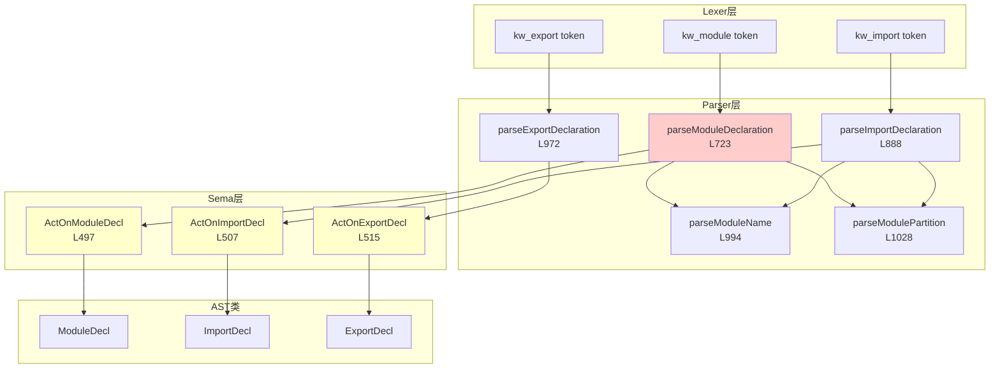

# Task 2.2.9: C++20模块功能域 - 函数清单

**任务ID**: Task 2.2.9  
**功能域**: C++20模块 (Modules)  
**执行时间**: 2026-04-19 21:10-21:25  
**状态**: ✅ DONE

---

## 📊 扫描结果总览

| 层级 | 文件数 | 函数数 | 说明 |
|------|--------|--------|------|
| Sema层 | 1个文件 | 3个函数 | ActOn回调 |
| Parser层 | 1个文件 | 5个函数 | 解析逻辑 |
| AST类 | 1个文件 | 3个类 | ModuleDecl, ImportDecl, ExportDecl |
| **总计** | **3个文件** | **8个函数 + 3个类** | - |

---

## 🔍 核心函数清单

### 1. Sema::ActOnModuleDecl - 模块声明处理

**文件**: `src/Sema/Sema.cpp`  
**行号**: L497-505  
**类型**: `DeclResult Sema::ActOnModuleDecl(SourceLocation Loc, llvm::StringRef Name, bool IsExported, llvm::StringRef Partition, bool IsPartition, bool IsGlobalFragment, bool IsPrivateFragment)`

**功能说明**:
处理module声明，支持三种形式：
1. `module name;` - 普通模块声明
2. `module;` - 全局模块片段
3. `module :private;` - 私有模块片段

**实现代码**:
```cpp
DeclResult Sema::ActOnModuleDecl(SourceLocation Loc, llvm::StringRef Name,
                                 bool IsExported, llvm::StringRef Partition,
                                 bool IsPartition, bool IsGlobalFragment,
                                 bool IsPrivateFragment) {
  auto *MD = Context.create<ModuleDecl>(Loc, Name, IsExported, Partition,
                                         IsPartition, IsGlobalFragment,
                                         IsPrivateFragment);
  return DeclResult(MD);
}
```

**特点**:
- ✅ 简单工厂模式
- ⚠️ **未注册到符号表**（与NamespaceDecl不同）
- ⚠️ **未设置CurContext**（模块内的声明应属于模块上下文）

**参数说明**:
- `Name`: 模块名称（如"std.core"）
- `IsExported`: 是否为export module
- `Partition`: 分区名称（如":impl"）
- `IsPartition`: 是否为模块分区
- `IsGlobalFragment`: 是否为全局模块片段（`module;`）
- `IsPrivateFragment`: 是否为私有模块片段（`module :private;`）

---

### 2. Sema::ActOnImportDecl - import声明处理

**文件**: `src/Sema/Sema.cpp`  
**行号**: L507-513  
**类型**: `DeclResult Sema::ActOnImportDecl(SourceLocation Loc, llvm::StringRef ModuleName, bool IsExported, llvm::StringRef Partition, llvm::StringRef Header, bool IsHeader)`

**功能说明**:
处理import声明，支持两种形式：
1. `import module.name;` - 模块导入
2. `import <header>;` / `import "header";` - 头文件导入

**实现代码**:
```cpp
DeclResult Sema::ActOnImportDecl(SourceLocation Loc, llvm::StringRef ModuleName,
                                 bool IsExported, llvm::StringRef Partition,
                                 llvm::StringRef Header, bool IsHeader) {
  auto *ID = Context.create<ImportDecl>(Loc, ModuleName, IsExported, Partition,
                                         Header, IsHeader);
  return DeclResult(ID);
}
```

**特点**:
- ✅ 区分模块导入和头文件导入
- ⚠️ **未实际加载模块内容**
- ⚠️ **未检查模块是否存在**

**参数说明**:
- `ModuleName`: 模块名称
- `IsExported`: 是否为export import（重新导出）
- `Partition`: 分区名称
- `Header`: 头文件名称（如果是头文件导入）
- `IsHeader`: 是否为头文件导入

---

### 3. Sema::ActOnExportDecl - export声明处理

**文件**: `src/Sema/Sema.cpp`  
**行号**: L515-518  
**类型**: `DeclResult Sema::ActOnExportDecl(SourceLocation Loc, Decl *Exported)`

**功能说明**:
处理export声明，导出单个声明

**实现代码**:
```cpp
DeclResult Sema::ActOnExportDecl(SourceLocation Loc, Decl *Exported) {
  auto *ED = Context.create<ExportDecl>(Loc, Exported);
  return DeclResult(ED);
}
```

**使用场景**:
- `export int x;` - 导出变量
- `export template<typename T> class Vector {};` - 导出模板

**特点**:
- ✅ 包装被导出的声明
- ⚠️ **未标记被导出声明的可见性**

---

### 4. Parser::parseModuleDeclaration - 模块声明解析

**文件**: `src/Parse/ParseDecl.cpp`  
**行号**: L723-881  
**类型**: `ModuleDecl *Parser::parseModuleDeclaration()`

**功能说明**:
解析module声明的完整语法

**支持的语法**:
```cpp
module-declaration ::= 
    'export'? 'module' module-name module-partition? attribute-specifier-seq? ';'
  | 'module' ';'                                    // global module fragment
  | 'module' ':' 'private' attribute-specifier-seq? ';' // private module fragment
```

**实现流程**:
```cpp
ModuleDecl *Parser::parseModuleDeclaration() {
  // Step 1: Check for 'export' keyword (optional)
  bool IsExported = false;
  if (Tok.is(TokenKind::kw_export)) {
    IsExported = true;
    consumeToken();
  }

  // Step 2: Expect 'module' keyword
  if (!Tok.is(TokenKind::kw_module)) {
    emitError(DiagID::err_expected);
    return nullptr;
  }
  SourceLocation ModuleLoc = Tok.getLocation();
  consumeToken();

  // Step 3: Check for global module fragment: module;
  if (Tok.is(TokenKind::semicolon)) {
    consumeToken();
    return llvm::cast<ModuleDecl>(Actions.ActOnModuleDecl(ModuleLoc, "", IsExported, "", false, true, false).get());
  }

  // Step 4: Check for private module fragment: module :private;
  if (Tok.is(TokenKind::colon)) {
    consumeToken();
    if (!Tok.is(TokenKind::kw_private)) {
      emitError(DiagID::err_expected);
      return nullptr;
    }
    consumeToken();
    
    // Parse optional attributes [[...]]
    while (Tok.is(TokenKind::l_square)) {
      // ... parse attributes ...
    }
    
    if (!Tok.is(TokenKind::semicolon)) {
      emitError(DiagID::err_expected_semi);
      return nullptr;
    }
    consumeToken();
    
    return llvm::cast<ModuleDecl>(Actions.ActOnModuleDecl(ModuleLoc, "", IsExported, "", false, false, true).get());
  }

  // Step 5: Parse module name (e.g., "std.core")
  llvm::StringRef FullModuleName = parseModuleName();

  // Step 6: Parse module partition (optional, e.g., ":impl")
  llvm::StringRef PartitionName;
  bool IsModulePartition = false;
  if (Tok.is(TokenKind::colon)) {
    IsModulePartition = true;
    PartitionName = parseModulePartition();
  }

  // Step 7: Create ModuleDecl
  ModuleDecl *MD = llvm::cast<ModuleDecl>(Actions.ActOnModuleDecl(ModuleLoc, FullModuleName, IsExported, PartitionName, IsModulePartition, false, false).get());

  // Step 8: Parse attribute-specifier-seq (optional)
  while (Tok.is(TokenKind::l_square)) {
    // Parse [[attr]] and add to MD->Attributes
    // ...
  }

  // Step 9: Expect ';'
  if (!Tok.is(TokenKind::semicolon)) {
    emitError(DiagID::err_expected_semi);
    return nullptr;
  }
  consumeToken();

  return MD;
}
```

**关键特性**:
- ✅ 支持三种module形式（普通/全局片段/私有片段）
- ✅ 支持模块分区（`:partition`）
- ✅ 支持属性（`[[attr]]`）
- ✅ 支持export module

**复杂度**: 🔴 **159行**，是Parser中最复杂的声明解析之一

---

### 5. Parser::parseImportDeclaration - import声明解析

**文件**: `src/Parse/ParseDecl.cpp`  
**行号**: L888-967  
**类型**: `ImportDecl *Parser::parseImportDeclaration()`

**功能说明**:
解析import声明

**支持的语法**:
```cpp
module-import ::= 
    'export'? 'import' module-name module-partition? ';'
  | 'export'? 'import' header-name ';'
header-name ::= '<' header-name-tokens '>' | '"' header-name-tokens '"'
```

**实现流程**:
```cpp
ImportDecl *Parser::parseImportDeclaration() {
  // Step 1: Check for 'export' keyword (optional)
  bool IsExported = false;
  if (Tok.is(TokenKind::kw_export)) {
    IsExported = true;
    consumeToken();
  }

  // Step 2: Expect 'import' keyword
  if (!Tok.is(TokenKind::kw_import)) {
    emitError(DiagID::err_expected);
    return nullptr;
  }
  SourceLocation ImportLoc = Tok.getLocation();
  consumeToken();

  // Step 3: Check for header import: import <header> or import "header"
  llvm::StringRef HeaderName;
  bool IsHeaderImport = false;

  if (Tok.is(TokenKind::less)) {
    // System header import: import <iostream>
    IsHeaderImport = true;
    consumeToken();
    
    std::string Header;
    while (!Tok.is(TokenKind::greater) && !Tok.is(TokenKind::eof)) {
      Header += Tok.getText().str();
      consumeToken();
    }
    
    if (!Tok.is(TokenKind::greater)) {
      emitError(DiagID::err_expected);
      return nullptr;
    }
    consumeToken();
    
    HeaderName = Context.saveString(Header);
    
  } else if (Tok.is(TokenKind::string_literal)) {
    // User header import: import "header.h"
    IsHeaderImport = true;
    HeaderName = Tok.getText();
    consumeToken();
  }

  if (IsHeaderImport) {
    if (!Tok.is(TokenKind::semicolon)) {
      emitError(DiagID::err_expected_semi);
      return nullptr;
    }
    consumeToken();
    
    return llvm::cast<ImportDecl>(Actions.ActOnImportDecl(ImportLoc, "", IsExported, "", HeaderName, true).get());
  }

  // Step 4: Parse module name
  llvm::StringRef ModuleName = parseModuleName();

  // Step 5: Parse module partition (optional)
  llvm::StringRef PartitionName;
  if (Tok.is(TokenKind::colon)) {
    PartitionName = parseModulePartition();
  }

  // Step 6: Expect ';'
  if (!Tok.is(TokenKind::semicolon)) {
    emitError(DiagID::err_expected_semi);
    return nullptr;
  }
  consumeToken();

  return llvm::cast<ImportDecl>(Actions.ActOnImportDecl(ImportLoc, ModuleName, IsExported, PartitionName, "", false).get());
}
```

**关键特性**:
- ✅ 区分模块导入和头文件导入
- ✅ 支持系统头文件（`<header>`）和用户头文件（`"header"`）
- ✅ 支持export import（重新导出）

---

### 6. Parser::parseExportDeclaration - export声明解析

**文件**: `src/Parse/ParseDecl.cpp`  
**行号**: L972-989  
**类型**: `ExportDecl *Parser::parseExportDeclaration()`

**功能说明**:
解析export声明

**实现的语法**:
```cpp
export-declaration ::= 'export' declaration
```

**实现代码**:
```cpp
ExportDecl *Parser::parseExportDeclaration() {
  // Expect 'export' keyword
  if (!Tok.is(TokenKind::kw_export)) {
    emitError(DiagID::err_expected);
    return nullptr;
  }

  SourceLocation ExportLoc = Tok.getLocation();
  consumeToken();

  // Parse the exported declaration
  Decl *ExportedDecl = parseDeclaration();
  if (!ExportedDecl) {
    return nullptr;
  }

  return llvm::cast<ExportDecl>(Actions.ActOnExportDecl(ExportLoc, ExportedDecl).get());
}
```

**特点**:
- ✅ 简单：解析export后跟任意声明
- ⚠️ **不支持export块**：`export { decl1; decl2; }`

---

### 7-8. Parser::parseModuleName / parseModulePartition - 辅助函数

**文件**: `src/Parse/ParseDecl.cpp`  
**行号**: L994-1047

**功能说明**:
解析模块名称和分区名称

**parseModuleName**:
```cpp
llvm::StringRef Parser::parseModuleName() {
  if (!Tok.is(TokenKind::identifier)) {
    emitError(DiagID::err_expected_identifier);
    return "";
  }

  llvm::StringRef ModuleName = Tok.getText();
  consumeToken();

  // Handle dotted module names (e.g., std.core)
  std::string FullName = ModuleName.str();
  while (Tok.is(TokenKind::period)) {
    consumeToken();

    if (!Tok.is(TokenKind::identifier)) {
      emitError(DiagID::err_expected_identifier);
      break;
    }

    FullName += ".";
    FullName += Tok.getText().str();
    consumeToken();
  }

  return Context.saveString(FullName);
}
```

**parseModulePartition**:
```cpp
llvm::StringRef Parser::parseModulePartition() {
  if (!Tok.is(TokenKind::colon)) {
    emitError(DiagID::err_expected_colon);
    return "";
  }

  consumeToken();

  if (!Tok.is(TokenKind::identifier)) {
    emitError(DiagID::err_expected_identifier);
    return "";
  }

  llvm::StringRef PartitionName = Tok.getText();
  consumeToken();

  return PartitionName;
}
```

---

## 📦 AST类定义

### ModuleDecl类

**文件**: `include/blocktype/AST/Decl.h`  
**行号**: L1265-1306

**成员变量**:
```cpp
class ModuleDecl : public NamedDecl {
  llvm::StringRef ModuleName;
  llvm::StringRef FullModuleName; // Full dotted module name (e.g., "std.core")
  llvm::StringRef PartitionName;
  llvm::SmallVector<llvm::StringRef, 4> Attributes; // Module attributes
  bool IsExported;
  bool IsModulePartition;
  bool IsGlobalModuleFragment;  // module; (global module fragment)
  bool IsPrivateModuleFragment; // module :private; (private module fragment)
};
```

**方法**:
- `getModuleName()`: 获取模块名
- `getFullModuleName()`: 获取完整模块名（含点号）
- `getPartitionName()`: 获取分区名
- `getAttributes()`: 获取属性列表
- `isExported()`: 是否export
- `isModulePartition()`: 是否是分区
- `isGlobalModuleFragment()`: 是否是全局片段
- `isPrivateModuleFragment()`: 是否是私有片段
- `setFullModuleName()`: 设置完整模块名
- `addAttribute()`: 添加属性

---

### ImportDecl类

**文件**: `include/blocktype/AST/Decl.h`  
**行号**: L1314-1344

**成员变量**:
```cpp
class ImportDecl : public NamedDecl {
  llvm::StringRef ModuleName;
  llvm::StringRef PartitionName;
  llvm::StringRef HeaderName; // Header name for header imports
  bool IsExported;
  bool IsHeaderImport; // True if importing a header
};
```

**方法**:
- `getModuleName()`: 获取模块名
- `getPartitionName()`: 获取分区名
- `getHeaderName()`: 获取头文件名
- `isExported()`: 是否export
- `isHeaderImport()`: 是否头文件导入
- `setHeaderName()`: 设置头文件名

---

### ExportDecl类

**文件**: `include/blocktype/AST/Decl.h`  
**行号**: L1352-1368

**成员变量**:
```cpp
class ExportDecl : public Decl {
  Decl *ExportedDecl;
};
```

**方法**:
- `getExportedDecl()`: 获取被导出的声明

---

## 🔄 完整调用链图



---

## ⚠️ 发现的问题

### P0问题 #1: 模块系统完全未实现语义

**严重程度**: 🔴 **P0 - 阻塞性问题**

**位置**: 整个模块系统

**问题描述**:
- Parser能正确解析module/import/export语法
- Sema只创建AST节点，**无任何语义处理**
- **未实现模块加载机制**
- **未实现模块可见性控制**
- **未实现模块缓存**
- **未设置CurContext为模块上下文**

**影响**:
- 模块声明只是"装饰"，不影响编译行为
- import不会实际加载模块内容
- export不会改变声明的可见性
- 多个模块单元可以重复定义相同名称

**建议修复路线图**:

**Phase 1: 基础架构**
```cpp
// 1. 添加ModuleManager类管理模块
class ModuleManager {
  llvm::StringMap<std::unique_ptr<ModuleUnit>> LoadedModules;
  
public:
  ModuleUnit* loadModule(llvm::StringRef Name);
  void setCurrentModule(ModuleDecl *MD);
  bool isNameVisible(llvm::StringRef Name);
};

// 2. 在Sema中添加ModuleManager
class Sema {
  std::unique_ptr<ModuleManager> ModMgr;
  ModuleDecl *CurrentModule = nullptr;
};
```

**Phase 2: ActOnModuleDecl集成**
```cpp
DeclResult Sema::ActOnModuleDecl(...) {
  auto *MD = Context.create<ModuleDecl>(...);
  
  // Set current module context
  CurrentModule = MD;
  ModMgr->setCurrentModule(MD);
  
  // Register module in global registry
  ModMgr->registerModule(MD);
  
  return DeclResult(MD);
}
```

**Phase 3: ActOnImportDecl实现加载**
```cpp
DeclResult Sema::ActOnImportDecl(...) {
  auto *ID = Context.create<ImportDecl>(...);
  
  // Load the imported module
  if (!IsHeader) {
    ModuleUnit *Imported = ModMgr->loadModule(ModuleName);
    if (!Imported) {
      Diags.report(Loc, DiagID::err_module_not_found, ModuleName);
      return DeclResult::getInvalid();
    }
    
    // Merge imported declarations into current scope
    for (auto *D : Imported->getExportedDecls()) {
      registerDecl(D);
    }
  }
  
  return DeclResult(ID);
}
```

**Phase 4: ActOnExportDecl标记可见性**
```cpp
DeclResult Sema::ActOnExportDecl(SourceLocation Loc, Decl *Exported) {
  auto *ED = Context.create<ExportDecl>(Loc, Exported);
  
  // Mark the exported declaration as visible outside module
  if (auto *ND = llvm::dyn_cast<NamedDecl>(Exported)) {
    ND->setModuleVisibility(ModuleVisibility::Exported);
  }
  
  return DeclResult(ED);
}
```

---

### P1问题 #2: ActOnModuleDecl/ImportDecl未注册到符号表

**位置**: 
- `ActOnModuleDecl` L497-505
- `ActOnImportDecl` L507-513

**当前实现**:
```cpp
DeclResult Sema::ActOnModuleDecl(...) {
  auto *MD = Context.create<ModuleDecl>(...);
  return DeclResult(MD);  // ← 未注册
}

DeclResult Sema::ActOnImportDecl(...) {
  auto *ID = Context.create<ImportDecl>(...);
  return DeclResult(ID);  // ← 未注册
}
```

**对比**: NamespaceDecl会调用`registerDecl`
```cpp
DeclResult Sema::ActOnNamespaceDecl(...) {
  auto *NS = Context.create<NamespaceDecl>(...);
  registerDecl(NS);  // ← 注册到符号表
  if (CurContext) CurContext->addDecl(NS);
  return DeclResult(NS);
}
```

**问题**:
- 模块声明无法通过名称查找访问
- 无法检测重复的模块声明

**建议修复**:
```cpp
DeclResult Sema::ActOnModuleDecl(...) {
  auto *MD = Context.create<ModuleDecl>(...);
  registerDecl(MD);  // ← 添加注册
  if (CurContext) CurContext->addDecl(MD);
  return DeclResult(MD);
}
```

---

### P2问题 #3: parseExportDeclaration不支持export块

**位置**: `ParseDecl.cpp` L972-989

**当前实现**:
```cpp
ExportDecl *Parser::parseExportDeclaration() {
  // ...
  Decl *ExportedDecl = parseDeclaration();  // ← 只解析单个声明
  // ...
}
```

**问题**:
- C++20支持export块：`export { decl1; decl2; }`
- 当前实现只能`export single_decl;`

**建议改进**:
```cpp
ExportDecl *Parser::parseExportDeclaration() {
  // ...
  consumeToken(); // consume 'export'
  
  // Check for export block: export { ... }
  if (Tok.is(TokenKind::l_brace)) {
    return parseExportBlock();
  }
  
  // Single declaration export
  Decl *ExportedDecl = parseDeclaration();
  // ...
}

ExportDecl *Parser::parseExportBlock() {
  // Parse export { decl1; decl2; ... }
  // Create multiple ExportDecl or a single ExportBlockDecl
  // ...
}
```

---

### P3问题 #4: 缺少模块接口/实现分离支持

**观察**:
- 当前实现没有区分模块接口单元（`.ixx`/`.cppm`）和实现单元（`.cpp`）
- 没有`module;`全局片段后的声明过滤逻辑

**C++20标准**:
```cpp
// Module interface unit (.cppm)
module;           // Global module fragment
#include <cstdio> // Only allowed here

module mylib;     // Module declaration

export int foo(); // Exported declaration

// Module implementation unit (.cpp)
module mylib;     // Same module name

int foo() { ... } // Not exported, but part of module
```

**建议**:
- 添加ModuleUnitType枚举（Interface/Implementation）
- 在全局片段后只允许特定声明（#include等）
- 验证实现单元的模块名与接口单元匹配

---

## 📈 统计数据

| 指标 | 数值 |
|------|------|
| 核心函数总数 | 8个（3个Sema + 5个Parser） |
| AST类数量 | 3个（ModuleDecl, ImportDecl, ExportDecl） |
| Parser复杂度 | parseModuleDeclaration: 159行 |
| 发现问题数 | 4个（P0×1, P1×1, P2×1, P3×1） |
| 代码行数估算 | ~400行（Parser 300行 + Sema 20行 + AST 80行） |
| **实现完整度** | **~10%**（仅语法解析，无语义） |

---

## 🎯 总结

### ✅ 优点

1. **语法解析完整**: 支持module/import/export的所有基本形式
2. **AST设计合理**: ModuleDecl/ImportDecl/ExportDecl结构清晰
3. **支持高级特性**: 模块分区、全局/私有片段、属性、export import
4. **Parser实现健壮**: 详细的错误恢复和诊断

### ❌ 严重问题

1. **🔴 P0: 语义完全未实现**: 模块系统只是"语法糖"，无实际功能
2. **P1: 未注册到符号表**: 模块声明无法查找
3. **P2: 不支持export块**: 只能导出单个声明
4. **P3: 缺少接口/实现分离**: 未区分interface/implementation unit

### 🔗 与其他功能域的关联

- **Task 2.2.3 (名称查找)**: 模块需要独立的名称空间管理
- **Task 2.2.5 (声明处理)**: export声明包装其他声明
- **未来工作**: 需要完整的ModuleManager实现模块加载和可见性控制

### 🚨 紧急程度评估

**C++20模块是编译器的重要特性**，但当前实现仅为骨架：
- **短期**：可以编译带module/import/export的代码，但无实际效果
- **中期**：需要实现ModuleManager和模块加载机制
- **长期**：需要模块缓存、增量编译、预编译模块等优化

---

**报告生成时间**: 2026-04-19 21:25  
**下一步**: Task 2.2.10 - Lambda表达式功能域
