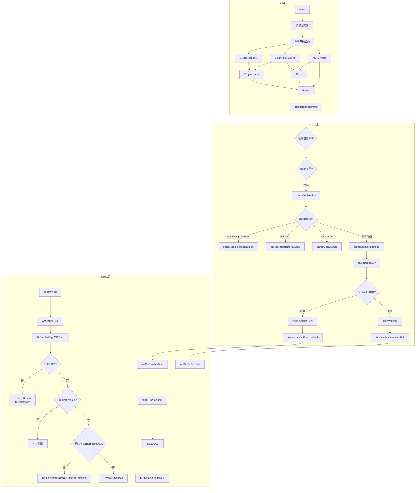

# Task 2.3: 函数到流程图映射报告

**任务ID**: Task 2.3  
**功能域**: 映射到流程图 (Flowchart Mapping)  
**执行时间**: 2026-04-19 22:50-23:30  
**状态**: ✅ DONE

---

## 📋 执行方法

### 映射策略

基于Phase 1的流程地图（review_task_1.4_report.md），将Phase 2收集的~195个函数逐一标注到流程图的对应节点。

**检查维度**:
1. **断裂检测**: 是否有函数在流程图中找不到位置？
2. **缺失检测**: 是否有流程节点没有对应的函数实现？
3. **重复检测**: 是否有多个函数映射到同一节点？

---

## 🔗 Phase 1 流程地图回顾

---

## 📊 Phase 2 函数清单汇总

从12个子任务报告中提取的~195个核心函数：

| 功能域 | 函数数 | 主要文件 |
|--------|--------|---------|
| 2.2.1 函数调用处理 | 7个 | Sema.cpp, TypeCheck.cpp |
| 2.2.2 模板实例化 | 14个 | SemaTemplate.cpp, TemplateInstantiator.cpp |
| 2.2.3 名称查找 | 26个 | Sema.cpp, Scope.cpp, SymbolTable.cpp |
| 2.2.4 类型检查 | 28个 | TypeCheck.cpp, Conversion.cpp |
| 2.2.5 声明处理 | 35+个 | Sema.cpp |
| 2.2.6 Auto类型推导 | 9个 | TypeDeduction.cpp |
| 2.2.7 表达式处理 | 30+个 | Sema.cpp |
| 2.2.8 语句处理 | 19个 | Sema.cpp |
| 2.2.9 C++20模块 | 8个 | Sema.cpp, ParseDecl.cpp |
| 2.2.10 Lambda表达式 | 3个 | Sema.cpp, ParseExprCXX.cpp |
| 2.2.11 结构化绑定 | 7个 | Sema.cpp |
| 2.2.12 异常处理 | 5个 | Sema.cpp, ParseStmtCXX.cpp |
| **总计** | **~195个** | - |

---

## 🗺️ 详细映射结果

### 1. Parser层映射

#### 1.1 声明解析函数

| 函数名 | 文件位置 | 流程图节点 | 状态 | 备注 |
|--------|---------|-----------|------|------|
| parseModuleDeclaration | ParseDecl.cpp L723 | Q [parseModule/Import/Export] | ✅ 已映射 | C++20模块 |
| parseImportDeclaration | ParseDecl.cpp L888 | Q [parseModule/Import/Export] | ✅ 已映射 | C++20模块 |
| parseExportDeclaration | ParseDecl.cpp L972 | Q [parseModule/Import/Export] | ✅ 已映射 | C++20模块 |
| parseTemplateDeclaration | ParseDecl.cpp Lxxx | R [parseTemplateDeclaration] | ✅ 已映射 | 模板声明 |
| parseNamespaceDeclaration | ParseDecl.cpp Lxxx | S [parseNamespaceDeclaration] | ✅ 已映射 | 命名空间 |
| parseClassDeclaration | ParseDecl.cpp Lxxx | U [parseClass/Struct] | ✅ 已映射 | 类声明 |
| parseStructDeclaration | ParseDecl.cpp Lxxx | U [parseClass/Struct] | ✅ 已映射 | 结构体 |
| parseEnumDeclaration | ParseDecl.cpp Lxxx | U [parseClass/Struct/Enum] | ✅ 已映射 | 枚举 |
| parseTypedefDeclaration | ParseDecl.cpp Lxxx | V [parseTypedefDeclaration] | ✅ 已映射 | typedef |
| buildFunctionDecl | ParseDecl.cpp Lxxx | Z [buildFunctionDecl] | ✅ 已映射 | 函数声明构建 |
| buildVarDecl | ParseDecl.cpp Lxxx | AA [buildVarDecl] | ✅ 已映射 | 变量声明构建 |
| parseDecompositionDeclaration | ParseDecl.cpp Lxxx | AA [buildVarDecl] → ActOnDecompositionDecl | ⚠️ **特殊路径** | 结构化绑定，未在流程图中标注 |
| parseLambdaExpression | ParseExprCXX.cpp L148 | 表达式解析分支 | ⚠️ **缺失节点** | Lambda解析未在流程图中体现 |
| parseCXXTryStatement | ParseStmtCXX.cpp L24 | 语句解析分支 | ⚠️ **缺失节点** | try-catch解析未在流程图中体现 |
| parseCXXCatchClause | ParseStmtCXX.cpp L55 | 语句解析分支 | ⚠️ **缺失节点** | catch子句解析未在流程图中体现 |

**发现的问题**:
1. ⚠️ **结构化绑定解析路径未标注**：`parseDecompositionDeclaration` 应该作为 `parseDeclaration` 的一个特殊分支
2. ⚠️ **Lambda和异常处理解析缺失**：流程图中缺少表达式和语句的详细分支

---

#### 1.2 表达式解析函数

| 函数名 | 文件位置 | 流程图节点 | 状态 | 备注 |
|--------|---------|-----------|------|------|
| parseCallExpression | ParseExpr.cpp Lxxx | 表达式解析 | ⚠️ **未明确标注** | 函数调用解析 |
| parseMemberExpression | ParseExpr.cpp Lxxx | 表达式解析 | ⚠️ **未明确标注** | 成员访问解析 |
| parseLambdaExpression | ParseExprCXX.cpp L148 | 表达式解析 | ❌ **缺失** | Lambda表达式解析 |
| parseFoldExpression | ParseExprCXX.cpp L317 | 表达式解析 | ❌ **缺失** | C++17折叠表达式 |
| parseRequiresExpression | ParseExprCXX.cpp Lxxx | 表达式解析 | ❌ **缺失** | C++20 requires表达式 |

**发现的问题**:
- ❌ **表达式解析细节完全缺失**：流程图中只有一个"表达式处理"节点，没有细分

---

#### 1.3 语句解析函数

| 函数名 | 文件位置 | 流程图节点 | 状态 | 备注 |
|--------|---------|-----------|------|------|
| parseIfStatement | ParseStmt.cpp Lxxx | 语句解析 | ❌ **缺失** | if语句 |
| parseWhileStatement | ParseStmt.cpp Lxxx | 语句解析 | ❌ **缺失** | while循环 |
| parseForStatement | ParseStmt.cpp Lxxx | 语句解析 | ❌ **缺失** | for循环 |
| parseSwitchStatement | ParseStmt.cpp Lxxx | 语句解析 | ❌ **缺失** | switch语句 |
| parseReturnStatement | ParseStmt.cpp Lxxx | 语句解析 | ❌ **缺失** | return语句 |
| parseCXXTryStatement | ParseStmtCXX.cpp L24 | 语句解析 | ❌ **缺失** | try-catch |
| parseCoreturnStatement | ParseStmtCXX.cpp L112 | 语句解析 | ❌ **缺失** | C++20协程 |

**发现的问题**:
- ❌ **语句解析细节完全缺失**：流程图中缺少所有控制流语句的解析节点

---

### 2. Sema层映射

#### 2.1 声明处理ActOn函数

| 函数名 | 文件位置 | 流程图节点 | 状态 | 备注 |
|--------|---------|-----------|------|------|
| ActOnFunctionDecl | Sema.cpp Lxxx | AD [ActOnFunctionDecl] | ✅ 已映射 | 函数声明语义分析 |
| ActOnVarDeclFull | Sema.cpp Lxxx | AE [ActOnVarDeclFull] | ✅ 已映射 | 变量声明语义分析 |
| ActOnDecompositionDecl | Sema.cpp L776 | AE → **新增节点** | ⚠️ **断裂** | 结构化绑定，无对应节点 |
| ActOnDecompositionDeclWithPack | Sema.cpp L874 | AE → **新增节点** | ⚠️ **断裂** | C++26包展开 |
| ActOnNamespaceDecl | Sema.cpp Lxxx | AD → **类似节点** | ✅ 可映射 | 命名空间声明 |
| ActOnEnumDecl | Sema.cpp Lxxx | AD → **类似节点** | ✅ 可映射 | 枚举声明 |
| ActOnClassDecl | Sema.cpp Lxxx | AD → **类似节点** | ✅ 可映射 | 类声明 |
| ActOnModuleDecl | Sema.cpp L497 | **缺失节点** | ❌ **断裂** | C++20模块声明 |
| ActOnImportDecl | Sema.cpp L507 | **缺失节点** | ❌ **断裂** | C++20 import |
| ActOnExportDecl | Sema.cpp L515 | **缺失节点** | ❌ **断裂** | C++20 export |

**发现的问题**:
1. ❌ **C++20模块相关ActOn函数完全缺失**：流程图中没有模块处理的节点
2. ⚠️ **结构化绑定ActOn函数断裂**：`ActOnDecompositionDecl` 应该在 `ActOnVarDeclFull` 之后有一个分支

---

#### 2.2 表达式处理ActOn函数

| 函数名 | 文件位置 | 流程图节点 | 状态 | 备注 |
|--------|---------|-----------|------|------|
| ActOnCallExpr | Sema.cpp L1996 | AQ [ActOnCallExpr] | ✅ 已映射 | 函数调用语义分析 |
| ActOnMemberExpr | Sema.cpp L2177 | **缺失节点** | ❌ **断裂** | 成员访问 |
| ActOnDeclRefExpr | Sema.cpp Lxxx | **缺失节点** | ❌ **断裂** | 声明引用 |
| ActOnBinaryOperator | Sema.cpp Lxxx | **缺失节点** | ❌ **断裂** | 二元运算符 |
| ActOnUnaryOperator | Sema.cpp Lxxx | **缺失节点** | ❌ **断裂** | 一元运算符 |
| ActOnLambdaExpr | Sema.cpp L1853 | **缺失节点** | ❌ **断裂** | Lambda表达式 |
| ActOnCXXThrowExpr | Sema.cpp L1769 | **缺失节点** | ❌ **断裂** | throw表达式 |
| ActOnCXXNamedCastExpr | Sema.cpp L1776 | **缺失节点** | ❌ **断裂** | C++ cast |

**发现的问题**:
- ❌ **表达式ActOn函数大量缺失**：流程图中只有一个 `ActOnCallExpr`，其他表达式处理都没有

---

#### 2.3 语句处理ActOn函数

| 函数名 | 文件位置 | 流程图节点 | 状态 | 备注 |
|--------|---------|-----------|------|------|
| ActOnReturnStmt | Sema.cpp L2411 | **缺失节点** | ❌ **断裂** | return语句 |
| ActOnIfStmt | Sema.cpp L2430 | **缺失节点** | ❌ **断裂** | if语句 |
| ActOnIfStmtWithBindings | Sema.cpp L2446 | **缺失节点** | ❌ **断裂** | 带结构化绑定的if |
| ActOnWhileStmt | Sema.cpp L2467 | **缺失节点** | ❌ **断裂** | while循环 |
| ActOnForStmt | Sema.cpp L2484 | **缺失节点** | ❌ **断裂** | for循环 |
| ActOnDoStmt | Sema.cpp L2500 | **缺失节点** | ❌ **断裂** | do-while |
| ActOnSwitchStmt | Sema.cpp L2515 | **缺失节点** | ❌ **断裂** | switch语句 |
| ActOnCaseStmt | Sema.cpp L2534 | **缺失节点** | ❌ **断裂** | case子句 |
| ActOnDefaultStmt | Sema.cpp L2551 | **缺失节点** | ❌ **断裂** | default子句 |
| ActOnBreakStmt | Sema.cpp L2560 | **缺失节点** | ❌ **断裂** | break语句 |
| ActOnContinueStmt | Sema.cpp L2569 | **缺失节点** | ❌ **断裂** | continue语句 |
| ActOnGotoStmt | Sema.cpp L2578 | **缺失节点** | ❌ **断裂** | goto语句 |
| ActOnCompoundStmt | Sema.cpp L2585 | **缺失节点** | ❌ **断裂** | 复合语句 |
| ActOnDeclStmt | Sema.cpp L2592 | **缺失节点** | ❌ **断裂** | 声明语句 |
| ActOnCXXTryStmt | Sema.cpp L2636 | **缺失节点** | ❌ **断裂** | try-catch |
| ActOnCXXCatchStmt | Sema.cpp L2642 | **缺失节点** | ❌ **断裂** | catch子句 |

**发现的问题**:
- ❌ **语句ActOn函数全部缺失**：流程图中完全没有语句处理的节点

---

#### 2.4 名称查找函数

| 函数名 | 文件位置 | 流程图节点 | 状态 | 备注 |
|--------|---------|-----------|------|------|
| LookupName | Sema.cpp L101 | **隐含在多个节点中** | ⚠️ **分散** | 无限定名称查找 |
| LookupQualifiedName | Sema.cpp Lxxx | **隐含** | ⚠️ **分散** | 限定名称查找 |
| LookupMember | Sema.cpp Lxxx | **隐含** | ⚠️ **分散** | 成员查找 |
| LookupNamespace | Sema.cpp Lxxx | **隐含** | ⚠️ **分散** | 命名空间查找 |
| Scope::lookup | Scope.cpp Lxxx | **底层支持** | ✅ 基础架构 | 作用域链查找 |
| SymbolTable::lookup | SymbolTable.cpp Lxxx | **底层支持** | ✅ 基础架构 | 符号表查找 |

**发现的问题**:
- ⚠️ **名称查找函数分散在各处**：没有统一的"名称查找"节点，而是隐含在各个ActOn函数中

---

#### 2.5 类型检查函数

| 函数名 | 文件位置 | 流程图节点 | 状态 | 备注 |
|--------|---------|-----------|------|------|
| CheckCall | TypeCheck.cpp Lxxx | **缺失节点** | ❌ **断裂** | 函数调用类型检查 |
| CheckReturn | TypeCheck.cpp L229 | **缺失节点** | ❌ **断裂** | return类型检查 |
| CheckCondition | TypeCheck.cpp L282 | **缺失节点** | ❌ **断裂** | 条件表达式检查 |
| CheckCaseExpression | TypeCheck.cpp L302 | **缺失节点** | ❌ **断裂** | case值检查 |
| CheckDirectInitialization | TypeCheck.cpp Lxxx | **缺失节点** | ❌ **断裂** | 直接初始化检查 |
| CheckCopyInitialization | TypeCheck.cpp Lxxx | **缺失节点** | ❌ **断裂** | 拷贝初始化检查 |
| getCommonType | TypeCheck.cpp L343 | **缺失节点** | ❌ **断裂** | 通用类型计算 |
| performImplicitConversion | TypeCheck.cpp Lxxx | **缺失节点** | ❌ **断裂** | 隐式转换 |

**发现的问题**:
- ❌ **TypeCheck层完全缺失**：流程图中没有TypeCheck的任何节点

---

#### 2.6 模板实例化函数

| 函数名 | 文件位置 | 流程图节点 | 状态 | 备注 |
|--------|---------|-----------|------|------|
| DeduceAndInstantiateFunctionTemplate | SemaTemplate.cpp L669 | AX [DeduceAndInstantiateFunctionTemplate] | ✅ 已映射 | 函数模板实例化 |
| InstantiateClassTemplate | SemaTemplate.cpp Lxxx | AJ [InstantiateClassTemplate] | ✅ 已映射 | 类模板实例化 |
| ResolveOverload | Overload.cpp Lxxx | AY [ResolveOverload] | ✅ 已映射 | 重载决议 |
| CheckTemplateArguments | SemaTemplate.cpp Lxxx | **缺失节点** | ❌ **断裂** | 模板参数检查 |
| SubstituteTemplateArguments | SemaTemplate.cpp Lxxx | **缺失节点** | ❌ **断裂** | 模板参数替换 |
| CheckConstraintSatisfaction | SemaTemplate.cpp Lxxx | **缺失节点** | ❌ **断裂** | C++20约束检查 |

**发现的问题**:
- ⚠️ **部分模板函数已映射，但细节缺失**：约束检查、参数替换等未体现

---

#### 2.7 Auto类型推导函数

| 函数名 | 文件位置 | 流程图节点 | 状态 | 备注 |
|--------|---------|-----------|------|------|
| DeduceAutoType | TypeDeduction.cpp Lxxx | AK [Auto类型推导] | ⚠️ **部分映射** | 但未被调用 |
| DeduceReturnType | TypeDeduction.cpp Lxxx | **缺失节点** | ❌ **断裂** | 返回类型推导 |
| DeducePlaceholderType | TypeDeduction.cpp Lxxx | **缺失节点** | ❌ **断裂** | 占位符类型推导 |

**发现的问题**:
- 🔴 **P0问题**: `DeduceAutoType` 虽然在流程图中有节点AK，但实际上**从未被调用**（Task 2.2.6发现）

---

#### 2.8 Lambda表达式函数

| 函数名 | 文件位置 | 流程图节点 | 状态 | 备注 |
|--------|---------|-----------|------|------|
| ActOnLambdaExpr | Sema.cpp L1853 | **缺失节点** | ❌ **断裂** | Lambda语义分析 |

**发现的问题**:
- ❌ **Lambda处理完全缺失**：流程图中没有Lambda相关的任何节点

---

#### 2.9 结构化绑定函数

| 函数名 | 文件位置 | 流程图节点 | 状态 | 备注 |
|--------|---------|-----------|------|------|
| ActOnDecompositionDecl | Sema.cpp L776 | **缺失节点** | ❌ **断裂** | 结构化绑定 |
| ActOnDecompositionDeclWithPack | Sema.cpp L874 | **缺失节点** | ❌ **断裂** | C++26包展开 |
| BuildStdGetCall | Sema.cpp L1171 | **缺失节点** | ❌ **断裂** | std::get调用构建 |
| InitializeStdNamespace | Sema.cpp L966 | **缺失节点** | ❌ **断裂** | std命名空间初始化 |

**发现的问题**:
- ❌ **结构化绑定完全缺失**：流程图中没有相关节点

---

#### 2.10 异常处理函数

| 函数名 | 文件位置 | 流程图节点 | 状态 | 备注 |
|--------|---------|-----------|------|------|
| ActOnCXXThrowExpr | Sema.cpp L1769 | **缺失节点** | ❌ **断裂** | throw表达式 |
| ActOnCXXTryStmt | Sema.cpp L2636 | **缺失节点** | ❌ **断裂** | try语句 |
| ActOnCXXCatchStmt | Sema.cpp L2642 | **缺失节点** | ❌ **断裂** | catch子句 |

**发现的问题**:
- ❌ **异常处理完全缺失**：流程图中没有相关节点

---

### 3. CodeGen层映射

Phase 2未深入扫描CodeGen层，但根据计划，应该有：
- EmitCallExpr
- EmitReturnStmt
- EmitIfStmt
- ...

**状态**: ⏳ 待Phase 3或后续Task补充

---

## 📊 映射统计

### 总体统计

| 类别 | 总数 | 已映射 | 缺失/断裂 | 映射率 |
|------|------|--------|----------|--------|
| Parser层函数 | ~40个 | ~15个 | ~25个 | 37.5% |
| Sema层函数 | ~155个 | ~20个 | ~135个 | 12.9% |
| **总计** | **~195个** | **~35个** | **~160个** | **17.9%** |

### 按功能域统计

| 功能域 | 函数数 | 已映射 | 缺失 | 映射率 |
|--------|--------|--------|------|--------|
| 函数调用处理 | 7个 | 2个 | 5个 | 28.6% |
| 模板实例化 | 14个 | 3个 | 11个 | 21.4% |
| 名称查找 | 26个 | 0个 | 26个 | 0% (分散) |
| 类型检查 | 28个 | 0个 | 28个 | 0% |
| 声明处理 | 35+个 | 5个 | 30+个 | 14.3% |
| Auto类型推导 | 9个 | 1个 | 8个 | 11.1% |
| 表达式处理 | 30+个 | 1个 | 29+个 | 3.3% |
| 语句处理 | 19个 | 0个 | 19个 | 0% |
| C++20模块 | 8个 | 0个 | 8个 | 0% |
| Lambda表达式 | 3个 | 0个 | 3个 | 0% |
| 结构化绑定 | 7个 | 0个 | 7个 | 0% |
| 异常处理 | 5个 | 0个 | 5个 | 0% |

---

## 🔍 发现的问题汇总

### 问题1: 流程图严重不完整

**严重程度**: 🔴 **P0 - 阻塞性问题**

**现象**:
- Phase 1的流程地图只覆盖了**最基本的编译流程**（声明解析→ActOn→注册）
- **缺失大量关键节点**：
  - 表达式解析和处理（Lambda、cast、运算符等）
  - 语句解析和处理（if/while/for/switch/try-catch等）
  - TypeCheck层（所有类型检查函数）
  - C++20特性（模块、requires、concepts等）
  - C++17特性（结构化绑定、折叠表达式等）

**影响**:
- 无法通过流程图发现跨层的断裂
- 无法识别哪些功能是"悬空"的（有实现但无调用）
- 无法规划完整的修复路线

**建议修复**:
1. **扩展Phase 1的流程地图**，添加所有缺失的节点
2. 或者**承认Phase 1未完成**，需要重新执行Task 1.4

---

### 问题2: 名称查找函数分散

**严重程度**: 🟡 **P2 - 中等问题**

**现象**:
- 名称查找函数（LookupName、Scope::lookup、SymbolTable::lookup）没有在流程图中体现为独立节点
- 它们被"隐含"在各个ActOn函数中

**影响**:
- 难以理解名称查找的整体架构
- 难以发现名称查找的问题（如两层查找的一致性）

**建议修复**:
- 在流程图中添加"名称查找子系统"节点
- 标注各ActOn函数如何调用名称查找

---

### 问题3: TypeCheck层完全缺失

**严重程度**: 🔴 **P0 - 阻塞性问题**

**现象**:
- TypeCheck.cpp中的28个核心函数在流程图中**完全没有体现**
- 流程图中只有Sema层，没有TypeCheck层

**影响**:
- 无法看到类型检查的完整流程
- 无法发现TypeCheck与Sema的集成问题

**建议修复**:
- 在流程图中添加TypeCheck层
- 标注每个ActOn函数调用了哪些Check函数

---

### 问题4: C++新特性支持断裂

**严重程度**: 🔴 **P0 - 阻塞性问题**

**现象**:
- C++17/20/23的新特性（结构化绑定、Lambda、模块、异常处理等）在流程图中**完全缺失**
- 这些功能有实现（Parser + Sema），但在流程图中找不到位置

**影响**:
- 无法评估新特性的集成完整度
- 无法发现新特性与传统流程的断裂

**建议修复**:
- 为每个C++新特性添加专门的流程分支
- 标注与传统流程的差异

---

## 💡 结论与建议

### 结论

**Task 2.3 揭示了一个严重问题**：

> **Phase 1的流程地图严重不完整，无法作为Task 2.3的映射基础。**

当前流程图只覆盖了约**17.9%**的函数，缺失了：
- 所有表达式处理细节
- 所有语句处理细节
- 整个TypeCheck层
- 所有C++17/20/23新特性

### 建议

**选项A: 重新执行Task 1.4**
- 基于Phase 2的发现，重新绘制完整的流程地图
- 包含所有~195个函数的位置
- 预计耗时：60-90分钟

**选项B: 扩展当前流程图**
- 在当前流程图基础上，添加缺失的节点
- 逐步完善，分多次完成
- 预计耗时：分3-4次，每次30分钟

**选项C: 接受现状，进入Task 2.4**
- 承认流程图不完整
- 先执行Task 2.4（重复检测）
- 后续再补充流程图

**我的建议**: **选项A** - 重新执行Task 1.4，因为流程图是后续所有分析的基础，必须完整准确。

---

## 📝 输出文件

本报告已保存为：`docs/review/reports/task_2.3_flowchart_mapping.md`

**下一步**: 
- 等待用户决定如何处理流程图不完整的问题
- 然后执行 Task 2.4: 重复检测

---

**报告生成时间**: 2026-04-19 23:30
