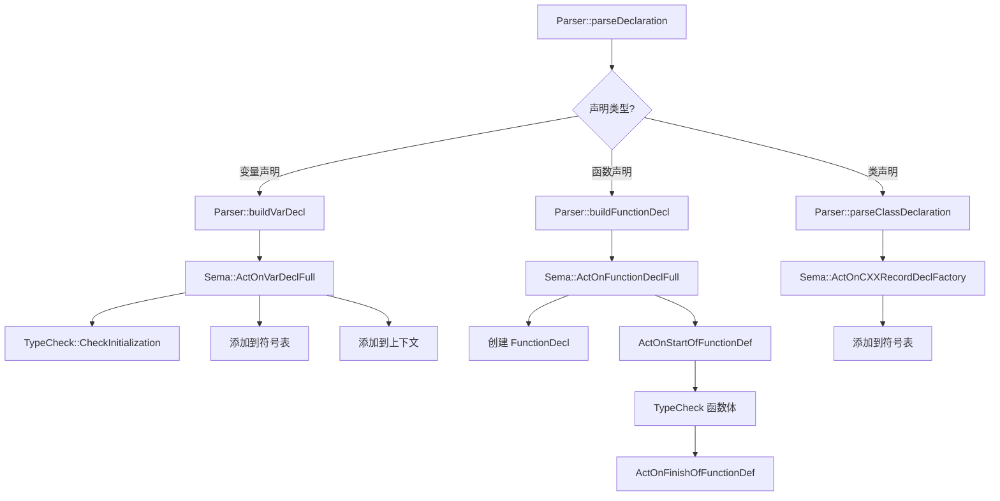
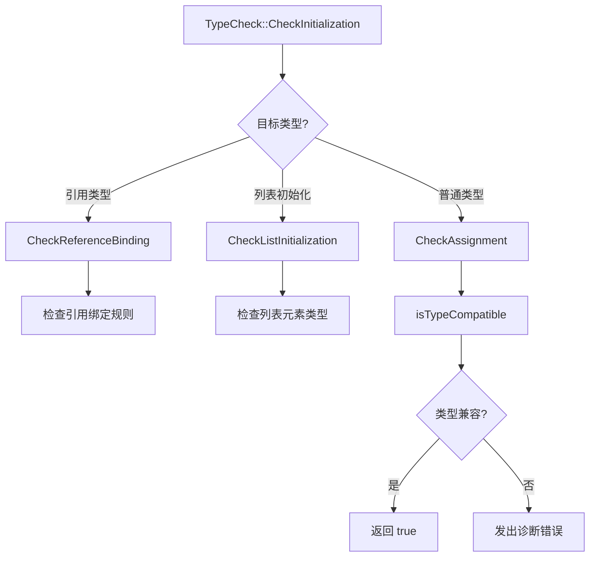

# Task 1.3: Sema 流程细化分析

**执行时间**: 2026-04-21 20:48
**状态**: ✅ 分析完成

---

## 📋 Sema 概述

Sema（Semantic Analysis）是编译器的语义分析模块，负责：
1. **语义检查**: 类型检查、作用域检查、访问控制等
2. **符号管理**: 符号表管理、作用域栈管理
3. **AST 构建**: 创建和注册 AST 节点
4. **常量求值**: 编译时常量计算

---

## 🔍 关键 ActOn 函数分析

### 1. ActOnVarDecl (L326)

**功能**: 创建变量声明

**流程**:
```
ActOnVarDecl(Loc, Name, T, Init)
  ├─ 创建 VarDecl 节点
  ├─ 如果有初始化表达式
  │   └─ TC.CheckInitialization(T, Init, Loc)  // 类型检查
  ├─ 添加到符号表 (CurrentScope)
  ├─ 添加到当前上下文 (CurContext)
  └─ 返回 DeclResult
```

**调用的 Check 函数**:
- `TypeCheck::CheckInitialization()` - 检查初始化类型兼容性

**返回**: `DeclResult` 包含创建的 `VarDecl*`

---

### 2. ActOnFunctionDecl (L344)

**功能**: 创建函数声明（不含函数体）

**流程**:
```
ActOnFunctionDecl(Loc, Name, T, Params, Body)
  ├─ 处理 auto 返回类型推导（延迟到模板实例化）
  ├─ 创建 FunctionDecl 节点
  ├─ registerDecl(FD)  // 注册到符号表
  ├─ 添加到当前上下文 (CurContext)
  └─ 返回 DeclResult
```

**关键点**:
- Auto 返回类型推导延迟处理
- 不进行函数体类型检查（在 ActOnFunctionDeclFull 中处理）

**返回**: `DeclResult` 包含创建的 `FunctionDecl*`

---

### 3. ActOnCallExpr (L1996)

**功能**: 创建函数调用表达式

**流程**:
```
ActOnCallExpr(Fn, Args, LParenLoc, RParenLoc)
  ├─ 检查 Fn 是否为 null
  ├─ 处理 Lambda 表达式调用
  │   ├─ Case 1: 直接 Lambda 表达式 [](){}()
  │   │   ├─ 获取闭包类
  │   │   ├─ 查找 operator() 方法
  │   │   └─ 设置返回类型
  │   └─ Case 2: Lambda 变量 auto lambda = [](){}; lambda()
  │       ├─ 检查变量类型是否为 RecordType
  │       ├─ 检查是否为 Lambda 闭包类
  │       ├─ 查找 operator() 方法
  │       └─ 设置返回类型
  ├─ 处理普通函数调用
  │   ├─ 获取函数声明
  │   ├─ TC.CheckCall(FD, Args, LParenLoc)  // 参数类型检查
  │   └─ 设置返回类型
  └─ 返回 ExprResult
```

**调用的 Check 函数**:
- `TypeCheck::CheckCall()` - 检查函数参数类型兼容性

**返回**: `ExprResult` 包含创建的 `CallExpr*`

---

### 4. ActOnVarDeclFull (L580)

**功能**: 创建完整的变量声明（带完整初始化）

**流程**:
```
ActOnVarDeclFull(Loc, Name, T, Init, IsStatic)
  ├─ 创建 VarDecl 节点
  ├─ 如果有初始化表达式
  │   └─ TC.CheckInitialization(T, Init, Loc)
  ├─ 如果是静态变量
  │   └─ 检查是否在函数作用域内
  ├─ 添加到符号表
  ├─ 添加到当前上下文
  └─ 返回 DeclResult
```

---

### 5. ActOnFunctionDeclFull (L1209)

**功能**: 创建完整的函数声明（带函数体）

**流程**:
```
ActOnFunctionDeclFull(Loc, Name, T, Params, Body, IsInline, IsConstexpr)
  ├─ 创建 FunctionDecl 节点
  ├─ 设置 inline/constexpr 属性
  ├─ 注册到符号表
  ├─ 如果有函数体
  │   ├─ ActOnStartOfFunctionDef(FD)
  │   │   ├─ 设置 CurFunction = FD
  │   │   ├─ PushScope(FunctionBodyScope)
  │   │   └─ 注册参数到作用域
  │   ├─ TypeCheck 函数体（遍历语句）
  │   └─ ActOnFinishOfFunctionDef(FD)
  │       ├─ CurFunction = nullptr
  │       └─ PopScope()
  └─ 返回 DeclResult
```

---

## 📊 TypeCheck 函数分析

### Check 函数列表

| 函数 | 功能 | 调用位置 |
|------|------|----------|
| `CheckInitialization` | 检查初始化类型兼容性 | ActOnVarDecl, ActOnVarDeclFull |
| `CheckAssignment` | 检查赋值类型兼容性 | 赋值表达式处理 |
| `CheckCall` | 检查函数调用参数 | ActOnCallExpr |
| `CheckReturn` | 检查返回语句类型 | ActOnReturnStmt |
| `CheckCondition` | 检查条件表达式 | if/while/for 语句 |
| `CheckCaseExpression` | 检查 case 表达式 | switch 语句 |
| `CheckDirectInitialization` | 检查直接初始化 | 构造函数调用 |
| `CheckListInitialization` | 检查列表初始化 | 初始化列表 |
| `CheckReferenceBinding` | 检查引用绑定 | 引用初始化 |

### CheckInitialization 流程

```
CheckInitialization(Dest, Init, Loc)
  ├─ 获取初始化表达式类型
  ├─ 如果 Dest 是引用类型
  │   └─ CheckReferenceBinding(Dest, Init, Loc)
  ├─ 如果 Init 是初始化列表
  │   └─ CheckListInitialization(Dest, Args, Loc)
  ├─ 否则
  │   └─ CheckAssignment(Dest, InitType, Loc)
  └─ 返回检查结果
```

### CheckCall 流程

```
CheckCall(F, Args, CallLoc)
  ├─ 获取函数参数列表
  ├─ 检查参数数量是否匹配
  ├─ 对每个参数
  │   └─ CheckInitialization(ParamType, Arg, Loc)
  └─ 返回检查结果
```

---

## 🔄 Sema 子流程图

### 声明处理流程



### 表达式处理流程

```mermaid
graph TD
    A[Parser::parseExpression] --> B{表达式类型?}
    
    B -->|函数调用| C[Parser::parseCallExpression]
    C --> D[Sema::ActOnCallExpr]
    D --> E{是 Lambda?}
    E -->|是| F[查找 operator()]
    E -->|否| G[获取 FunctionDecl]
    F --> H[TypeCheck::CheckCall]
    G --> H
    H --> I[设置返回类型]
    
    B -->|二元运算| J[Parser::parseRHS]
    J --> K[Sema::ActOnBinaryOp]
    K --> L[TypeCheck::getCommonType]
    
    B -->|变量引用| M[Parser::parseIdentifier]
    M --> N[Sema::ActOnIdExpr]
    N --> O[查找符号]
```

### 类型检查流程



---

## 📝 符号管理流程

### 作用域栈管理

```
PushScope(ScopeFlags)
  ├─ 创建新 Scope
  ├─ 设置父作用域
  └─ 压入作用域栈

PopScope()
  ├─ 弹出作用域栈
  └─ 返回弹出的作用域
```

### 符号注册

```
registerDecl(Decl *D)
  ├─ 添加到 CurrentScope
  └─ 添加到 CurContext (如果有)

Symbols.addDecl(Decl *D)
  ├─ 检查重定义
  ├─ 添加到符号表
  └─ 设置声明的作用域
```

---

## 🎯 关键数据流

### Parser → Sema 数据流

```
Parser                    Sema
  |                         |
  |-- Loc, Name, T ------->| ActOnVarDecl
  |                         |
  |<-- DeclResult ---------|
  |                         |
  |-- Expr *Fn ------------>| ActOnCallExpr
  |    ArrayRef<Expr*>      |
  |                         |
  |<-- ExprResult ---------|
```

### Sema → TypeCheck 数据流

```
Sema                      TypeCheck
  |                         |
  |-- DestType, Init ----->| CheckInitialization
  |                         |
  |<-- bool ---------------|
  |                         |
  |-- FD, Args ----------->| CheckCall
  |                         |
  |<-- bool ---------------|
```

---

## 📊 统计数据

### ActOn 函数统计

| 类别 | 数量 | 示例 |
|------|------|------|
| DeclResult ActOn* | 26 | ActOnVarDecl, ActOnFunctionDecl |
| ExprResult ActOn* | 15+ | ActOnCallExpr, ActOnBinaryOp |
| StmtResult ActOn* | 8+ | ActOnReturnStmt, ActOnIfStmt |
| void ActOn* | 10+ | ActOnStartOfFunctionDef |

### TypeCheck 函数统计

| 类别 | 数量 | 功能 |
|------|------|------|
| Check* 函数 | 9 | 类型检查 |
| is* 函数 | 3 | 类型兼容性判断 |
| get* 函数 | 3 | 类型推导 |

---

## 🔍 发现的模式

### 1. ActOn 函数模式

所有 ActOn 函数遵循统一模式：
1. **创建 AST 节点**: 使用 `Context.create<T>()`
2. **类型检查**: 调用 `TC.Check*()` 函数
3. **符号注册**: 调用 `registerDecl()` 或添加到符号表
4. **返回结果**: 返回 `Result` 对象（DeclResult/ExprResult/StmtResult）

### 2. 错误处理模式

使用 `Result` 对象统一处理错误：
```cpp
if (!TC.CheckInitialization(...))
  return DeclResult::getInvalid();

return DeclResult(VD);  // 成功
```

### 3. 作用域管理模式

使用 RAII 管理作用域：
```cpp
ActOnStartOfFunctionDef(FD);
// ... 处理函数体 ...
ActOnFinishOfFunctionDef(FD);
```

---

## 💡 改进建议

### 1. 类型推导增强

当前 auto 返回类型推导延迟处理，建议：
- 在 ActOnFunctionDeclFull 中实现完整的类型推导
- 支持 C++14 泛型 lambda 的 auto 参数推导

### 2. 错误恢复增强

当前类型检查失败直接返回 Invalid，建议：
- 尝试创建恢复节点
- 继续解析以发现更多错误

### 3. 常量求值增强

当前 ConstEval 功能有限，建议：
- 支持更多常量表达式
- 实现 constexpr 函数求值

---

## 📈 与 Parser 的交互

### 职责分离

| Parser 职责 | Sema 职责 |
|-------------|-----------|
| 词法分析 | 语义检查 |
| 语法分析 | 类型检查 |
| AST 结构构建 | AST 语义标注 |
| 错误恢复 | 符号管理 |

### 数据传递

Parser 调用 Sema 的 ActOn 函数，传递：
- **位置信息**: SourceLocation
- **标识符**: Name (StringRef)
- **类型信息**: QualType
- **子节点**: Expr*, Stmt*, Decl*

Sema 返回给 Parser：
- **结果对象**: DeclResult, ExprResult, StmtResult
- **错误状态**: isValid(), isInvalid()

---

**报告生成时间**: 2026-04-21 20:48
**文件位置**: `docs/dev status/task_1.3_sema_flow.md`
