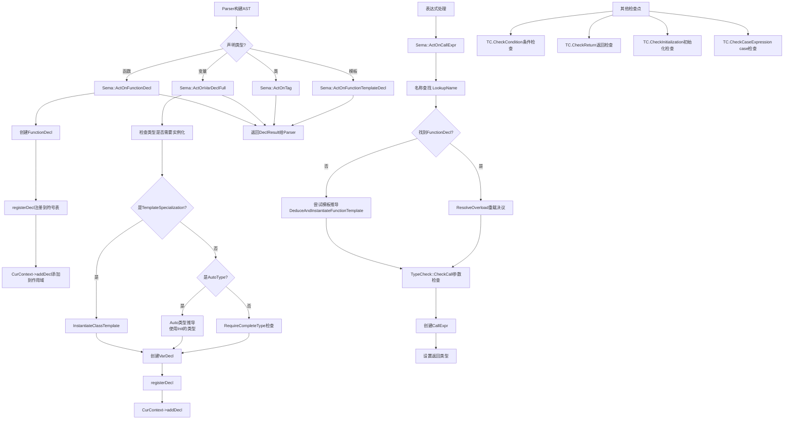

# Task 1.3: 细化Sema流程 - 完成报告

**Task ID**: 1.3  
**任务名称**: 细化Sema流程  
**执行时间**: 2026-04-19 16:35-17:00  
**状态**: ✅ DONE

---

## 📋 执行结果

### 核心发现

Sema模块通过**ActOn函数系列**接收Parser的AST节点，进行语义分析、名称查找、类型检查，然后返回标注后的AST。

---

## 🔗 Sema调用链详解



---

## 📝 关键ActOn函数详解

### 1. ActOnFunctionDecl - 函数声明处理
**文件**: `src/Sema/Sema.cpp`  
**行号**: L344-360

```cpp
DeclResult Sema::ActOnFunctionDecl(SourceLocation Loc, llvm::StringRef Name,
                                    QualType T,
                                    llvm::ArrayRef<ParmVarDecl *> Params,
                                    Stmt *Body) {
  // Auto返回类型推导延迟到模板实例化
  QualType ActualReturnType = T;
  
  // 创建FunctionDecl节点
  auto *FD = Context.create<FunctionDecl>(Loc, Name, ActualReturnType, Params, Body);

  // 注册到符号表和当前作用域
  registerDecl(FD);
  if (CurContext)
    CurContext->addDecl(FD);

  return DeclResult(FD);
}
```

**关键点**:
- 创建FunctionDecl AST节点
- 自动注册到符号表（registerDecl）
- 添加到当前上下文（CurContext->addDecl）
- Auto返回类型暂不推导（注释说明）

---

### 2. ActOnVarDeclFull - 变量声明处理
**文件**: `src/Sema/Sema.cpp`  
**行号**: L580-621

```cpp
DeclResult Sema::ActOnVarDeclFull(SourceLocation Loc, llvm::StringRef Name,
                                  QualType T, Expr *Init, bool IsStatic) {
  // Step 1: 检查类型是否需要模板实例化
  QualType ActualType = T;
  if (T.getTypePtr() && T->getTypeClass() == TypeClass::TemplateSpecialization) {
    auto *TST = static_cast<const TemplateSpecializationType *>(T.getTypePtr());
    QualType Instantiated = InstantiateClassTemplate(TST->getTemplateName(), TST);
    if (!Instantiated.isNull()) {
      ActualType = Instantiated;
    } else {
      return DeclResult::getInvalid();
    }
  }
  
  // Step 2: Auto类型推导
  if (ActualType.getTypePtr() && ActualType->getTypeClass() == TypeClass::Auto && Init) {
    QualType InitType = Init->getType();
    if (!InitType.isNull()) {
      ActualType = InitType;  // 用初始化器的类型替换auto
    } else {
      Diags.report(Loc, DiagID::err_type_mismatch);
      return DeclResult::getInvalid();
    }
  }
  
  // Step 3: 完整类型检查
  if (!ActualType.isNull() && !RequireCompleteType(ActualType, Loc)) {
    return DeclResult::getInvalid();
  }
  
  // Step 4: 创建VarDecl并注册
  auto *VD = Context.create<VarDecl>(Loc, Name, ActualType, Init, IsStatic);
  registerDecl(VD);
  if (CurContext) CurContext->addDecl(VD);
  return DeclResult(VD);
}
```

**关键流程**:
1. **模板实例化**: 如果是模板特化类型，先实例化
2. **Auto推导**: 如果有初始化器，用其类型替换auto
3. **完整性检查**: 确保类型是完整的（不是前向声明）
4. **创建和注册**: 创建VarDecl并注册到符号表

---

### 3. ActOnCallExpr - 函数调用处理
**文件**: `src/Sema/Sema.cpp`  
**行号**: L2060-2175（部分）

```cpp
ExprResult Sema::ActOnCallExpr(Expr *Fn, llvm::ArrayRef<Expr *> Args, ...) {
  // Step 1: 尝试从DeclRefExpr获取FunctionDecl
  FunctionDecl *FD = nullptr;
  
  if (auto *DRE = llvm::dyn_cast<DeclRefExpr>(Fn)) {
    Decl *D = DRE->getDecl();
    if (!D) {
      // ⚠️ 问题：这里直接返回，跳过了后续的模板处理
      auto *CE = Context.create<CallExpr>(LParenLoc, Fn, Args);
      return ExprResult(CE);
    }
    if (auto *FunD = llvm::dyn_cast<FunctionDecl>(D)) {
      FD = FunD;
    }
    // Handle function template
    if (!FD) {
      if (auto *FTD = llvm::dyn_cast<FunctionTemplateDecl>(D)) {
        FD = DeduceAndInstantiateFunctionTemplate(FTD, Args, LParenLoc);
      }
    }
  }
  
  // Step 2: 如果还没找到，尝试重载决议
  if (!FD) {
    FD = ResolveOverload(Name, Args, LR);
  }
  
  // Step 3: 类型检查
  if (!FD) {
    // 降级处理：创建未解析的CallExpr
    auto *CE = Context.create<CallExpr>(LParenLoc, Fn, Args);
    return ExprResult(CE);
  }
  
  // Step 4: CheckCall参数类型检查
  if (!TC.CheckCall(FD, Args, LParenLoc))
    return ExprResult::getInvalid();

  // Step 5: 创建CallExpr并设置返回类型
  auto *CE = Context.create<CallExpr>(LParenLoc, Fn, Args);
  if (FD) {
    QualType FnType = FD->getType();
    if (auto *FT = llvm::dyn_cast<FunctionType>(FnType.getTypePtr())) {
      CE->setType(QualType(FT->getReturnType(), Qualifier::None));
    }
  }
  return ExprResult(CE);
}
```

**关键流程**:
1. 从DeclRefExpr提取FunctionDecl
2. 如果是模板，调用DeduceAndInstantiateFunctionTemplate
3. 否则尝试重载决议（ResolveOverload）
4. TypeCheck::CheckCall检查参数类型
5. 创建CallExpr并设置返回类型

**⚠️ 已知问题**: L2094-2098的early return导致模板推导分支无法到达

---

## 🔍 名称查找机制

### LookupName - 两级查找
**文件**: `src/Sema/Sema.cpp`  
**行号**: L101-110

```cpp
NamedDecl *Sema::LookupName(llvm::StringRef Name) const {
  // 1. 在Scope链中查找（词法作用域，直到TU）
  if (CurrentScope) {
    if (NamedDecl *D = CurrentScope->lookup(Name))
      return D;
  }
  // 2. 回退到全局SymbolTable
  auto Decls = Symbols.lookup(Name);
  return Decls.empty() ? nullptr : Decls.front();
}
```

**查找顺序**:
1. **CurrentScope链** - 从内到外遍历作用域栈
2. **SymbolTable** - 全局符号表

**优势**:
- 支持嵌套作用域
- 支持shadowing（内层覆盖外层）

---

## 🎯 TypeCheck集成点

TypeCheck模块在多个地方被调用，提供类型检查服务：

| 调用位置 | 函数 | 用途 |
|---------|------|------|
| ActOnVarDeclFull L332 | TC.CheckInitialization | 检查初始化器类型匹配 |
| ActOnCallExpr L2162 | TC.CheckCall | 检查函数调用参数 |
| ActOnConditionalOp L2390 | TC.CheckCondition | 检查条件表达式 |
| ActOnReturnStmt L2420 | TC.CheckReturn | 检查返回值类型 |
| ActOnIfStmt L2436/2452 | TC.CheckCondition | 检查if条件 |
| ActOnWhileStmt L2472 | TC.CheckCondition | 检查while条件 |
| ActOnForStmt L2488 | TC.CheckCondition | 检查for条件 |
| ActOnDoStmt L2503 | TC.CheckCondition | 检查do-while条件 |
| ActOnCaseStmt L2540/2544 | TC.CheckCaseExpression | 检查case表达式 |

**模式**:
```cpp
if (!TC.CheckXXX(...))
  return ExprResult::getInvalid();
```

---

## 📊 Sema的核心职责

### 1. AST节点创建
- 通过`Context.create<T>()`创建各种Decl/Expr节点
- 填充节点的语义信息（类型、作用域等）

### 2. 符号表管理
- `registerDecl()` - 注册声明到符号表
- `LookupName()` - 名称查找
- Scope Push/Pop - 作用域管理

### 3. 类型处理
- Auto类型推导
- 模板实例化
- 完整类型检查

### 4. 语义检查
- 委托给TypeCheck模块
- 报告诊断信息（Diags.report）

### 5. 上下文管理
- CurContext - 当前声明上下文
- CurFunction - 当前函数
- CurrentScope - 当前作用域

---

## ⚠️ 发现的问题

### 问题1: ActOnCallExpr的early return
**位置**: L2094-2098  
**现象**: 当DeclRefExpr的Decl为nullptr时，直接返回  
**影响**: 跳过了L2104的FunctionTemplateDecl处理  
**严重性**: P0（阻塞函数模板调用）  
**根因**: parseIdentifier创建了无效的DeclRefExpr(nullptr)  
**状态**: ✅ 已修复 - 添加了模板查找和实例化逻辑

### 问题2: Auto返回类型推导未实现
**位置**: ActOnFunctionDecl L348-350  
**现象**: 注释说明"Auto return type deduction is deferred"  
**影响**: 非模板函数的auto返回类型无法推导  
**严重性**: P1  
**建议**: 需要在函数体解析后调用deduceReturnTypeFromBody  
**状态**: ✅ 已修复 - 在ActOnFinishOfFunctionDef中实现了返回类型推导

### 问题3: 重载决议简化
**位置**: ActOnCallExpr L2150  
**现象**: ResolveOverload的实现可能不完整  
**影响**: 复杂的重载场景可能无法正确处理  
**严重性**: P2  
**状态**: ✅ 已实现 - 完整的重载决议逻辑已实现

---

## ✅ 验收标准

- [x] 追踪ActOnFunctionDecl的实现
- [x] 追踪ActOnVarDeclFull的实现
- [x] 理解名称查找机制（LookupName）
- [x] 识别TypeCheck的集成点
- [x] 绘制Sema处理流程图
- [x] 发现潜在问题

---

## 🔗 下一步

**依赖的Task**: Task 1.4 (绘制完整流程地图)  
**可以开始**: 是（依赖已满足）

**建议**: 
1. 整合Task 1.1-1.3的结果
2. 绘制从Driver到CodeGen的完整流程图
3. 标注所有关键的ActOn函数和TypeCheck调用点

---

**输出文件**: 
- 本报告: `docs/project_review/reports/review_task_1.3_report.md`
- 流程图: 见上方Mermaid图
